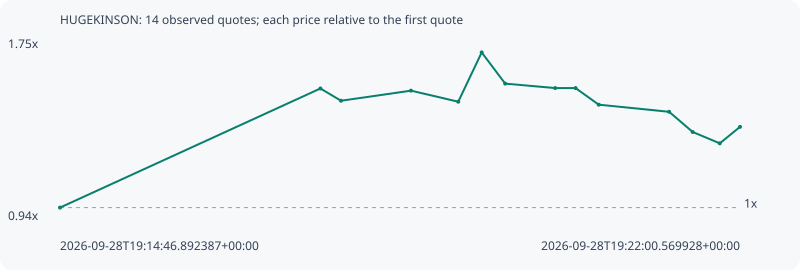

# HUGEKINSON

**solana** / `BBwH6xYy2LTmbjYX3e9uS5UKgNqmrx7PVSsfpwgsXcNL`

[All tokens](README.md) · [Market window](../README.md)

## Native assessments

This contract is in the quote cohort; it has no native model assessment in this window.

## Series 22bcc6b1a59f363c4d21

Pool: `not supplied`

[Complete series](../series/solana/22bcc6b1a59f363c4d21.json)

Every dot is a captured quote. Lines connect observations; the curve ends at the last available quote.

| Peak | Final | Return | Maximum drawdown |
| ---: | ---: | ---: | ---: |
| 1.6969x | 1.3625x | +36.25% | 24.07% |

### Complete quote timeline

| Time (UTC) | Price (USD) | Multiple | Evidence |
| --- | ---: | ---: | --- |
| 2026-09-28T19:14:46.892387+00:00 | 1.49031e-05 | 1.0000x | `capture:7d9e3e65-8bda-4696-b6d1-7a86825bd98c:rank:99` |
| 2026-09-28T19:17:32.965607+00:00 | 2.28752e-05 | 1.5349x | `capture:0f04cfe5-88a0-4a83-ae8d-85c5cb3cdc89:rank:99` |
| 2026-09-28T19:17:46.087880+00:00 | 2.20553e-05 | 1.4799x | `capture:ee91a1c6-bc99-4c7a-9cdc-bd6cb5478a9b:rank:95` |
| 2026-09-28T19:18:30.722167+00:00 | 2.27295e-05 | 1.5252x | `capture:9f88d118-9108-4dff-bbfc-246eaed5ce38:rank:99` |
| 2026-09-28T19:19:00.883835+00:00 | 2.19887e-05 | 1.4754x | `capture:a2495d99-5671-4c7e-b87c-48f48d90f2f2:rank:99` |
| 2026-09-28T19:19:15.826416+00:00 | 2.52895e-05 | 1.6969x | `capture:ba1dc6a3-b8b7-461a-8110-8490f03539a5:rank:99` |
| 2026-09-28T19:19:30.814098+00:00 | 2.32008e-05 | 1.5568x | `capture:b25d90dc-c8db-4388-8a2b-d06541e5320f:rank:97` |
| 2026-09-28T19:20:02.715590+00:00 | 2.29023e-05 | 1.5367x | `capture:60ff17d8-3b18-4f61-9bc7-006afd324cf2:rank:98` |
| 2026-09-28T19:20:15.699547+00:00 | 2.29023e-05 | 1.5367x | `capture:10a94828-637f-4580-a9f7-2fbd34d8589a:rank:97` |
| 2026-09-28T19:20:30.480194+00:00 | 2.17908e-05 | 1.4622x | `capture:54722132-db1d-4a2b-8c1c-2b0e71d01430:rank:97` |
| 2026-09-28T19:21:15.372716+00:00 | 2.13144e-05 | 1.4302x | `capture:a923b968-a768-495e-ae33-6de2042c551f:rank:94` |
| 2026-09-28T19:21:30.402460+00:00 | 1.9962e-05 | 1.3395x | `capture:d926629b-2050-4e50-a602-1638c6205870:rank:85` |
| 2026-09-28T19:21:47.649380+00:00 | 1.92033e-05 | 1.2885x | `capture:0799ec6d-0e89-46b5-ae88-5695bf6c5fc3:rank:92` |
| 2026-09-28T19:22:00.569928+00:00 | 2.03058e-05 | 1.3625x | `capture:263cda40-4b31-4b2d-b168-fa4310edb46d:rank:89` |

### Exit-policy timeline

Calculated from captured quotes under the window policy. Native assessments are linked separately above.

| Time (UTC) | Action | Price (USD) | Evidence |
| --- | --- | ---: | --- |
| 2026-09-28T19:14:46.892387+00:00 | BUY | 1.49031e-05 | `capture:7d9e3e65-8bda-4696-b6d1-7a86825bd98c:rank:99` |
| 2026-09-28T19:17:32.965607+00:00 | TP | 2.28752e-05 | `capture:0f04cfe5-88a0-4a83-ae8d-85c5cb3cdc89:rank:99` |
