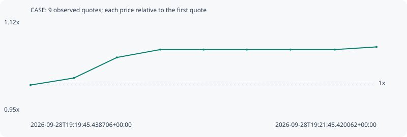

# CASE

**robinhood** / `0xa643c2c8ce98ea2b1038d2d501fb52f1556e275f`

[All tokens](README.md) · [Market window](../README.md)

## Native assessments

This contract is in the quote cohort; it has no native model assessment in this window.

## Series 26aeceaa3567b3589485

Pool: `not supplied`

[Complete series](../series/robinhood/26aeceaa3567b3589485.json)

Every dot is a captured quote. Lines connect observations; the curve ends at the last available quote.

| Peak | Final | Return | Maximum drawdown |
| ---: | ---: | ---: | ---: |
| 1.0716x | 1.0716x | +7.16% | 0.00% |

### Complete quote timeline

| Time (UTC) | Price (USD) | Multiple | Evidence |
| --- | ---: | ---: | --- |
| 2026-09-28T19:19:45.438706+00:00 | 1.06055e-05 | 1.0000x | `capture:59b12f7b-2112-42c7-834a-a2eb9bcaee3d:rank:95` |
| 2026-09-28T19:20:00.494705+00:00 | 1.07456e-05 | 1.0132x | `capture:5b06d6b3-9eca-4487-82fb-6b28820c37d9:rank:68` |
| 2026-09-28T19:20:15.393373+00:00 | 1.11546e-05 | 1.0518x | `capture:17802da9-7cee-48c3-9f5b-5829781be3f6:rank:58` |
| 2026-09-28T19:20:30.417446+00:00 | 1.13119e-05 | 1.0666x | `capture:f2fe9ac4-89a0-4ad3-8f15-5a70d7e1d5f7:rank:55` |
| 2026-09-28T19:20:45.464282+00:00 | 1.13119e-05 | 1.0666x | `capture:26559b75-812f-4386-982b-eba5073faf44:rank:52` |
| 2026-09-28T19:21:00.449260+00:00 | 1.13119e-05 | 1.0666x | `capture:186445b2-8971-4639-85b9-26b2e8fb9d2c:rank:49` |
| 2026-09-28T19:21:15.606838+00:00 | 1.13119e-05 | 1.0666x | `capture:c2a8ab31-038e-42f4-8e33-852fee1b9a24:rank:49` |
| 2026-09-28T19:21:30.959683+00:00 | 1.13119e-05 | 1.0666x | `capture:300e0f35-12d4-46a9-a17e-17adbe8e1059:rank:52` |
| 2026-09-28T19:21:45.420062+00:00 | 1.13648e-05 | 1.0716x | `capture:ec22b61b-732a-44d2-be85-c577051928eb:rank:49` |

### Exit-policy timeline

Calculated from captured quotes under the window policy. Native assessments are linked separately above.

| Time (UTC) | Action | Price (USD) | Evidence |
| --- | --- | ---: | --- |
| 2026-09-28T19:19:45.438706+00:00 | BUY | 1.06055e-05 | `capture:59b12f7b-2112-42c7-834a-a2eb9bcaee3d:rank:95` |
| 2026-09-28T19:20:00.494705+00:00 | HOLD | 1.07456e-05 | `capture:5b06d6b3-9eca-4487-82fb-6b28820c37d9:rank:68` |
| 2026-09-28T19:20:15.393373+00:00 | HOLD | 1.11546e-05 | `capture:17802da9-7cee-48c3-9f5b-5829781be3f6:rank:58` |
| 2026-09-28T19:20:30.417446+00:00 | HOLD | 1.13119e-05 | `capture:f2fe9ac4-89a0-4ad3-8f15-5a70d7e1d5f7:rank:55` |
| 2026-09-28T19:20:45.464282+00:00 | HOLD | 1.13119e-05 | `capture:26559b75-812f-4386-982b-eba5073faf44:rank:52` |
| 2026-09-28T19:21:00.449260+00:00 | HOLD | 1.13119e-05 | `capture:186445b2-8971-4639-85b9-26b2e8fb9d2c:rank:49` |
| 2026-09-28T19:21:15.606838+00:00 | HOLD | 1.13119e-05 | `capture:c2a8ab31-038e-42f4-8e33-852fee1b9a24:rank:49` |
| 2026-09-28T19:21:30.959683+00:00 | HOLD | 1.13119e-05 | `capture:300e0f35-12d4-46a9-a17e-17adbe8e1059:rank:52` |
| 2026-09-28T19:21:45.420062+00:00 | HOLD | 1.13648e-05 | `capture:ec22b61b-732a-44d2-be85-c577051928eb:rank:49` |
