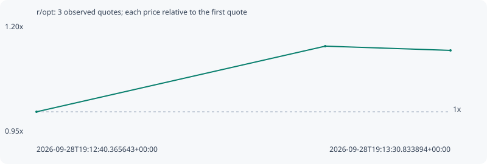

# r/opt

**solana** / `3wNbnWqEyXuPG8Xh14Uaj9yBUHhASnBjcioWKPaTpump`

[All tokens](README.md) · [Market window](../README.md)

## Native assessments

This contract is in the quote cohort; it has no native model assessment in this window.

## Series 4888cc9eea542136d75e

Pool: `not supplied`

[Complete series](../series/solana/4888cc9eea542136d75e.json)

Every dot is a captured quote. Lines connect observations; the curve ends at the last available quote.

| Peak | Final | Return | Maximum drawdown |
| ---: | ---: | ---: | ---: |
| 1.1502x | 1.1404x | +14.04% | 0.85% |

### Complete quote timeline

| Time (UTC) | Price (USD) | Multiple | Evidence |
| --- | ---: | ---: | --- |
| 2026-09-28T19:12:40.365643+00:00 | 3.65719e-06 | 1.0000x | `capture:3af1faa1-2074-484e-893e-ed2c676e1576:rank:16` |
| 2026-09-28T19:13:15.565374+00:00 | 4.2064e-06 | 1.1502x | `capture:ca31b3d4-ad60-4333-98b3-6d940a196f86:rank:16` |
| 2026-09-28T19:13:30.833894+00:00 | 4.17081e-06 | 1.1404x | `capture:2beb38a4-bfac-4502-bbc3-8c8c0f943007:rank:17` |

### Exit-policy timeline

Calculated from captured quotes under the window policy. Native assessments are linked separately above.

| Time (UTC) | Action | Price (USD) | Evidence |
| --- | --- | ---: | --- |
| 2026-09-28T19:12:40.365643+00:00 | BUY | 3.65719e-06 | `capture:3af1faa1-2074-484e-893e-ed2c676e1576:rank:16` |
| 2026-09-28T19:13:15.565374+00:00 | HOLD | 4.2064e-06 | `capture:ca31b3d4-ad60-4333-98b3-6d940a196f86:rank:16` |
| 2026-09-28T19:13:30.833894+00:00 | HOLD | 4.17081e-06 | `capture:2beb38a4-bfac-4502-bbc3-8c8c0f943007:rank:17` |
