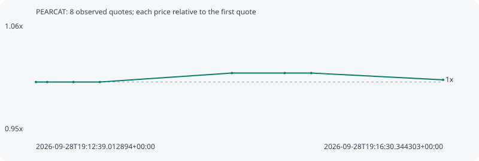

# PEARCAT

**robinhood** / `0x40e1a49553ce67058fb33c2fe1446c7e0ee0038f`

[All tokens](README.md) · [Market window](../README.md)

## Native assessments

This contract is in the quote cohort; it has no native model assessment in this window.

## Series 7be92ab2de1cf80751b4

Pool: `not supplied`

[Complete series](../series/robinhood/7be92ab2de1cf80751b4.json)

Every dot is a captured quote. Lines connect observations; the curve ends at the last available quote.

| Peak | Final | Return | Maximum drawdown |
| ---: | ---: | ---: | ---: |
| 1.0091x | 1.0022x | +0.22% | 0.69% |

### Complete quote timeline

| Time (UTC) | Price (USD) | Multiple | Evidence |
| --- | ---: | ---: | --- |
| 2026-09-28T19:12:39.012894+00:00 | 0.000153988 | 1.0000x | `capture:fe8ad944-154e-4481-bd56-8ab821bfbfe1:rank:82` |
| 2026-09-28T19:12:45.402569+00:00 | 0.000153988 | 1.0000x | `capture:8deb508c-ea33-4c21-a5c5-f0991dd6dcac:rank:82` |
| 2026-09-28T19:13:00.335966+00:00 | 0.000153988 | 1.0000x | `capture:ee3ee7f8-576f-4c42-a7e0-cd9f917fdb36:rank:83` |
| 2026-09-28T19:13:15.331879+00:00 | 0.000153988 | 1.0000x | `capture:c384257a-4501-4701-8a0c-a6b08fe727d5:rank:93` |
| 2026-09-28T19:14:30.367936+00:00 | 0.000155394 | 1.0091x | `capture:7a0b9f45-7248-4af6-b349-4bf6d5ef81be:rank:99` |
| 2026-09-28T19:15:00.325882+00:00 | 0.000155394 | 1.0091x | `capture:663c0420-2b9e-4a94-998b-531fa9202dee:rank:92` |
| 2026-09-28T19:15:15.449577+00:00 | 0.000155394 | 1.0091x | `capture:14452070-ab94-45a0-af6d-e6c54082daec:rank:93` |
| 2026-09-28T19:16:30.344303+00:00 | 0.000154326 | 1.0022x | `capture:18d587e7-b24d-4b8d-82f1-0ac2903a3303:rank:99` |

### Exit-policy timeline

Calculated from captured quotes under the window policy. Native assessments are linked separately above.

| Time (UTC) | Action | Price (USD) | Evidence |
| --- | --- | ---: | --- |
| 2026-09-28T19:12:39.012894+00:00 | BUY | 0.000153988 | `capture:fe8ad944-154e-4481-bd56-8ab821bfbfe1:rank:82` |
| 2026-09-28T19:12:45.402569+00:00 | HOLD | 0.000153988 | `capture:8deb508c-ea33-4c21-a5c5-f0991dd6dcac:rank:82` |
| 2026-09-28T19:13:00.335966+00:00 | HOLD | 0.000153988 | `capture:ee3ee7f8-576f-4c42-a7e0-cd9f917fdb36:rank:83` |
| 2026-09-28T19:13:15.331879+00:00 | HOLD | 0.000153988 | `capture:c384257a-4501-4701-8a0c-a6b08fe727d5:rank:93` |
| 2026-09-28T19:14:30.367936+00:00 | HOLD | 0.000155394 | `capture:7a0b9f45-7248-4af6-b349-4bf6d5ef81be:rank:99` |
| 2026-09-28T19:15:00.325882+00:00 | HOLD | 0.000155394 | `capture:663c0420-2b9e-4a94-998b-531fa9202dee:rank:92` |
| 2026-09-28T19:15:15.449577+00:00 | HOLD | 0.000155394 | `capture:14452070-ab94-45a0-af6d-e6c54082daec:rank:93` |
| 2026-09-28T19:16:30.344303+00:00 | HOLD | 0.000154326 | `capture:18d587e7-b24d-4b8d-82f1-0ac2903a3303:rank:99` |
