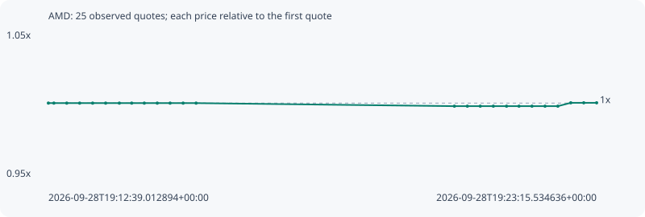

# AMD

**robinhood** / `0x86923f96303d656e4aa86d9d42d1e57ad2023fdc`

[All tokens](README.md) · [Market window](../README.md)

## Native assessments

This contract is in the quote cohort; it has no native model assessment in this window.

## Series 569ecd42ff9beb79f392

Pool: `not supplied`

[Complete series](../series/robinhood/569ecd42ff9beb79f392.json)

Every dot is a captured quote. Lines connect observations; the curve ends at the last available quote.

| Peak | Final | Return | Maximum drawdown |
| ---: | ---: | ---: | ---: |
| 1.0002x | 1.0002x | +0.02% | 0.22% |

### Complete quote timeline

| Time (UTC) | Price (USD) | Multiple | Evidence |
| --- | ---: | ---: | --- |
| 2026-09-28T19:12:39.012894+00:00 | 608.219 | 1.0000x | `capture:fe8ad944-154e-4481-bd56-8ab821bfbfe1:rank:58` |
| 2026-09-28T19:12:45.402569+00:00 | 608.219 | 1.0000x | `capture:8deb508c-ea33-4c21-a5c5-f0991dd6dcac:rank:58` |
| 2026-09-28T19:13:00.335966+00:00 | 608.208 | 1.0000x | `capture:ee3ee7f8-576f-4c42-a7e0-cd9f917fdb36:rank:50` |
| 2026-09-28T19:13:15.331879+00:00 | 608.208 | 1.0000x | `capture:c384257a-4501-4701-8a0c-a6b08fe727d5:rank:51` |
| 2026-09-28T19:13:30.402311+00:00 | 608.208 | 1.0000x | `capture:44090e9e-d515-41c4-a78f-893390e6f2b0:rank:48` |
| 2026-09-28T19:13:45.493213+00:00 | 608.208 | 1.0000x | `capture:52264519-193b-4508-b560-e9ee4e3e0963:rank:46` |
| 2026-09-28T19:14:01.407289+00:00 | 608.208 | 1.0000x | `capture:0a62cce6-2c27-4761-80c1-feb9130a0c83:rank:59` |
| 2026-09-28T19:14:15.755233+00:00 | 608.208 | 1.0000x | `capture:09651124-e158-421c-bcdc-cb2310b48412:rank:55` |
| 2026-09-28T19:14:30.367936+00:00 | 608.208 | 1.0000x | `capture:7a0b9f45-7248-4af6-b349-4bf6d5ef81be:rank:53` |
| 2026-09-28T19:14:45.422215+00:00 | 608.208 | 1.0000x | `capture:bf6e34c4-c499-472e-8e2b-ebbb151300e2:rank:60` |
| 2026-09-28T19:15:00.325882+00:00 | 608.208 | 1.0000x | `capture:663c0420-2b9e-4a94-998b-531fa9202dee:rank:57` |
| 2026-09-28T19:15:15.449577+00:00 | 608.208 | 1.0000x | `capture:14452070-ab94-45a0-af6d-e6c54082daec:rank:59` |
| 2026-09-28T19:15:30.501058+00:00 | 608.208 | 1.0000x | `capture:4e680297-1e75-418b-b818-8b2903e8b923:rank:57` |
| 2026-09-28T19:20:30.417446+00:00 | 606.894 | 0.9978x | `capture:f2fe9ac4-89a0-4ad3-8f15-5a70d7e1d5f7:rank:97` |
| 2026-09-28T19:20:45.464282+00:00 | 606.894 | 0.9978x | `capture:26559b75-812f-4386-982b-eba5073faf44:rank:93` |
| 2026-09-28T19:21:00.449260+00:00 | 606.894 | 0.9978x | `capture:186445b2-8971-4639-85b9-26b2e8fb9d2c:rank:91` |
| 2026-09-28T19:21:15.606838+00:00 | 606.894 | 0.9978x | `capture:c2a8ab31-038e-42f4-8e33-852fee1b9a24:rank:93` |
| 2026-09-28T19:21:30.959683+00:00 | 606.894 | 0.9978x | `capture:300e0f35-12d4-46a9-a17e-17adbe8e1059:rank:96` |
| 2026-09-28T19:21:45.420062+00:00 | 606.894 | 0.9978x | `capture:ec22b61b-732a-44d2-be85-c577051928eb:rank:92` |
| 2026-09-28T19:22:00.489634+00:00 | 606.894 | 0.9978x | `capture:d6c64542-18c5-48a0-a6c9-f0e2a9c54b41:rank:91` |
| 2026-09-28T19:22:15.632268+00:00 | 606.894 | 0.9978x | `capture:13e6d33e-e854-4b87-b3da-49aedec6950e:rank:87` |
| 2026-09-28T19:22:30.535979+00:00 | 606.894 | 0.9978x | `capture:091fb4d2-10fc-4d5f-9c22-af9f55e90e4a:rank:95` |
| 2026-09-28T19:22:45.520851+00:00 | 608.343 | 1.0002x | `capture:128617a9-4055-4a8d-8b04-c8876bad9c70:rank:85` |
| 2026-09-28T19:23:00.594785+00:00 | 608.343 | 1.0002x | `capture:b6c633f1-3960-4db3-a2ca-34618f913368:rank:87` |
| 2026-09-28T19:23:15.534636+00:00 | 608.343 | 1.0002x | `capture:d5a0d1a4-a366-4985-80da-e34160e2f58c:rank:95` |

### Exit-policy timeline

Calculated from captured quotes under the window policy. Native assessments are linked separately above.

| Time (UTC) | Action | Price (USD) | Evidence |
| --- | --- | ---: | --- |
| 2026-09-28T19:12:39.012894+00:00 | BUY | 608.219 | `capture:fe8ad944-154e-4481-bd56-8ab821bfbfe1:rank:58` |
| 2026-09-28T19:12:45.402569+00:00 | HOLD | 608.219 | `capture:8deb508c-ea33-4c21-a5c5-f0991dd6dcac:rank:58` |
| 2026-09-28T19:13:00.335966+00:00 | HOLD | 608.208 | `capture:ee3ee7f8-576f-4c42-a7e0-cd9f917fdb36:rank:50` |
| 2026-09-28T19:13:15.331879+00:00 | HOLD | 608.208 | `capture:c384257a-4501-4701-8a0c-a6b08fe727d5:rank:51` |
| 2026-09-28T19:13:30.402311+00:00 | HOLD | 608.208 | `capture:44090e9e-d515-41c4-a78f-893390e6f2b0:rank:48` |
| 2026-09-28T19:13:45.493213+00:00 | HOLD | 608.208 | `capture:52264519-193b-4508-b560-e9ee4e3e0963:rank:46` |
| 2026-09-28T19:14:01.407289+00:00 | HOLD | 608.208 | `capture:0a62cce6-2c27-4761-80c1-feb9130a0c83:rank:59` |
| 2026-09-28T19:14:15.755233+00:00 | HOLD | 608.208 | `capture:09651124-e158-421c-bcdc-cb2310b48412:rank:55` |
| 2026-09-28T19:14:30.367936+00:00 | HOLD | 608.208 | `capture:7a0b9f45-7248-4af6-b349-4bf6d5ef81be:rank:53` |
| 2026-09-28T19:14:45.422215+00:00 | HOLD | 608.208 | `capture:bf6e34c4-c499-472e-8e2b-ebbb151300e2:rank:60` |
| 2026-09-28T19:15:00.325882+00:00 | HOLD | 608.208 | `capture:663c0420-2b9e-4a94-998b-531fa9202dee:rank:57` |
| 2026-09-28T19:15:15.449577+00:00 | HOLD | 608.208 | `capture:14452070-ab94-45a0-af6d-e6c54082daec:rank:59` |
| 2026-09-28T19:15:30.501058+00:00 | HOLD | 608.208 | `capture:4e680297-1e75-418b-b818-8b2903e8b923:rank:57` |
| 2026-09-28T19:20:30.417446+00:00 | HOLD | 606.894 | `capture:f2fe9ac4-89a0-4ad3-8f15-5a70d7e1d5f7:rank:97` |
| 2026-09-28T19:20:45.464282+00:00 | HOLD | 606.894 | `capture:26559b75-812f-4386-982b-eba5073faf44:rank:93` |
| 2026-09-28T19:21:00.449260+00:00 | HOLD | 606.894 | `capture:186445b2-8971-4639-85b9-26b2e8fb9d2c:rank:91` |
| 2026-09-28T19:21:15.606838+00:00 | HOLD | 606.894 | `capture:c2a8ab31-038e-42f4-8e33-852fee1b9a24:rank:93` |
| 2026-09-28T19:21:30.959683+00:00 | HOLD | 606.894 | `capture:300e0f35-12d4-46a9-a17e-17adbe8e1059:rank:96` |
| 2026-09-28T19:21:45.420062+00:00 | HOLD | 606.894 | `capture:ec22b61b-732a-44d2-be85-c577051928eb:rank:92` |
| 2026-09-28T19:22:00.489634+00:00 | HOLD | 606.894 | `capture:d6c64542-18c5-48a0-a6c9-f0e2a9c54b41:rank:91` |
| 2026-09-28T19:22:15.632268+00:00 | HOLD | 606.894 | `capture:13e6d33e-e854-4b87-b3da-49aedec6950e:rank:87` |
| 2026-09-28T19:22:30.535979+00:00 | HOLD | 606.894 | `capture:091fb4d2-10fc-4d5f-9c22-af9f55e90e4a:rank:95` |
| 2026-09-28T19:22:45.520851+00:00 | HOLD | 608.343 | `capture:128617a9-4055-4a8d-8b04-c8876bad9c70:rank:85` |
| 2026-09-28T19:23:00.594785+00:00 | HOLD | 608.343 | `capture:b6c633f1-3960-4db3-a2ca-34618f913368:rank:87` |
| 2026-09-28T19:23:15.534636+00:00 | HOLD | 608.343 | `capture:d5a0d1a4-a366-4985-80da-e34160e2f58c:rank:95` |
