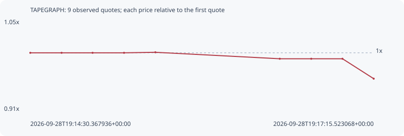

# TAPEGRAPH

**robinhood** / `0xb2adbe31831383260e63c7fc512378c229da6419`

[All tokens](README.md) · [Market window](../README.md)

## Native assessments

This contract is in the quote cohort; it has no native model assessment in this window.

## Series c91e45453e3ea1edd5c1

Pool: `not supplied`

[Complete series](../series/robinhood/c91e45453e3ea1edd5c1.json)

Every dot is a captured quote. Lines connect observations; the curve ends at the last available quote.

| Peak | Final | Return | Maximum drawdown |
| ---: | ---: | ---: | ---: |
| 1.0008x | 0.9598x | -4.02% | 4.10% |

### Complete quote timeline

| Time (UTC) | Price (USD) | Multiple | Evidence |
| --- | ---: | ---: | --- |
| 2026-09-28T19:14:30.367936+00:00 | 1.21984e-05 | 1.0000x | `capture:7a0b9f45-7248-4af6-b349-4bf6d5ef81be:rank:97` |
| 2026-09-28T19:14:45.422215+00:00 | 1.21984e-05 | 1.0000x | `capture:bf6e34c4-c499-472e-8e2b-ebbb151300e2:rank:98` |
| 2026-09-28T19:15:00.325882+00:00 | 1.21984e-05 | 1.0000x | `capture:663c0420-2b9e-4a94-998b-531fa9202dee:rank:89` |
| 2026-09-28T19:15:15.449577+00:00 | 1.21984e-05 | 1.0000x | `capture:14452070-ab94-45a0-af6d-e6c54082daec:rank:88` |
| 2026-09-28T19:15:30.501058+00:00 | 1.22084e-05 | 1.0008x | `capture:4e680297-1e75-418b-b818-8b2903e8b923:rank:93` |
| 2026-09-28T19:16:30.344303+00:00 | 1.20856e-05 | 0.9908x | `capture:18d587e7-b24d-4b8d-82f1-0ac2903a3303:rank:82` |
| 2026-09-28T19:16:45.486467+00:00 | 1.20856e-05 | 0.9908x | `capture:4ca26bf7-9d1e-455b-a63e-1b5df831b997:rank:81` |
| 2026-09-28T19:17:00.510014+00:00 | 1.20856e-05 | 0.9908x | `capture:d9309a4d-09d7-45ee-91ce-c4a055e8faac:rank:87` |
| 2026-09-28T19:17:15.523068+00:00 | 1.17076e-05 | 0.9598x | `capture:333d670d-dbd3-4656-95f9-1bc781b271db:rank:75` |

### Exit-policy timeline

Calculated from captured quotes under the window policy. Native assessments are linked separately above.

| Time (UTC) | Action | Price (USD) | Evidence |
| --- | --- | ---: | --- |
| 2026-09-28T19:14:30.367936+00:00 | BUY | 1.21984e-05 | `capture:7a0b9f45-7248-4af6-b349-4bf6d5ef81be:rank:97` |
| 2026-09-28T19:14:45.422215+00:00 | HOLD | 1.21984e-05 | `capture:bf6e34c4-c499-472e-8e2b-ebbb151300e2:rank:98` |
| 2026-09-28T19:15:00.325882+00:00 | HOLD | 1.21984e-05 | `capture:663c0420-2b9e-4a94-998b-531fa9202dee:rank:89` |
| 2026-09-28T19:15:15.449577+00:00 | HOLD | 1.21984e-05 | `capture:14452070-ab94-45a0-af6d-e6c54082daec:rank:88` |
| 2026-09-28T19:15:30.501058+00:00 | HOLD | 1.22084e-05 | `capture:4e680297-1e75-418b-b818-8b2903e8b923:rank:93` |
| 2026-09-28T19:16:30.344303+00:00 | HOLD | 1.20856e-05 | `capture:18d587e7-b24d-4b8d-82f1-0ac2903a3303:rank:82` |
| 2026-09-28T19:16:45.486467+00:00 | HOLD | 1.20856e-05 | `capture:4ca26bf7-9d1e-455b-a63e-1b5df831b997:rank:81` |
| 2026-09-28T19:17:00.510014+00:00 | HOLD | 1.20856e-05 | `capture:d9309a4d-09d7-45ee-91ce-c4a055e8faac:rank:87` |
| 2026-09-28T19:17:15.523068+00:00 | HOLD | 1.17076e-05 | `capture:333d670d-dbd3-4656-95f9-1bc781b271db:rank:75` |
