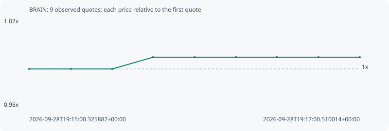

# BRAIN

**robinhood** / `0xbb59e4c6a56111a35a8066bbf0593d50139c7d94`

[All tokens](README.md) · [Market window](../README.md)

## Native assessments

This contract is in the quote cohort; it has no native model assessment in this window.

## Series 005f462c41d9fe9e6ca6

Pool: `not supplied`

[Complete series](../series/robinhood/005f462c41d9fe9e6ca6.json)

Every dot is a captured quote. Lines connect observations; the curve ends at the last available quote.

| Peak | Final | Return | Maximum drawdown |
| ---: | ---: | ---: | ---: |
| 1.0156x | 1.0156x | +1.56% | 0.00% |

### Complete quote timeline

| Time (UTC) | Price (USD) | Multiple | Evidence |
| --- | ---: | ---: | --- |
| 2026-09-28T19:15:00.325882+00:00 | 1.01537e-05 | 1.0000x | `capture:663c0420-2b9e-4a94-998b-531fa9202dee:rank:91` |
| 2026-09-28T19:15:15.449577+00:00 | 1.01537e-05 | 1.0000x | `capture:14452070-ab94-45a0-af6d-e6c54082daec:rank:92` |
| 2026-09-28T19:15:30.501058+00:00 | 1.01537e-05 | 1.0000x | `capture:4e680297-1e75-418b-b818-8b2903e8b923:rank:95` |
| 2026-09-28T19:15:45.353664+00:00 | 1.03118e-05 | 1.0156x | `capture:b9051b67-24e1-4469-9f82-bc08bd56807d:rank:83` |
| 2026-09-28T19:16:00.473367+00:00 | 1.03118e-05 | 1.0156x | `capture:cd404827-1073-4901-b09c-82ef1488855b:rank:80` |
| 2026-09-28T19:16:15.518445+00:00 | 1.03118e-05 | 1.0156x | `capture:c193221c-c80a-4a3b-ad88-59f12dcb1689:rank:81` |
| 2026-09-28T19:16:30.344303+00:00 | 1.03118e-05 | 1.0156x | `capture:18d587e7-b24d-4b8d-82f1-0ac2903a3303:rank:86` |
| 2026-09-28T19:16:45.486467+00:00 | 1.03118e-05 | 1.0156x | `capture:4ca26bf7-9d1e-455b-a63e-1b5df831b997:rank:86` |
| 2026-09-28T19:17:00.510014+00:00 | 1.03118e-05 | 1.0156x | `capture:d9309a4d-09d7-45ee-91ce-c4a055e8faac:rank:91` |

### Exit-policy timeline

Calculated from captured quotes under the window policy. Native assessments are linked separately above.

| Time (UTC) | Action | Price (USD) | Evidence |
| --- | --- | ---: | --- |
| 2026-09-28T19:15:00.325882+00:00 | BUY | 1.01537e-05 | `capture:663c0420-2b9e-4a94-998b-531fa9202dee:rank:91` |
| 2026-09-28T19:15:15.449577+00:00 | HOLD | 1.01537e-05 | `capture:14452070-ab94-45a0-af6d-e6c54082daec:rank:92` |
| 2026-09-28T19:15:30.501058+00:00 | HOLD | 1.01537e-05 | `capture:4e680297-1e75-418b-b818-8b2903e8b923:rank:95` |
| 2026-09-28T19:15:45.353664+00:00 | HOLD | 1.03118e-05 | `capture:b9051b67-24e1-4469-9f82-bc08bd56807d:rank:83` |
| 2026-09-28T19:16:00.473367+00:00 | HOLD | 1.03118e-05 | `capture:cd404827-1073-4901-b09c-82ef1488855b:rank:80` |
| 2026-09-28T19:16:15.518445+00:00 | HOLD | 1.03118e-05 | `capture:c193221c-c80a-4a3b-ad88-59f12dcb1689:rank:81` |
| 2026-09-28T19:16:30.344303+00:00 | HOLD | 1.03118e-05 | `capture:18d587e7-b24d-4b8d-82f1-0ac2903a3303:rank:86` |
| 2026-09-28T19:16:45.486467+00:00 | HOLD | 1.03118e-05 | `capture:4ca26bf7-9d1e-455b-a63e-1b5df831b997:rank:86` |
| 2026-09-28T19:17:00.510014+00:00 | HOLD | 1.03118e-05 | `capture:d9309a4d-09d7-45ee-91ce-c4a055e8faac:rank:91` |
