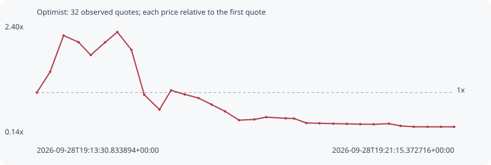

# Optimist

**solana** / `7VySefcz618cz6TkNbXRjVKLtzkLD2a6tyMpH6iTVbDq`

[All tokens](README.md) · [Market window](../README.md)

## Native assessments

This contract is in the quote cohort; it has no native model assessment in this window.

## Series c9a231d93e2b3308167f

Pool: `not supplied`

[Complete series](../series/solana/c9a231d93e2b3308167f.json)

Every dot is a captured quote. Lines connect observations; the curve ends at the last available quote.

| Peak | Final | Return | Maximum drawdown |
| ---: | ---: | ---: | ---: |
| 2.2431x | 0.2954x | -70.46% | 86.83% |

### Complete quote timeline

| Time (UTC) | Price (USD) | Multiple | Evidence |
| --- | ---: | ---: | --- |
| 2026-09-28T19:13:30.833894+00:00 | 1.26296e-05 | 1.0000x | `capture:2beb38a4-bfac-4502-bbc3-8c8c0f943007:rank:42` |
| 2026-09-28T19:13:45.640151+00:00 | 1.8004e-05 | 1.4255x | `capture:4d31b656-3ffe-4768-bef6-377adf019420:rank:29` |
| 2026-09-28T19:14:00.595194+00:00 | 2.74207e-05 | 2.1711x | `capture:2c78112b-48e7-4f74-8c2e-1cb8642a79dc:rank:20` |
| 2026-09-28T19:14:17.246316+00:00 | 2.56998e-05 | 2.0349x | `capture:7a923cde-d765-4388-a15c-4f47fde0a3b5:rank:13` |
| 2026-09-28T19:14:30.874732+00:00 | 2.23522e-05 | 1.7698x | `capture:fa585070-b1ae-4f9d-afbd-aa986f487793:rank:12` |
| 2026-09-28T19:14:46.892387+00:00 | 2.5659e-05 | 2.0317x | `capture:7d9e3e65-8bda-4696-b6d1-7a86825bd98c:rank:10` |
| 2026-09-28T19:15:00.432009+00:00 | 2.83292e-05 | 2.2431x | `capture:797f9a41-958a-44ba-ac57-3b9cacf5d06b:rank:8` |
| 2026-09-28T19:15:16.098308+00:00 | 2.37194e-05 | 1.8781x | `capture:ab2becb9-3f94-4a57-b9e8-472ad0998012:rank:8` |
| 2026-09-28T19:15:30.340579+00:00 | 1.20855e-05 | 0.9569x | `capture:564db5fc-5586-41d3-88fb-a9a955708f1d:rank:6` |
| 2026-09-28T19:15:47.323285+00:00 | 8.21155e-06 | 0.6502x | `capture:65003429-a569-4442-8d4f-b2c93db69061:rank:4` |
| 2026-09-28T19:16:00.259696+00:00 | 1.32074e-05 | 1.0457x | `capture:4236f8d5-90c4-4c9b-a73e-d6443ae3bf32:rank:4` |
| 2026-09-28T19:16:15.455827+00:00 | 1.21527e-05 | 0.9622x | `capture:acc657c6-9a43-46bf-986e-7b907c831cba:rank:4` |
| 2026-09-28T19:16:30.624202+00:00 | 1.12127e-05 | 0.8878x | `capture:0d391072-ec81-4bb7-9be0-0d6bbb801c70:rank:4` |
| 2026-09-28T19:16:45.311485+00:00 | 9.52274e-06 | 0.7540x | `capture:72cccbac-c3fe-4991-8f62-08c53849b146:rank:4` |
| 2026-09-28T19:17:00.368914+00:00 | 7.74222e-06 | 0.6130x | `capture:1232cf18-7088-40a1-9f55-ad9ae22b44f5:rank:3` |
| 2026-09-28T19:17:15.914647+00:00 | 5.46577e-06 | 0.4328x | `capture:9792e199-c0c2-4272-ac95-24501e4a3f79:rank:3` |
| 2026-09-28T19:17:32.965607+00:00 | 5.65716e-06 | 0.4479x | `capture:0f04cfe5-88a0-4a83-ae8d-85c5cb3cdc89:rank:3` |
| 2026-09-28T19:17:46.087880+00:00 | 6.25213e-06 | 0.4950x | `capture:ee91a1c6-bc99-4c7a-9cdc-bd6cb5478a9b:rank:3` |
| 2026-09-28T19:18:07.749963+00:00 | 5.95477e-06 | 0.4715x | `capture:b0fb1b47-4973-472f-9619-8480bc7d294e:rank:3` |
| 2026-09-28T19:18:17.126008+00:00 | 5.89959e-06 | 0.4671x | `capture:5ed98f51-d1e1-422a-81df-4186a8b0a0a2:rank:3` |
| 2026-09-28T19:18:30.722167+00:00 | 4.73954e-06 | 0.3753x | `capture:9f88d118-9108-4dff-bbfc-246eaed5ce38:rank:3` |
| 2026-09-28T19:18:45.386687+00:00 | 4.66252e-06 | 0.3692x | `capture:f533100a-ce62-4457-9107-42e7601ea5d7:rank:3` |
| 2026-09-28T19:19:00.883835+00:00 | 4.5719e-06 | 0.3620x | `capture:a2495d99-5671-4c7e-b87c-48f48d90f2f2:rank:3` |
| 2026-09-28T19:19:15.826416+00:00 | 4.50651e-06 | 0.3568x | `capture:ba1dc6a3-b8b7-461a-8110-8490f03539a5:rank:4` |
| 2026-09-28T19:19:30.814098+00:00 | 4.42627e-06 | 0.3505x | `capture:b25d90dc-c8db-4388-8a2b-d06541e5320f:rank:7` |
| 2026-09-28T19:19:45.817199+00:00 | 4.39194e-06 | 0.3477x | `capture:722d1b7b-ef4f-4ac5-883c-0557bae2b60b:rank:7` |
| 2026-09-28T19:20:02.715590+00:00 | 4.56025e-06 | 0.3611x | `capture:60ff17d8-3b18-4f61-9bc7-006afd324cf2:rank:10` |
| 2026-09-28T19:20:15.699547+00:00 | 3.98241e-06 | 0.3153x | `capture:10a94828-637f-4580-a9f7-2fbd34d8589a:rank:11` |
| 2026-09-28T19:20:30.480194+00:00 | 3.75245e-06 | 0.2971x | `capture:54722132-db1d-4a2b-8c1c-2b0e71d01430:rank:11` |
| 2026-09-28T19:20:45.683165+00:00 | 3.73739e-06 | 0.2959x | `capture:17963a37-fd65-46b6-8e1c-350082721f8c:rank:15` |
| 2026-09-28T19:21:00.690136+00:00 | 3.73739e-06 | 0.2959x | `capture:f2ff842d-38e9-4cbe-a281-98c17d5a5672:rank:22` |
| 2026-09-28T19:21:15.372716+00:00 | 3.7302e-06 | 0.2954x | `capture:a923b968-a768-495e-ae33-6de2042c551f:rank:26` |

### Exit-policy timeline

Calculated from captured quotes under the window policy. Native assessments are linked separately above.

| Time (UTC) | Action | Price (USD) | Evidence |
| --- | --- | ---: | --- |
| 2026-09-28T19:13:30.833894+00:00 | BUY | 1.26296e-05 | `capture:2beb38a4-bfac-4502-bbc3-8c8c0f943007:rank:42` |
| 2026-09-28T19:13:45.640151+00:00 | PROFIT | 1.8004e-05 | `capture:4d31b656-3ffe-4768-bef6-377adf019420:rank:29` |
| 2026-09-28T19:14:00.595194+00:00 | TP | 2.74207e-05 | `capture:2c78112b-48e7-4f74-8c2e-1cb8642a79dc:rank:20` |
