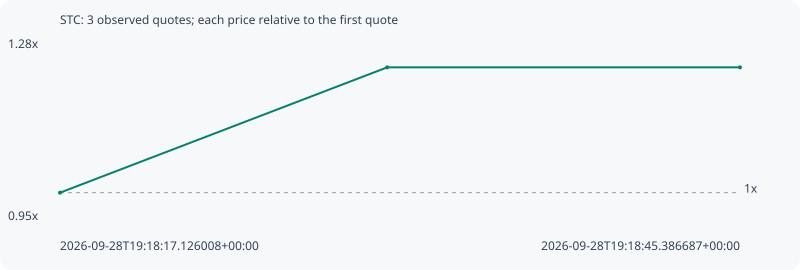

# STC

**solana** / `A2EyPshAzKGYG4QnY7ZSdHWkq7DpwiGnTnYgNBoQvjR1`

[All tokens](README.md) · [Market window](../README.md)

## Native assessments

This contract is in the quote cohort; it has no native model assessment in this window.

## Series 8dd0c4143f57fe225fad

Pool: `not supplied`

[Complete series](../series/solana/8dd0c4143f57fe225fad.json)

Every dot is a captured quote. Lines connect observations; the curve ends at the last available quote.

| Peak | Final | Return | Maximum drawdown |
| ---: | ---: | ---: | ---: |
| 1.2292x | 1.2292x | +22.92% | 0.00% |

### Complete quote timeline

| Time (UTC) | Price (USD) | Multiple | Evidence |
| --- | ---: | ---: | --- |
| 2026-09-28T19:18:17.126008+00:00 | 5.69539e-06 | 1.0000x | `capture:5ed98f51-d1e1-422a-81df-4186a8b0a0a2:rank:95` |
| 2026-09-28T19:18:30.722167+00:00 | 7.00059e-06 | 1.2292x | `capture:9f88d118-9108-4dff-bbfc-246eaed5ce38:rank:93` |
| 2026-09-28T19:18:45.386687+00:00 | 7.00059e-06 | 1.2292x | `capture:f533100a-ce62-4457-9107-42e7601ea5d7:rank:90` |

### Exit-policy timeline

Calculated from captured quotes under the window policy. Native assessments are linked separately above.

| Time (UTC) | Action | Price (USD) | Evidence |
| --- | --- | ---: | --- |
| 2026-09-28T19:18:17.126008+00:00 | BUY | 5.69539e-06 | `capture:5ed98f51-d1e1-422a-81df-4186a8b0a0a2:rank:95` |
| 2026-09-28T19:18:30.722167+00:00 | HOLD | 7.00059e-06 | `capture:9f88d118-9108-4dff-bbfc-246eaed5ce38:rank:93` |
| 2026-09-28T19:18:45.386687+00:00 | HOLD | 7.00059e-06 | `capture:f533100a-ce62-4457-9107-42e7601ea5d7:rank:90` |
