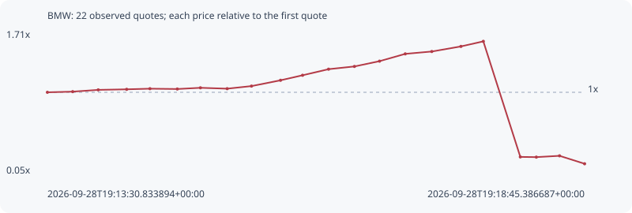

# BMW

**solana** / `Qh7JtiXEEA2GPUSNFEPMNpJKmbVduF3x9SLVtECpump`

[All tokens](README.md) · [Market window](../README.md)

## Native assessments

This contract is in the quote cohort; it has no native model assessment in this window.

## Series 23ccc1bf75051859234e

Pool: `not supplied`

[Complete series](../series/solana/23ccc1bf75051859234e.json)

Every dot is a captured quote. Lines connect observations; the curve ends at the last available quote.

| Peak | Final | Return | Maximum drawdown |
| ---: | ---: | ---: | ---: |
| 1.5934x | 0.1677x | -83.23% | 89.48% |

### Complete quote timeline

| Time (UTC) | Price (USD) | Multiple | Evidence |
| --- | ---: | ---: | --- |
| 2026-09-28T19:13:30.833894+00:00 | 0.000286382 | 1.0000x | `capture:2beb38a4-bfac-4502-bbc3-8c8c0f943007:rank:41` |
| 2026-09-28T19:13:45.640151+00:00 | 0.000288567 | 1.0076x | `capture:4d31b656-3ffe-4768-bef6-377adf019420:rank:17` |
| 2026-09-28T19:14:00.595194+00:00 | 0.000294481 | 1.0283x | `capture:2c78112b-48e7-4f74-8c2e-1cb8642a79dc:rank:10` |
| 2026-09-28T19:14:17.246316+00:00 | 0.000296307 | 1.0347x | `capture:7a923cde-d765-4388-a15c-4f47fde0a3b5:rank:10` |
| 2026-09-28T19:14:30.874732+00:00 | 0.000298443 | 1.0421x | `capture:fa585070-b1ae-4f9d-afbd-aa986f487793:rank:8` |
| 2026-09-28T19:14:46.892387+00:00 | 0.000297348 | 1.0383x | `capture:7d9e3e65-8bda-4696-b6d1-7a86825bd98c:rank:6` |
| 2026-09-28T19:15:00.432009+00:00 | 0.000301391 | 1.0524x | `capture:797f9a41-958a-44ba-ac57-3b9cacf5d06b:rank:3` |
| 2026-09-28T19:15:16.098308+00:00 | 0.000298469 | 1.0422x | `capture:ab2becb9-3f94-4a57-b9e8-472ad0998012:rank:2` |
| 2026-09-28T19:15:30.340579+00:00 | 0.000307111 | 1.0724x | `capture:564db5fc-5586-41d3-88fb-a9a955708f1d:rank:1` |
| 2026-09-28T19:15:47.323285+00:00 | 0.000326427 | 1.1398x | `capture:65003429-a569-4442-8d4f-b2c93db69061:rank:1` |
| 2026-09-28T19:16:00.259696+00:00 | 0.000343217 | 1.1985x | `capture:4236f8d5-90c4-4c9b-a73e-d6443ae3bf32:rank:1` |
| 2026-09-28T19:16:15.455827+00:00 | 0.000363486 | 1.2692x | `capture:acc657c6-9a43-46bf-986e-7b907c831cba:rank:1` |
| 2026-09-28T19:16:30.624202+00:00 | 0.00037262 | 1.3011x | `capture:0d391072-ec81-4bb7-9be0-0d6bbb801c70:rank:1` |
| 2026-09-28T19:16:45.311485+00:00 | 0.000390242 | 1.3627x | `capture:72cccbac-c3fe-4991-8f62-08c53849b146:rank:1` |
| 2026-09-28T19:17:00.368914+00:00 | 0.000414574 | 1.4476x | `capture:1232cf18-7088-40a1-9f55-ad9ae22b44f5:rank:1` |
| 2026-09-28T19:17:15.914647+00:00 | 0.000422417 | 1.4750x | `capture:9792e199-c0c2-4272-ac95-24501e4a3f79:rank:1` |
| 2026-09-28T19:17:32.965607+00:00 | 0.000439424 | 1.5344x | `capture:0f04cfe5-88a0-4a83-ae8d-85c5cb3cdc89:rank:0` |
| 2026-09-28T19:17:46.087880+00:00 | 0.000456322 | 1.5934x | `capture:ee91a1c6-bc99-4c7a-9cdc-bd6cb5478a9b:rank:0` |
| 2026-09-28T19:18:07.749963+00:00 | 7.08432e-05 | 0.2474x | `capture:b0fb1b47-4973-472f-9619-8480bc7d294e:rank:0` |
| 2026-09-28T19:18:17.126008+00:00 | 7.01941e-05 | 0.2451x | `capture:5ed98f51-d1e1-422a-81df-4186a8b0a0a2:rank:0` |
| 2026-09-28T19:18:30.722167+00:00 | 7.45089e-05 | 0.2602x | `capture:9f88d118-9108-4dff-bbfc-246eaed5ce38:rank:0` |
| 2026-09-28T19:18:45.386687+00:00 | 4.80187e-05 | 0.1677x | `capture:f533100a-ce62-4457-9107-42e7601ea5d7:rank:0` |

### Exit-policy timeline

Calculated from captured quotes under the window policy. Native assessments are linked separately above.

| Time (UTC) | Action | Price (USD) | Evidence |
| --- | --- | ---: | --- |
| 2026-09-28T19:13:30.833894+00:00 | BUY | 0.000286382 | `capture:2beb38a4-bfac-4502-bbc3-8c8c0f943007:rank:41` |
| 2026-09-28T19:13:45.640151+00:00 | HOLD | 0.000288567 | `capture:4d31b656-3ffe-4768-bef6-377adf019420:rank:17` |
| 2026-09-28T19:14:00.595194+00:00 | HOLD | 0.000294481 | `capture:2c78112b-48e7-4f74-8c2e-1cb8642a79dc:rank:10` |
| 2026-09-28T19:14:17.246316+00:00 | HOLD | 0.000296307 | `capture:7a923cde-d765-4388-a15c-4f47fde0a3b5:rank:10` |
| 2026-09-28T19:14:30.874732+00:00 | HOLD | 0.000298443 | `capture:fa585070-b1ae-4f9d-afbd-aa986f487793:rank:8` |
| 2026-09-28T19:14:46.892387+00:00 | HOLD | 0.000297348 | `capture:7d9e3e65-8bda-4696-b6d1-7a86825bd98c:rank:6` |
| 2026-09-28T19:15:00.432009+00:00 | HOLD | 0.000301391 | `capture:797f9a41-958a-44ba-ac57-3b9cacf5d06b:rank:3` |
| 2026-09-28T19:15:16.098308+00:00 | HOLD | 0.000298469 | `capture:ab2becb9-3f94-4a57-b9e8-472ad0998012:rank:2` |
| 2026-09-28T19:15:30.340579+00:00 | HOLD | 0.000307111 | `capture:564db5fc-5586-41d3-88fb-a9a955708f1d:rank:1` |
| 2026-09-28T19:15:47.323285+00:00 | HOLD | 0.000326427 | `capture:65003429-a569-4442-8d4f-b2c93db69061:rank:1` |
| 2026-09-28T19:16:00.259696+00:00 | HOLD | 0.000343217 | `capture:4236f8d5-90c4-4c9b-a73e-d6443ae3bf32:rank:1` |
| 2026-09-28T19:16:15.455827+00:00 | PROFIT | 0.000363486 | `capture:acc657c6-9a43-46bf-986e-7b907c831cba:rank:1` |
| 2026-09-28T19:16:30.624202+00:00 | HOLD_BAG | 0.00037262 | `capture:0d391072-ec81-4bb7-9be0-0d6bbb801c70:rank:1` |
| 2026-09-28T19:16:45.311485+00:00 | HOLD_BAG | 0.000390242 | `capture:72cccbac-c3fe-4991-8f62-08c53849b146:rank:1` |
| 2026-09-28T19:17:00.368914+00:00 | HOLD_BAG | 0.000414574 | `capture:1232cf18-7088-40a1-9f55-ad9ae22b44f5:rank:1` |
| 2026-09-28T19:17:15.914647+00:00 | HOLD_BAG | 0.000422417 | `capture:9792e199-c0c2-4272-ac95-24501e4a3f79:rank:1` |
| 2026-09-28T19:17:32.965607+00:00 | TP | 0.000439424 | `capture:0f04cfe5-88a0-4a83-ae8d-85c5cb3cdc89:rank:0` |
