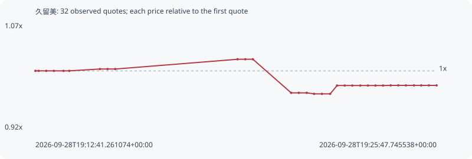

# 久留美

**bsc** / `0xfedf19759ba9c45b1a8345a2bde916b38acc7777`

[All tokens](README.md) · [Market window](../README.md)

## Native assessments

This contract is in the quote cohort; it has no native model assessment in this window.

## Series b46ae20e69dd21a137d4

Pool: `not supplied`

[Complete series](../series/bsc/b46ae20e69dd21a137d4.json)

Every dot is a captured quote. Lines connect observations; the curve ends at the last available quote.

| Peak | Final | Return | Maximum drawdown |
| ---: | ---: | ---: | ---: |
| 1.0162x | 0.9797x | -2.03% | 4.77% |

### Complete quote timeline

| Time (UTC) | Price (USD) | Multiple | Evidence |
| --- | ---: | ---: | --- |
| 2026-09-28T19:12:41.261074+00:00 | 0.00020789 | 1.0000x | `capture:795a88f0-804c-4f14-a3e8-ce8d9318f6df:rank:64` |
| 2026-09-28T19:12:47.639745+00:00 | 0.00020789 | 1.0000x | `capture:c2d8bd1a-9ed6-4d75-91ae-006bea65a635:rank:64` |
| 2026-09-28T19:13:02.549284+00:00 | 0.00020789 | 1.0000x | `capture:0aa38b41-b2e7-48f5-a3ba-8fd4a983fff8:rank:62` |
| 2026-09-28T19:13:17.511052+00:00 | 0.00020789 | 1.0000x | `capture:87e92f15-0601-4987-bd47-ae2e9f91de16:rank:64` |
| 2026-09-28T19:13:36.268178+00:00 | 0.00020789 | 1.0000x | `capture:577859f6-aadc-4653-b269-a860dbe8c41c:rank:71` |
| 2026-09-28T19:13:47.694462+00:00 | 0.00020789 | 1.0000x | `capture:4e60f1a9-1927-46db-ae10-f1b1530de61d:rank:83` |
| 2026-09-28T19:14:47.684789+00:00 | 0.000208422 | 1.0026x | `capture:abe58c43-9edf-4da1-b6d9-c4db72f14d79:rank:93` |
| 2026-09-28T19:15:02.698030+00:00 | 0.000208422 | 1.0026x | `capture:d9b7eccd-b77f-4cc6-8305-4a84d44c62e0:rank:95` |
| 2026-09-28T19:15:17.739331+00:00 | 0.000208422 | 1.0026x | `capture:08cc1e53-32bc-48e9-9abe-0b7caf40b440:rank:93` |
| 2026-09-28T19:19:17.488471+00:00 | 0.000211268 | 1.0162x | `capture:b87f439a-4825-4a6f-b17c-0b78464d9310:rank:98` |
| 2026-09-28T19:19:32.672995+00:00 | 0.000211268 | 1.0162x | `capture:ceae4194-4b79-45b3-9a66-758dd19e2a7b:rank:98` |
| 2026-09-28T19:19:47.615151+00:00 | 0.000211268 | 1.0162x | `capture:0dedf968-cc48-4422-8bbf-180ff2103dbf:rank:96` |
| 2026-09-28T19:21:02.616817+00:00 | 0.000201491 | 0.9692x | `capture:ec0d171f-d990-484a-94d1-c335d7f6e8fb:rank:83` |
| 2026-09-28T19:21:17.612081+00:00 | 0.000201491 | 0.9692x | `capture:cc46cbda-0be4-42ba-bcf4-4a03c9e7e894:rank:84` |
| 2026-09-28T19:21:33.217678+00:00 | 0.000201491 | 0.9692x | `capture:3a34cabb-e5ee-4ff6-9f92-f0839c39884f:rank:84` |
| 2026-09-28T19:21:47.485842+00:00 | 0.000201196 | 0.9678x | `capture:9e0730ff-182b-409c-b854-c06b993be570:rank:73` |
| 2026-09-28T19:22:02.883000+00:00 | 0.000201196 | 0.9678x | `capture:eb8228cb-dfba-443e-9576-ee214dcd3354:rank:71` |
| 2026-09-28T19:22:19.090071+00:00 | 0.000201196 | 0.9678x | `capture:30ef0b61-e0e1-4eba-95c6-de3dc48fe868:rank:72` |
| 2026-09-28T19:22:32.671189+00:00 | 0.000203622 | 0.9795x | `capture:5d031323-644d-4272-bacc-8a363d4b77cb:rank:67` |
| 2026-09-28T19:22:47.674643+00:00 | 0.000203622 | 0.9795x | `capture:c8838291-6f5a-42d9-9013-9d9421deb79e:rank:64` |
| 2026-09-28T19:23:02.516005+00:00 | 0.000203622 | 0.9795x | `capture:f8b60e63-80ce-442a-9ca7-659f2b5ca21d:rank:65` |
| 2026-09-28T19:23:18.123882+00:00 | 0.000203622 | 0.9795x | `capture:f689df34-2acf-42e7-a37b-1a7d50808302:rank:68` |
| 2026-09-28T19:23:33.140484+00:00 | 0.000203622 | 0.9795x | `capture:ef2304f7-c374-4b90-a3e4-d8976f05c226:rank:66` |
| 2026-09-28T19:23:47.927661+00:00 | 0.000203622 | 0.9795x | `capture:51aa913c-158f-4059-8727-ff1ace24834c:rank:76` |
| 2026-09-28T19:24:02.684719+00:00 | 0.000203622 | 0.9795x | `capture:77fa5264-b080-4409-8d15-3f5504293a7d:rank:75` |
| 2026-09-28T19:24:17.754261+00:00 | 0.000203663 | 0.9797x | `capture:9e642626-a894-4304-aad8-bfad3e85b1e6:rank:90` |
| 2026-09-28T19:24:32.694463+00:00 | 0.000203663 | 0.9797x | `capture:2934d705-4adf-40dc-b5ef-2f9f3edbbe61:rank:89` |
| 2026-09-28T19:24:47.591753+00:00 | 0.000203663 | 0.9797x | `capture:1cb45dcb-fe83-4fcc-8cfd-c5de8d369858:rank:92` |
| 2026-09-28T19:25:03.394485+00:00 | 0.000203663 | 0.9797x | `capture:f1b0620f-7caf-483d-8db4-440b4d786962:rank:91` |
| 2026-09-28T19:25:17.566680+00:00 | 0.000203663 | 0.9797x | `capture:89c3d45d-a145-4312-88dc-a4340e727616:rank:94` |
| 2026-09-28T19:25:32.640282+00:00 | 0.000203663 | 0.9797x | `capture:a41f01eb-b1b7-4ed5-a604-19b71e522502:rank:95` |
| 2026-09-28T19:25:47.745538+00:00 | 0.000203663 | 0.9797x | `capture:b20e5ea5-a03d-4b94-91ce-404a72f5de9b:rank:91` |

### Exit-policy timeline

Calculated from captured quotes under the window policy. Native assessments are linked separately above.

| Time (UTC) | Action | Price (USD) | Evidence |
| --- | --- | ---: | --- |
| 2026-09-28T19:12:41.261074+00:00 | BUY | 0.00020789 | `capture:795a88f0-804c-4f14-a3e8-ce8d9318f6df:rank:64` |
| 2026-09-28T19:12:47.639745+00:00 | HOLD | 0.00020789 | `capture:c2d8bd1a-9ed6-4d75-91ae-006bea65a635:rank:64` |
| 2026-09-28T19:13:02.549284+00:00 | HOLD | 0.00020789 | `capture:0aa38b41-b2e7-48f5-a3ba-8fd4a983fff8:rank:62` |
| 2026-09-28T19:13:17.511052+00:00 | HOLD | 0.00020789 | `capture:87e92f15-0601-4987-bd47-ae2e9f91de16:rank:64` |
| 2026-09-28T19:13:36.268178+00:00 | HOLD | 0.00020789 | `capture:577859f6-aadc-4653-b269-a860dbe8c41c:rank:71` |
| 2026-09-28T19:13:47.694462+00:00 | HOLD | 0.00020789 | `capture:4e60f1a9-1927-46db-ae10-f1b1530de61d:rank:83` |
| 2026-09-28T19:14:47.684789+00:00 | HOLD | 0.000208422 | `capture:abe58c43-9edf-4da1-b6d9-c4db72f14d79:rank:93` |
| 2026-09-28T19:15:02.698030+00:00 | HOLD | 0.000208422 | `capture:d9b7eccd-b77f-4cc6-8305-4a84d44c62e0:rank:95` |
| 2026-09-28T19:15:17.739331+00:00 | HOLD | 0.000208422 | `capture:08cc1e53-32bc-48e9-9abe-0b7caf40b440:rank:93` |
| 2026-09-28T19:19:17.488471+00:00 | HOLD | 0.000211268 | `capture:b87f439a-4825-4a6f-b17c-0b78464d9310:rank:98` |
| 2026-09-28T19:19:32.672995+00:00 | HOLD | 0.000211268 | `capture:ceae4194-4b79-45b3-9a66-758dd19e2a7b:rank:98` |
| 2026-09-28T19:19:47.615151+00:00 | HOLD | 0.000211268 | `capture:0dedf968-cc48-4422-8bbf-180ff2103dbf:rank:96` |
| 2026-09-28T19:21:02.616817+00:00 | HOLD | 0.000201491 | `capture:ec0d171f-d990-484a-94d1-c335d7f6e8fb:rank:83` |
| 2026-09-28T19:21:17.612081+00:00 | HOLD | 0.000201491 | `capture:cc46cbda-0be4-42ba-bcf4-4a03c9e7e894:rank:84` |
| 2026-09-28T19:21:33.217678+00:00 | HOLD | 0.000201491 | `capture:3a34cabb-e5ee-4ff6-9f92-f0839c39884f:rank:84` |
| 2026-09-28T19:21:47.485842+00:00 | HOLD | 0.000201196 | `capture:9e0730ff-182b-409c-b854-c06b993be570:rank:73` |
| 2026-09-28T19:22:02.883000+00:00 | HOLD | 0.000201196 | `capture:eb8228cb-dfba-443e-9576-ee214dcd3354:rank:71` |
| 2026-09-28T19:22:19.090071+00:00 | HOLD | 0.000201196 | `capture:30ef0b61-e0e1-4eba-95c6-de3dc48fe868:rank:72` |
| 2026-09-28T19:22:32.671189+00:00 | HOLD | 0.000203622 | `capture:5d031323-644d-4272-bacc-8a363d4b77cb:rank:67` |
| 2026-09-28T19:22:47.674643+00:00 | HOLD | 0.000203622 | `capture:c8838291-6f5a-42d9-9013-9d9421deb79e:rank:64` |
| 2026-09-28T19:23:02.516005+00:00 | HOLD | 0.000203622 | `capture:f8b60e63-80ce-442a-9ca7-659f2b5ca21d:rank:65` |
| 2026-09-28T19:23:18.123882+00:00 | HOLD | 0.000203622 | `capture:f689df34-2acf-42e7-a37b-1a7d50808302:rank:68` |
| 2026-09-28T19:23:33.140484+00:00 | HOLD | 0.000203622 | `capture:ef2304f7-c374-4b90-a3e4-d8976f05c226:rank:66` |
| 2026-09-28T19:23:47.927661+00:00 | HOLD | 0.000203622 | `capture:51aa913c-158f-4059-8727-ff1ace24834c:rank:76` |
| 2026-09-28T19:24:02.684719+00:00 | HOLD | 0.000203622 | `capture:77fa5264-b080-4409-8d15-3f5504293a7d:rank:75` |
| 2026-09-28T19:24:17.754261+00:00 | HOLD | 0.000203663 | `capture:9e642626-a894-4304-aad8-bfad3e85b1e6:rank:90` |
| 2026-09-28T19:24:32.694463+00:00 | HOLD | 0.000203663 | `capture:2934d705-4adf-40dc-b5ef-2f9f3edbbe61:rank:89` |
| 2026-09-28T19:24:47.591753+00:00 | HOLD | 0.000203663 | `capture:1cb45dcb-fe83-4fcc-8cfd-c5de8d369858:rank:92` |
| 2026-09-28T19:25:03.394485+00:00 | HOLD | 0.000203663 | `capture:f1b0620f-7caf-483d-8db4-440b4d786962:rank:91` |
| 2026-09-28T19:25:17.566680+00:00 | HOLD | 0.000203663 | `capture:89c3d45d-a145-4312-88dc-a4340e727616:rank:94` |
| 2026-09-28T19:25:32.640282+00:00 | HOLD | 0.000203663 | `capture:a41f01eb-b1b7-4ed5-a604-19b71e522502:rank:95` |
| 2026-09-28T19:25:47.745538+00:00 | HOLD | 0.000203663 | `capture:b20e5ea5-a03d-4b94-91ce-404a72f5de9b:rank:91` |
