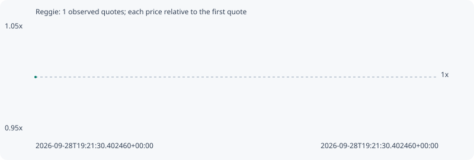

# Reggie

**solana** / `HHrJwqKNvad3ycshZ7LuaNftYfyyUZSuSN52hcYJyrM8`

[All tokens](README.md) · [Market window](../README.md)

## Native assessments

This contract is in the quote cohort; it has no native model assessment in this window.

## Series 4d80b9d202ed1eb4eeae

Pool: `not supplied`

[Complete series](../series/solana/4d80b9d202ed1eb4eeae.json)

Every dot is a captured quote. Lines connect observations; the curve ends at the last available quote.

Fewer than two quotes: return and drawdown are not calculated.

### Complete quote timeline

| Time (UTC) | Price (USD) | Multiple | Evidence |
| --- | ---: | ---: | --- |
| 2026-09-28T19:21:30.402460+00:00 | 4.63533e-06 | 1.0000x | `capture:d926629b-2050-4e50-a602-1638c6205870:rank:96` |

### Exit-policy timeline

Calculated from captured quotes under the window policy. Native assessments are linked separately above.

| Time (UTC) | Action | Price (USD) | Evidence |
| --- | --- | ---: | --- |
