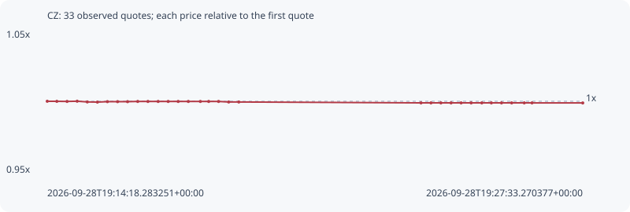

# CZ

**bsc** / `0x7a848a5a8169aa6a2f603d056a749f924f504444`

[All tokens](README.md) · [Market window](../README.md)

## Native assessments

- [2026-09-28T19:14:18.283251Z](../cases/c8071017b9ee3a94.md): source parameters and model answers.

## Series 8e86c6ae68711c954e02

Pool: `not supplied`

[Complete series](../series/bsc/8e86c6ae68711c954e02.json)

Every dot is a captured quote. Lines connect observations; the curve ends at the last available quote.

| Peak | Final | Return | Maximum drawdown |
| ---: | ---: | ---: | ---: |
| 1.0000x | 0.9988x | -0.12% | 0.12% |

### Complete quote timeline

| Time (UTC) | Price (USD) | Multiple | Evidence |
| --- | ---: | ---: | --- |
| 2026-09-28T19:14:18.283251+00:00 | 0.00238455 | 1.0000x | `capture:68440f72-d36c-4c27-867d-03a757db141f:rank:39` |
| 2026-09-28T19:14:32.527710+00:00 | 0.00238443 | 0.9999x | `capture:4f6a3c72-f6f0-49d7-97fe-a760f1872e88:rank:33` |
| 2026-09-28T19:14:47.684789+00:00 | 0.00238427 | 0.9999x | `capture:abe58c43-9edf-4da1-b6d9-c4db72f14d79:rank:30` |
| 2026-09-28T19:15:02.698030+00:00 | 0.00238463 | 1.0000x | `capture:d9b7eccd-b77f-4cc6-8305-4a84d44c62e0:rank:28` |
| 2026-09-28T19:15:17.739331+00:00 | 0.00238341 | 0.9995x | `capture:08cc1e53-32bc-48e9-9abe-0b7caf40b440:rank:26` |
| 2026-09-28T19:15:32.749915+00:00 | 0.00238312 | 0.9994x | `capture:81e75e19-4c52-4e91-ba7d-af89c6539b19:rank:24` |
| 2026-09-28T19:15:47.591170+00:00 | 0.00238388 | 0.9997x | `capture:98b3c66b-c70a-4987-9342-10165ae058ec:rank:24` |
| 2026-09-28T19:16:02.665866+00:00 | 0.00238388 | 0.9997x | `capture:831c8e00-640d-4942-9ad6-ae68e842f3cf:rank:25` |
| 2026-09-28T19:16:17.512218+00:00 | 0.00238388 | 0.9997x | `capture:a4477278-80c9-4a7a-9a8f-66687623072c:rank:24` |
| 2026-09-28T19:16:32.607943+00:00 | 0.00238422 | 0.9999x | `capture:4487eb62-651f-462e-aece-4003e9e61067:rank:24` |
| 2026-09-28T19:16:47.751534+00:00 | 0.00238422 | 0.9999x | `capture:39d9c9d0-d8a7-439e-86b7-5fff162807b9:rank:27` |
| 2026-09-28T19:17:02.908604+00:00 | 0.00238422 | 0.9999x | `capture:16fde76e-cae4-4138-b96e-57b291931df8:rank:29` |
| 2026-09-28T19:17:17.816055+00:00 | 0.00238422 | 0.9999x | `capture:7f9359fa-2f23-4e78-9500-f9df7d85a6b2:rank:30` |
| 2026-09-28T19:17:32.654140+00:00 | 0.00238422 | 0.9999x | `capture:4e95b3e2-d20d-4729-ac41-d7699561b97b:rank:31` |
| 2026-09-28T19:17:47.717594+00:00 | 0.00238422 | 0.9999x | `capture:2cc72c7e-c2ae-4eb2-929b-e80f3d8c4e15:rank:38` |
| 2026-09-28T19:18:05.582121+00:00 | 0.00238422 | 0.9999x | `capture:07127a86-393c-4e05-bde5-d28a70a854fb:rank:42` |
| 2026-09-28T19:18:17.953086+00:00 | 0.00238422 | 0.9999x | `capture:ca903b0a-a9a8-4246-873f-5115402fbf9c:rank:42` |
| 2026-09-28T19:18:32.607444+00:00 | 0.00238422 | 0.9999x | `capture:86009bbc-85b0-465e-8657-55be8d6c15de:rank:43` |
| 2026-09-28T19:18:47.632598+00:00 | 0.0023833 | 0.9995x | `capture:bfa4352f-2279-41ec-a6fd-d3e101a21181:rank:41` |
| 2026-09-28T19:19:02.666276+00:00 | 0.0023833 | 0.9995x | `capture:6fe1da90-a254-48b3-b112-ab24c6060e81:rank:41` |
| 2026-09-28T19:23:33.140484+00:00 | 0.00238177 | 0.9988x | `capture:ef2304f7-c374-4b90-a3e4-d8976f05c226:rank:46` |
| 2026-09-28T19:23:47.927661+00:00 | 0.00238177 | 0.9988x | `capture:51aa913c-158f-4059-8727-ff1ace24834c:rank:47` |
| 2026-09-28T19:24:02.684719+00:00 | 0.00238177 | 0.9988x | `capture:77fa5264-b080-4409-8d15-3f5504293a7d:rank:50` |
| 2026-09-28T19:24:17.754261+00:00 | 0.00238177 | 0.9988x | `capture:9e642626-a894-4304-aad8-bfad3e85b1e6:rank:51` |
| 2026-09-28T19:24:32.694463+00:00 | 0.00238177 | 0.9988x | `capture:2934d705-4adf-40dc-b5ef-2f9f3edbbe61:rank:61` |
| 2026-09-28T19:24:47.591753+00:00 | 0.00238177 | 0.9988x | `capture:1cb45dcb-fe83-4fcc-8cfd-c5de8d369858:rank:67` |
| 2026-09-28T19:25:03.394485+00:00 | 0.00238177 | 0.9988x | `capture:f1b0620f-7caf-483d-8db4-440b4d786962:rank:67` |
| 2026-09-28T19:25:17.566680+00:00 | 0.00238177 | 0.9988x | `capture:89c3d45d-a145-4312-88dc-a4340e727616:rank:68` |
| 2026-09-28T19:25:32.640282+00:00 | 0.00238177 | 0.9988x | `capture:a41f01eb-b1b7-4ed5-a604-19b71e522502:rank:75` |
| 2026-09-28T19:25:47.745538+00:00 | 0.00238177 | 0.9988x | `capture:b20e5ea5-a03d-4b94-91ce-404a72f5de9b:rank:73` |
| 2026-09-28T19:26:06.431923+00:00 | 0.00238177 | 0.9988x | `capture:a3278748-b5f3-45be-a966-ab473520d9c2:rank:83` |
| 2026-09-28T19:26:17.917162+00:00 | 0.00238177 | 0.9988x | `capture:3b80c987-c82b-4a3e-8f0b-d3017a78edcb:rank:81` |
| 2026-09-28T19:27:33.270377+00:00 | 0.00238168 | 0.9988x | `capture:1cb6d037-a95b-477e-be82-4cc75b729c8b:rank:93` |

### Exit-policy timeline

Calculated from captured quotes under the window policy. Native assessments are linked separately above.

| Time (UTC) | Action | Price (USD) | Evidence |
| --- | --- | ---: | --- |
| 2026-09-28T19:14:18.283251+00:00 | BUY | 0.00238455 | `capture:68440f72-d36c-4c27-867d-03a757db141f:rank:39` |
| 2026-09-28T19:14:32.527710+00:00 | HOLD | 0.00238443 | `capture:4f6a3c72-f6f0-49d7-97fe-a760f1872e88:rank:33` |
| 2026-09-28T19:14:47.684789+00:00 | HOLD | 0.00238427 | `capture:abe58c43-9edf-4da1-b6d9-c4db72f14d79:rank:30` |
| 2026-09-28T19:15:02.698030+00:00 | HOLD | 0.00238463 | `capture:d9b7eccd-b77f-4cc6-8305-4a84d44c62e0:rank:28` |
| 2026-09-28T19:15:17.739331+00:00 | HOLD | 0.00238341 | `capture:08cc1e53-32bc-48e9-9abe-0b7caf40b440:rank:26` |
| 2026-09-28T19:15:32.749915+00:00 | HOLD | 0.00238312 | `capture:81e75e19-4c52-4e91-ba7d-af89c6539b19:rank:24` |
| 2026-09-28T19:15:47.591170+00:00 | HOLD | 0.00238388 | `capture:98b3c66b-c70a-4987-9342-10165ae058ec:rank:24` |
| 2026-09-28T19:16:02.665866+00:00 | HOLD | 0.00238388 | `capture:831c8e00-640d-4942-9ad6-ae68e842f3cf:rank:25` |
| 2026-09-28T19:16:17.512218+00:00 | HOLD | 0.00238388 | `capture:a4477278-80c9-4a7a-9a8f-66687623072c:rank:24` |
| 2026-09-28T19:16:32.607943+00:00 | HOLD | 0.00238422 | `capture:4487eb62-651f-462e-aece-4003e9e61067:rank:24` |
| 2026-09-28T19:16:47.751534+00:00 | HOLD | 0.00238422 | `capture:39d9c9d0-d8a7-439e-86b7-5fff162807b9:rank:27` |
| 2026-09-28T19:17:02.908604+00:00 | HOLD | 0.00238422 | `capture:16fde76e-cae4-4138-b96e-57b291931df8:rank:29` |
| 2026-09-28T19:17:17.816055+00:00 | HOLD | 0.00238422 | `capture:7f9359fa-2f23-4e78-9500-f9df7d85a6b2:rank:30` |
| 2026-09-28T19:17:32.654140+00:00 | HOLD | 0.00238422 | `capture:4e95b3e2-d20d-4729-ac41-d7699561b97b:rank:31` |
| 2026-09-28T19:17:47.717594+00:00 | HOLD | 0.00238422 | `capture:2cc72c7e-c2ae-4eb2-929b-e80f3d8c4e15:rank:38` |
| 2026-09-28T19:18:05.582121+00:00 | HOLD | 0.00238422 | `capture:07127a86-393c-4e05-bde5-d28a70a854fb:rank:42` |
| 2026-09-28T19:18:17.953086+00:00 | HOLD | 0.00238422 | `capture:ca903b0a-a9a8-4246-873f-5115402fbf9c:rank:42` |
| 2026-09-28T19:18:32.607444+00:00 | HOLD | 0.00238422 | `capture:86009bbc-85b0-465e-8657-55be8d6c15de:rank:43` |
| 2026-09-28T19:18:47.632598+00:00 | HOLD | 0.0023833 | `capture:bfa4352f-2279-41ec-a6fd-d3e101a21181:rank:41` |
| 2026-09-28T19:19:02.666276+00:00 | HOLD | 0.0023833 | `capture:6fe1da90-a254-48b3-b112-ab24c6060e81:rank:41` |
| 2026-09-28T19:23:33.140484+00:00 | HOLD | 0.00238177 | `capture:ef2304f7-c374-4b90-a3e4-d8976f05c226:rank:46` |
| 2026-09-28T19:23:47.927661+00:00 | HOLD | 0.00238177 | `capture:51aa913c-158f-4059-8727-ff1ace24834c:rank:47` |
| 2026-09-28T19:24:02.684719+00:00 | HOLD | 0.00238177 | `capture:77fa5264-b080-4409-8d15-3f5504293a7d:rank:50` |
| 2026-09-28T19:24:17.754261+00:00 | HOLD | 0.00238177 | `capture:9e642626-a894-4304-aad8-bfad3e85b1e6:rank:51` |
| 2026-09-28T19:24:32.694463+00:00 | HOLD | 0.00238177 | `capture:2934d705-4adf-40dc-b5ef-2f9f3edbbe61:rank:61` |
| 2026-09-28T19:24:47.591753+00:00 | HOLD | 0.00238177 | `capture:1cb45dcb-fe83-4fcc-8cfd-c5de8d369858:rank:67` |
| 2026-09-28T19:25:03.394485+00:00 | HOLD | 0.00238177 | `capture:f1b0620f-7caf-483d-8db4-440b4d786962:rank:67` |
| 2026-09-28T19:25:17.566680+00:00 | HOLD | 0.00238177 | `capture:89c3d45d-a145-4312-88dc-a4340e727616:rank:68` |
| 2026-09-28T19:25:32.640282+00:00 | HOLD | 0.00238177 | `capture:a41f01eb-b1b7-4ed5-a604-19b71e522502:rank:75` |
| 2026-09-28T19:25:47.745538+00:00 | HOLD | 0.00238177 | `capture:b20e5ea5-a03d-4b94-91ce-404a72f5de9b:rank:73` |
| 2026-09-28T19:26:06.431923+00:00 | HOLD | 0.00238177 | `capture:a3278748-b5f3-45be-a966-ab473520d9c2:rank:83` |
| 2026-09-28T19:26:17.917162+00:00 | HOLD | 0.00238177 | `capture:3b80c987-c82b-4a3e-8f0b-d3017a78edcb:rank:81` |
| 2026-09-28T19:27:33.270377+00:00 | HOLD | 0.00238168 | `capture:1cb6d037-a95b-477e-be82-4cc75b729c8b:rank:93` |
