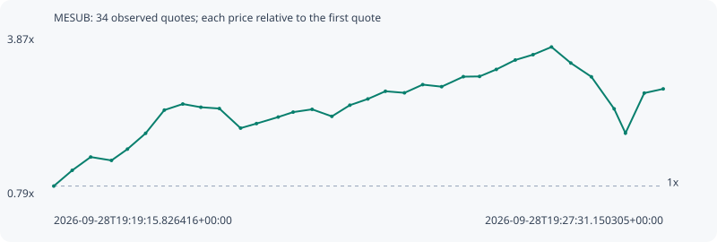

# MESUB

**solana** / `BcyEzKVBXkPAX6651VV2GkuVyAUS7kVSwTPaamGrpump`

[All tokens](README.md) · [Market window](../README.md)

## Native assessments

This contract is in the quote cohort; it has no native model assessment in this window.

## Series b72a35b94f13c30ea5e3

Pool: `not supplied`

[Complete series](../series/solana/b72a35b94f13c30ea5e3.json)

Every dot is a captured quote. Lines connect observations; the curve ends at the last available quote.

| Peak | Final | Return | Maximum drawdown |
| ---: | ---: | ---: | ---: |
| 3.6563x | 2.8559x | +185.59% | 45.01% |

### Complete quote timeline

| Time (UTC) | Price (USD) | Multiple | Evidence |
| --- | ---: | ---: | --- |
| 2026-09-28T19:19:15.826416+00:00 | 1.30329e-05 | 1.0000x | `capture:ba1dc6a3-b8b7-461a-8110-8490f03539a5:rank:62` |
| 2026-09-28T19:19:30.814098+00:00 | 1.69466e-05 | 1.3003x | `capture:b25d90dc-c8db-4388-8a2b-d06541e5320f:rank:38` |
| 2026-09-28T19:19:45.817199+00:00 | 2.02642e-05 | 1.5548x | `capture:722d1b7b-ef4f-4ac5-883c-0557bae2b60b:rank:31` |
| 2026-09-28T19:20:02.715590+00:00 | 1.9414e-05 | 1.4896x | `capture:60ff17d8-3b18-4f61-9bc7-006afd324cf2:rank:31` |
| 2026-09-28T19:20:15.699547+00:00 | 2.22302e-05 | 1.7057x | `capture:10a94828-637f-4580-a9f7-2fbd34d8589a:rank:29` |
| 2026-09-28T19:20:30.480194+00:00 | 2.61678e-05 | 2.0078x | `capture:54722132-db1d-4a2b-8c1c-2b0e71d01430:rank:28` |
| 2026-09-28T19:20:45.683165+00:00 | 3.19439e-05 | 2.4510x | `capture:17963a37-fd65-46b6-8e1c-350082721f8c:rank:28` |
| 2026-09-28T19:21:00.690136+00:00 | 3.34587e-05 | 2.5672x | `capture:f2ff842d-38e9-4cbe-a281-98c17d5a5672:rank:25` |
| 2026-09-28T19:21:15.372716+00:00 | 3.26567e-05 | 2.5057x | `capture:a923b968-a768-495e-ae33-6de2042c551f:rank:21` |
| 2026-09-28T19:21:30.402460+00:00 | 3.23293e-05 | 2.4806x | `capture:d926629b-2050-4e50-a602-1638c6205870:rank:21` |
| 2026-09-28T19:21:47.649380+00:00 | 2.74514e-05 | 2.1063x | `capture:0799ec6d-0e89-46b5-ae88-5695bf6c5fc3:rank:21` |
| 2026-09-28T19:22:00.569928+00:00 | 2.85892e-05 | 2.1936x | `capture:263cda40-4b31-4b2d-b168-fa4310edb46d:rank:18` |
| 2026-09-28T19:22:18.240717+00:00 | 3.021e-05 | 2.3180x | `capture:546b2c55-1845-4da7-bc9c-4439cd0ccdba:rank:17` |
| 2026-09-28T19:22:30.371968+00:00 | 3.14413e-05 | 2.4125x | `capture:507d17cb-af67-4a81-a2b2-d5ddfbc40021:rank:16` |
| 2026-09-28T19:22:45.783808+00:00 | 3.21306e-05 | 2.4653x | `capture:9558d322-c429-480b-885f-82f4481c8506:rank:15` |
| 2026-09-28T19:23:01.833252+00:00 | 3.03785e-05 | 2.3309x | `capture:c5462412-2da1-4432-8949-8fcd1492c57f:rank:13` |
| 2026-09-28T19:23:16.460099+00:00 | 3.31645e-05 | 2.5447x | `capture:2d456a2a-6755-4e1d-9a80-b6e3b2d44ec1:rank:13` |
| 2026-09-28T19:23:31.092727+00:00 | 3.47139e-05 | 2.6636x | `capture:0e687519-8b01-4d7e-b48c-e2ec34135d17:rank:13` |
| 2026-09-28T19:23:45.375171+00:00 | 3.66299e-05 | 2.8106x | `capture:1b404fa0-870b-4e7c-bafd-c3ef241c5093:rank:13` |
| 2026-09-28T19:24:00.852400+00:00 | 3.62405e-05 | 2.7807x | `capture:5205c587-4734-452c-b758-46c4814dded1:rank:14` |
| 2026-09-28T19:24:15.655418+00:00 | 3.82808e-05 | 2.9372x | `capture:5b9df0f6-51c0-4dbb-9de7-7df7a46bfee0:rank:14` |
| 2026-09-28T19:24:31.056437+00:00 | 3.77722e-05 | 2.8982x | `capture:971b5dda-397d-4fe7-b49e-94713bb088df:rank:14` |
| 2026-09-28T19:24:48.687179+00:00 | 4.02613e-05 | 3.0892x | `capture:feb72cbd-a170-4ba3-8a11-eb1df1686719:rank:14` |
| 2026-09-28T19:25:01.877958+00:00 | 4.03225e-05 | 3.0939x | `capture:fd6d01ae-d246-439e-ac58-27ae75880eb9:rank:14` |
| 2026-09-28T19:25:15.488701+00:00 | 4.20666e-05 | 3.2277x | `capture:b8fee87c-9981-475c-930b-99c255910a9f:rank:13` |
| 2026-09-28T19:25:30.900173+00:00 | 4.44131e-05 | 3.4078x | `capture:7f757769-25c3-429a-81d0-c6b2ee45ee15:rank:12` |
| 2026-09-28T19:25:45.342895+00:00 | 4.57382e-05 | 3.5094x | `capture:0ca3656d-ce8c-444b-8f77-acf34c08a1f4:rank:12` |
| 2026-09-28T19:26:00.340634+00:00 | 4.76524e-05 | 3.6563x | `capture:5b3728c5-aff9-43f3-bbb5-25b251825caa:rank:11` |
| 2026-09-28T19:26:16.031602+00:00 | 4.36575e-05 | 3.3498x | `capture:bb8d4bfc-85e1-4d55-a2ff-e47193bcce5f:rank:11` |
| 2026-09-28T19:26:32.771713+00:00 | 4.0227e-05 | 3.0866x | `capture:2fed7296-b3d1-4ba6-8398-799ee55f1f2b:rank:11` |
| 2026-09-28T19:26:51.267717+00:00 | 3.22557e-05 | 2.4749x | `capture:4cc162c2-aa4a-403b-a901-4bb5058380d6:rank:10` |
| 2026-09-28T19:27:00.453239+00:00 | 2.62064e-05 | 2.0108x | `capture:4273fbb8-5342-4e37-8d61-ced6b88e542d:rank:10` |
| 2026-09-28T19:27:15.715818+00:00 | 3.61759e-05 | 2.7757x | `capture:d04c9116-4617-4b61-8b98-5489321cd1cc:rank:9` |
| 2026-09-28T19:27:31.150305+00:00 | 3.72213e-05 | 2.8559x | `capture:7cad37e8-83d3-4438-8055-245db6707e2e:rank:8` |

### Exit-policy timeline

Calculated from captured quotes under the window policy. Native assessments are linked separately above.

| Time (UTC) | Action | Price (USD) | Evidence |
| --- | --- | ---: | --- |
| 2026-09-28T19:19:15.826416+00:00 | BUY | 1.30329e-05 | `capture:ba1dc6a3-b8b7-461a-8110-8490f03539a5:rank:62` |
| 2026-09-28T19:19:30.814098+00:00 | PROFIT | 1.69466e-05 | `capture:b25d90dc-c8db-4388-8a2b-d06541e5320f:rank:38` |
| 2026-09-28T19:19:45.817199+00:00 | TP | 2.02642e-05 | `capture:722d1b7b-ef4f-4ac5-883c-0557bae2b60b:rank:31` |
