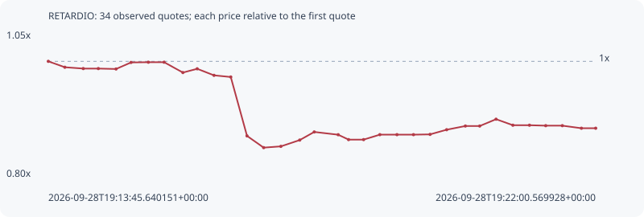

# RETARDIO

**solana** / `CSRRgTwf9o5KLgguS2M16aEAhV5PUUzfshrAAQ8opump`

[All tokens](README.md) · [Market window](../README.md)

## Native assessments

This contract is in the quote cohort; it has no native model assessment in this window.

## Series 6cd9dfa0675736af92f0

Pool: `not supplied`

[Complete series](../series/solana/6cd9dfa0675736af92f0.json)

Every dot is a captured quote. Lines connect observations; the curve ends at the last available quote.

| Peak | Final | Return | Maximum drawdown |
| ---: | ---: | ---: | ---: |
| 1.0000x | 0.8854x | -11.46% | 14.78% |

### Complete quote timeline

| Time (UTC) | Price (USD) | Multiple | Evidence |
| --- | ---: | ---: | --- |
| 2026-09-28T19:13:45.640151+00:00 | 0.00194221 | 1.0000x | `capture:4d31b656-3ffe-4768-bef6-377adf019420:rank:87` |
| 2026-09-28T19:14:00.595194+00:00 | 0.00192256 | 0.9899x | `capture:2c78112b-48e7-4f74-8c2e-1cb8642a79dc:rank:90` |
| 2026-09-28T19:14:17.246316+00:00 | 0.00191815 | 0.9876x | `capture:7a923cde-d765-4388-a15c-4f47fde0a3b5:rank:88` |
| 2026-09-28T19:14:30.874732+00:00 | 0.00191815 | 0.9876x | `capture:fa585070-b1ae-4f9d-afbd-aa986f487793:rank:90` |
| 2026-09-28T19:14:46.892387+00:00 | 0.00191673 | 0.9869x | `capture:7d9e3e65-8bda-4696-b6d1-7a86825bd98c:rank:89` |
| 2026-09-28T19:15:00.432009+00:00 | 0.00193857 | 0.9981x | `capture:797f9a41-958a-44ba-ac57-3b9cacf5d06b:rank:92` |
| 2026-09-28T19:15:16.098308+00:00 | 0.00193931 | 0.9985x | `capture:ab2becb9-3f94-4a57-b9e8-472ad0998012:rank:92` |
| 2026-09-28T19:15:30.340579+00:00 | 0.00193931 | 0.9985x | `capture:564db5fc-5586-41d3-88fb-a9a955708f1d:rank:93` |
| 2026-09-28T19:15:47.323285+00:00 | 0.00190489 | 0.9808x | `capture:65003429-a569-4442-8d4f-b2c93db69061:rank:92` |
| 2026-09-28T19:16:00.259696+00:00 | 0.00191739 | 0.9872x | `capture:4236f8d5-90c4-4c9b-a73e-d6443ae3bf32:rank:93` |
| 2026-09-28T19:16:15.455827+00:00 | 0.00189561 | 0.9760x | `capture:acc657c6-9a43-46bf-986e-7b907c831cba:rank:93` |
| 2026-09-28T19:16:30.624202+00:00 | 0.00189008 | 0.9732x | `capture:0d391072-ec81-4bb7-9be0-0d6bbb801c70:rank:89` |
| 2026-09-28T19:16:45.311485+00:00 | 0.0016941 | 0.8723x | `capture:72cccbac-c3fe-4991-8f62-08c53849b146:rank:77` |
| 2026-09-28T19:17:00.368914+00:00 | 0.00165508 | 0.8522x | `capture:1232cf18-7088-40a1-9f55-ad9ae22b44f5:rank:72` |
| 2026-09-28T19:17:15.914647+00:00 | 0.00165928 | 0.8543x | `capture:9792e199-c0c2-4272-ac95-24501e4a3f79:rank:71` |
| 2026-09-28T19:17:32.965607+00:00 | 0.00168022 | 0.8651x | `capture:0f04cfe5-88a0-4a83-ae8d-85c5cb3cdc89:rank:71` |
| 2026-09-28T19:17:46.087880+00:00 | 0.00170725 | 0.8790x | `capture:ee91a1c6-bc99-4c7a-9cdc-bd6cb5478a9b:rank:68` |
| 2026-09-28T19:18:07.749963+00:00 | 0.00169804 | 0.8743x | `capture:b0fb1b47-4973-472f-9619-8480bc7d294e:rank:72` |
| 2026-09-28T19:18:17.126008+00:00 | 0.00168176 | 0.8659x | `capture:5ed98f51-d1e1-422a-81df-4186a8b0a0a2:rank:69` |
| 2026-09-28T19:18:30.722167+00:00 | 0.00168176 | 0.8659x | `capture:9f88d118-9108-4dff-bbfc-246eaed5ce38:rank:73` |
| 2026-09-28T19:18:45.386687+00:00 | 0.00169824 | 0.8744x | `capture:f533100a-ce62-4457-9107-42e7601ea5d7:rank:74` |
| 2026-09-28T19:19:00.883835+00:00 | 0.00169824 | 0.8744x | `capture:a2495d99-5671-4c7e-b87c-48f48d90f2f2:rank:85` |
| 2026-09-28T19:19:15.826416+00:00 | 0.00169824 | 0.8744x | `capture:ba1dc6a3-b8b7-461a-8110-8490f03539a5:rank:89` |
| 2026-09-28T19:19:30.814098+00:00 | 0.00169917 | 0.8749x | `capture:b25d90dc-c8db-4388-8a2b-d06541e5320f:rank:89` |
| 2026-09-28T19:19:45.817199+00:00 | 0.0017147 | 0.8829x | `capture:722d1b7b-ef4f-4ac5-883c-0557bae2b60b:rank:85` |
| 2026-09-28T19:20:02.715590+00:00 | 0.00172698 | 0.8892x | `capture:60ff17d8-3b18-4f61-9bc7-006afd324cf2:rank:82` |
| 2026-09-28T19:20:15.699547+00:00 | 0.00172698 | 0.8892x | `capture:10a94828-637f-4580-a9f7-2fbd34d8589a:rank:84` |
| 2026-09-28T19:20:30.480194+00:00 | 0.0017497 | 0.9009x | `capture:54722132-db1d-4a2b-8c1c-2b0e71d01430:rank:80` |
| 2026-09-28T19:20:45.683165+00:00 | 0.00172968 | 0.8906x | `capture:17963a37-fd65-46b6-8e1c-350082721f8c:rank:81` |
| 2026-09-28T19:21:00.690136+00:00 | 0.00172968 | 0.8906x | `capture:f2ff842d-38e9-4cbe-a281-98c17d5a5672:rank:82` |
| 2026-09-28T19:21:15.372716+00:00 | 0.00172815 | 0.8898x | `capture:a923b968-a768-495e-ae33-6de2042c551f:rank:74` |
| 2026-09-28T19:21:30.402460+00:00 | 0.00172815 | 0.8898x | `capture:d926629b-2050-4e50-a602-1638c6205870:rank:71` |
| 2026-09-28T19:21:47.649380+00:00 | 0.00171964 | 0.8854x | `capture:0799ec6d-0e89-46b5-ae88-5695bf6c5fc3:rank:94` |
| 2026-09-28T19:22:00.569928+00:00 | 0.00171964 | 0.8854x | `capture:263cda40-4b31-4b2d-b168-fa4310edb46d:rank:94` |

### Exit-policy timeline

Calculated from captured quotes under the window policy. Native assessments are linked separately above.

| Time (UTC) | Action | Price (USD) | Evidence |
| --- | --- | ---: | --- |
| 2026-09-28T19:13:45.640151+00:00 | BUY | 0.00194221 | `capture:4d31b656-3ffe-4768-bef6-377adf019420:rank:87` |
| 2026-09-28T19:14:00.595194+00:00 | HOLD | 0.00192256 | `capture:2c78112b-48e7-4f74-8c2e-1cb8642a79dc:rank:90` |
| 2026-09-28T19:14:17.246316+00:00 | HOLD | 0.00191815 | `capture:7a923cde-d765-4388-a15c-4f47fde0a3b5:rank:88` |
| 2026-09-28T19:14:30.874732+00:00 | HOLD | 0.00191815 | `capture:fa585070-b1ae-4f9d-afbd-aa986f487793:rank:90` |
| 2026-09-28T19:14:46.892387+00:00 | HOLD | 0.00191673 | `capture:7d9e3e65-8bda-4696-b6d1-7a86825bd98c:rank:89` |
| 2026-09-28T19:15:00.432009+00:00 | HOLD | 0.00193857 | `capture:797f9a41-958a-44ba-ac57-3b9cacf5d06b:rank:92` |
| 2026-09-28T19:15:16.098308+00:00 | HOLD | 0.00193931 | `capture:ab2becb9-3f94-4a57-b9e8-472ad0998012:rank:92` |
| 2026-09-28T19:15:30.340579+00:00 | HOLD | 0.00193931 | `capture:564db5fc-5586-41d3-88fb-a9a955708f1d:rank:93` |
| 2026-09-28T19:15:47.323285+00:00 | HOLD | 0.00190489 | `capture:65003429-a569-4442-8d4f-b2c93db69061:rank:92` |
| 2026-09-28T19:16:00.259696+00:00 | HOLD | 0.00191739 | `capture:4236f8d5-90c4-4c9b-a73e-d6443ae3bf32:rank:93` |
| 2026-09-28T19:16:15.455827+00:00 | HOLD | 0.00189561 | `capture:acc657c6-9a43-46bf-986e-7b907c831cba:rank:93` |
| 2026-09-28T19:16:30.624202+00:00 | HOLD | 0.00189008 | `capture:0d391072-ec81-4bb7-9be0-0d6bbb801c70:rank:89` |
| 2026-09-28T19:16:45.311485+00:00 | SL | 0.0016941 | `capture:72cccbac-c3fe-4991-8f62-08c53849b146:rank:77` |
