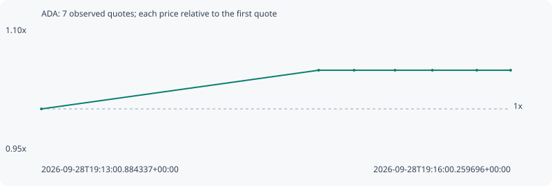

# ADA

**solana** / `5bvPcMyfbYunNqGEn7y3cjSTTDx7t9MTDFynGZZrLN2k`

[All tokens](README.md) · [Market window](../README.md)

## Native assessments

This contract is in the quote cohort; it has no native model assessment in this window.

## Series 7f22238cfa1133b7ff1f

Pool: `not supplied`

[Complete series](../series/solana/7f22238cfa1133b7ff1f.json)

Every dot is a captured quote. Lines connect observations; the curve ends at the last available quote.

| Peak | Final | Return | Maximum drawdown |
| ---: | ---: | ---: | ---: |
| 1.0453x | 1.0453x | +4.53% | 0.00% |

### Complete quote timeline

| Time (UTC) | Price (USD) | Multiple | Evidence |
| --- | ---: | ---: | --- |
| 2026-09-28T19:13:00.884337+00:00 | 6.48831e-06 | 1.0000x | `capture:5867894f-39b4-4bcd-bd87-86394c63aab4:rank:99` |
| 2026-09-28T19:14:46.892387+00:00 | 6.78248e-06 | 1.0453x | `capture:7d9e3e65-8bda-4696-b6d1-7a86825bd98c:rank:95` |
| 2026-09-28T19:15:00.432009+00:00 | 6.78248e-06 | 1.0453x | `capture:797f9a41-958a-44ba-ac57-3b9cacf5d06b:rank:96` |
| 2026-09-28T19:15:16.098308+00:00 | 6.78248e-06 | 1.0453x | `capture:ab2becb9-3f94-4a57-b9e8-472ad0998012:rank:93` |
| 2026-09-28T19:15:30.340579+00:00 | 6.78248e-06 | 1.0453x | `capture:564db5fc-5586-41d3-88fb-a9a955708f1d:rank:96` |
| 2026-09-28T19:15:47.323285+00:00 | 6.78248e-06 | 1.0453x | `capture:65003429-a569-4442-8d4f-b2c93db69061:rank:95` |
| 2026-09-28T19:16:00.259696+00:00 | 6.78248e-06 | 1.0453x | `capture:4236f8d5-90c4-4c9b-a73e-d6443ae3bf32:rank:98` |

### Exit-policy timeline

Calculated from captured quotes under the window policy. Native assessments are linked separately above.

| Time (UTC) | Action | Price (USD) | Evidence |
| --- | --- | ---: | --- |
| 2026-09-28T19:13:00.884337+00:00 | BUY | 6.48831e-06 | `capture:5867894f-39b4-4bcd-bd87-86394c63aab4:rank:99` |
| 2026-09-28T19:14:46.892387+00:00 | HOLD | 6.78248e-06 | `capture:7d9e3e65-8bda-4696-b6d1-7a86825bd98c:rank:95` |
| 2026-09-28T19:15:00.432009+00:00 | HOLD | 6.78248e-06 | `capture:797f9a41-958a-44ba-ac57-3b9cacf5d06b:rank:96` |
| 2026-09-28T19:15:16.098308+00:00 | HOLD | 6.78248e-06 | `capture:ab2becb9-3f94-4a57-b9e8-472ad0998012:rank:93` |
| 2026-09-28T19:15:30.340579+00:00 | HOLD | 6.78248e-06 | `capture:564db5fc-5586-41d3-88fb-a9a955708f1d:rank:96` |
| 2026-09-28T19:15:47.323285+00:00 | HOLD | 6.78248e-06 | `capture:65003429-a569-4442-8d4f-b2c93db69061:rank:95` |
| 2026-09-28T19:16:00.259696+00:00 | HOLD | 6.78248e-06 | `capture:4236f8d5-90c4-4c9b-a73e-d6443ae3bf32:rank:98` |
