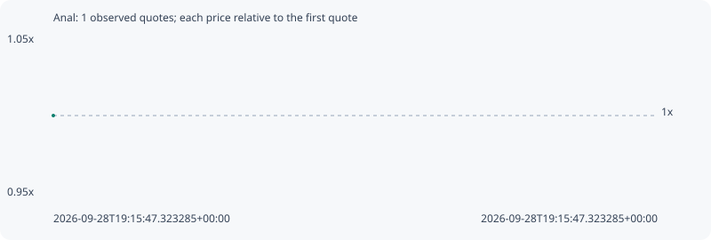

# Anal

**solana** / `GDxfw3KERBgEefhzFqih9N5vFqTCe93qkg5jUBivt76s`

[All tokens](README.md) · [Market window](../README.md)

## Native assessments

This contract is in the quote cohort; it has no native model assessment in this window.

## Series aa1fb2425f0519262dc4

Pool: `not supplied`

[Complete series](../series/solana/aa1fb2425f0519262dc4.json)

Every dot is a captured quote. Lines connect observations; the curve ends at the last available quote.

Fewer than two quotes: return and drawdown are not calculated.

### Complete quote timeline

| Time (UTC) | Price (USD) | Multiple | Evidence |
| --- | ---: | ---: | --- |
| 2026-09-28T19:15:47.323285+00:00 | 7.13245e-06 | 1.0000x | `capture:65003429-a569-4442-8d4f-b2c93db69061:rank:93` |

### Exit-policy timeline

Calculated from captured quotes under the window policy. Native assessments are linked separately above.

| Time (UTC) | Action | Price (USD) | Evidence |
| --- | --- | ---: | --- |
