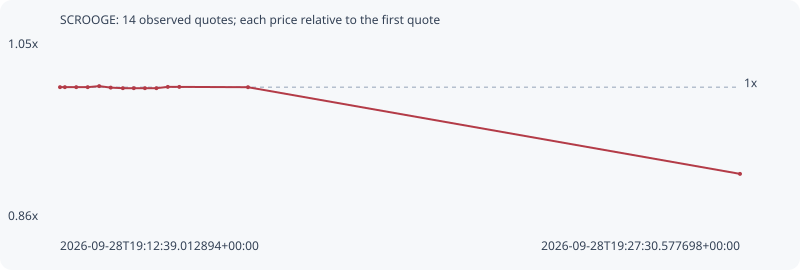

# SCROOGE

**robinhood** / `0x4da3916d3ae6feece32ec8a2c4856d4abeb41bfd`

[All tokens](README.md) · [Market window](../README.md)

## Native assessments

This contract is in the quote cohort; it has no native model assessment in this window.

## Series 113cd91ae32c2502b7eb

Pool: `not supplied`

[Complete series](../series/robinhood/113cd91ae32c2502b7eb.json)

Every dot is a captured quote. Lines connect observations; the curve ends at the last available quote.

| Peak | Final | Return | Maximum drawdown |
| ---: | ---: | ---: | ---: |
| 1.0011x | 0.9060x | -9.40% | 9.50% |

### Complete quote timeline

| Time (UTC) | Price (USD) | Multiple | Evidence |
| --- | ---: | ---: | --- |
| 2026-09-28T19:12:39.012894+00:00 | 0.000468585 | 1.0000x | `capture:fe8ad944-154e-4481-bd56-8ab821bfbfe1:rank:93` |
| 2026-09-28T19:12:45.402569+00:00 | 0.000468585 | 1.0000x | `capture:8deb508c-ea33-4c21-a5c5-f0991dd6dcac:rank:97` |
| 2026-09-28T19:13:00.335966+00:00 | 0.000468585 | 1.0000x | `capture:ee3ee7f8-576f-4c42-a7e0-cd9f917fdb36:rank:97` |
| 2026-09-28T19:13:15.331879+00:00 | 0.000468585 | 1.0000x | `capture:c384257a-4501-4701-8a0c-a6b08fe727d5:rank:97` |
| 2026-09-28T19:13:30.402311+00:00 | 0.000469114 | 1.0011x | `capture:44090e9e-d515-41c4-a78f-893390e6f2b0:rank:94` |
| 2026-09-28T19:13:45.493213+00:00 | 0.000468352 | 0.9995x | `capture:52264519-193b-4508-b560-e9ee4e3e0963:rank:90` |
| 2026-09-28T19:14:01.407289+00:00 | 0.000468069 | 0.9989x | `capture:0a62cce6-2c27-4761-80c1-feb9130a0c83:rank:81` |
| 2026-09-28T19:14:15.755233+00:00 | 0.000468069 | 0.9989x | `capture:09651124-e158-421c-bcdc-cb2310b48412:rank:77` |
| 2026-09-28T19:14:30.367936+00:00 | 0.000468069 | 0.9989x | `capture:7a0b9f45-7248-4af6-b349-4bf6d5ef81be:rank:82` |
| 2026-09-28T19:14:45.422215+00:00 | 0.000468069 | 0.9989x | `capture:bf6e34c4-c499-472e-8e2b-ebbb151300e2:rank:92` |
| 2026-09-28T19:15:00.325882+00:00 | 0.00046872 | 1.0003x | `capture:663c0420-2b9e-4a94-998b-531fa9202dee:rank:97` |
| 2026-09-28T19:15:15.449577+00:00 | 0.00046872 | 1.0003x | `capture:14452070-ab94-45a0-af6d-e6c54082daec:rank:97` |
| 2026-09-28T19:16:45.486467+00:00 | 0.000468566 | 1.0000x | `capture:4ca26bf7-9d1e-455b-a63e-1b5df831b997:rank:94` |
| 2026-09-28T19:27:30.577698+00:00 | 0.000424534 | 0.9060x | `capture:ff6b3949-9c3c-4cdf-b48c-d4010666c140:rank:99` |

### Exit-policy timeline

Calculated from captured quotes under the window policy. Native assessments are linked separately above.

| Time (UTC) | Action | Price (USD) | Evidence |
| --- | --- | ---: | --- |
| 2026-09-28T19:12:39.012894+00:00 | BUY | 0.000468585 | `capture:fe8ad944-154e-4481-bd56-8ab821bfbfe1:rank:93` |
| 2026-09-28T19:12:45.402569+00:00 | HOLD | 0.000468585 | `capture:8deb508c-ea33-4c21-a5c5-f0991dd6dcac:rank:97` |
| 2026-09-28T19:13:00.335966+00:00 | HOLD | 0.000468585 | `capture:ee3ee7f8-576f-4c42-a7e0-cd9f917fdb36:rank:97` |
| 2026-09-28T19:13:15.331879+00:00 | HOLD | 0.000468585 | `capture:c384257a-4501-4701-8a0c-a6b08fe727d5:rank:97` |
| 2026-09-28T19:13:30.402311+00:00 | HOLD | 0.000469114 | `capture:44090e9e-d515-41c4-a78f-893390e6f2b0:rank:94` |
| 2026-09-28T19:13:45.493213+00:00 | HOLD | 0.000468352 | `capture:52264519-193b-4508-b560-e9ee4e3e0963:rank:90` |
| 2026-09-28T19:14:01.407289+00:00 | HOLD | 0.000468069 | `capture:0a62cce6-2c27-4761-80c1-feb9130a0c83:rank:81` |
| 2026-09-28T19:14:15.755233+00:00 | HOLD | 0.000468069 | `capture:09651124-e158-421c-bcdc-cb2310b48412:rank:77` |
| 2026-09-28T19:14:30.367936+00:00 | HOLD | 0.000468069 | `capture:7a0b9f45-7248-4af6-b349-4bf6d5ef81be:rank:82` |
| 2026-09-28T19:14:45.422215+00:00 | HOLD | 0.000468069 | `capture:bf6e34c4-c499-472e-8e2b-ebbb151300e2:rank:92` |
| 2026-09-28T19:15:00.325882+00:00 | HOLD | 0.00046872 | `capture:663c0420-2b9e-4a94-998b-531fa9202dee:rank:97` |
| 2026-09-28T19:15:15.449577+00:00 | HOLD | 0.00046872 | `capture:14452070-ab94-45a0-af6d-e6c54082daec:rank:97` |
| 2026-09-28T19:16:45.486467+00:00 | HOLD | 0.000468566 | `capture:4ca26bf7-9d1e-455b-a63e-1b5df831b997:rank:94` |
| 2026-09-28T19:27:30.577698+00:00 | HOLD | 0.000424534 | `capture:ff6b3949-9c3c-4cdf-b48c-d4010666c140:rank:99` |
