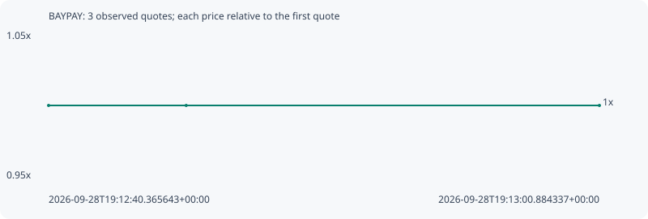

# BAYPAY

**solana** / `2GyjqZhMUWxpuiVgypqV6KZ1agbzgitEVUU16mSnpump`

[All tokens](README.md) · [Market window](../README.md)

## Native assessments

This contract is in the quote cohort; it has no native model assessment in this window.

## Series a1cf1878963815e0d8d3

Pool: `not supplied`

[Complete series](../series/solana/a1cf1878963815e0d8d3.json)

Every dot is a captured quote. Lines connect observations; the curve ends at the last available quote.

| Peak | Final | Return | Maximum drawdown |
| ---: | ---: | ---: | ---: |
| 1.0000x | 1.0000x | +0.00% | 0.00% |

### Complete quote timeline

| Time (UTC) | Price (USD) | Multiple | Evidence |
| --- | ---: | ---: | --- |
| 2026-09-28T19:12:40.365643+00:00 | 2.46034e-05 | 1.0000x | `capture:3af1faa1-2074-484e-893e-ed2c676e1576:rank:98` |
| 2026-09-28T19:12:45.490977+00:00 | 2.46034e-05 | 1.0000x | `capture:ac0279d6-7dd1-44b6-bf3e-910bf7b8eddf:rank:97` |
| 2026-09-28T19:13:00.884337+00:00 | 2.46034e-05 | 1.0000x | `capture:5867894f-39b4-4bcd-bd87-86394c63aab4:rank:96` |

### Exit-policy timeline

Calculated from captured quotes under the window policy. Native assessments are linked separately above.

| Time (UTC) | Action | Price (USD) | Evidence |
| --- | --- | ---: | --- |
| 2026-09-28T19:12:40.365643+00:00 | BUY | 2.46034e-05 | `capture:3af1faa1-2074-484e-893e-ed2c676e1576:rank:98` |
| 2026-09-28T19:12:45.490977+00:00 | HOLD | 2.46034e-05 | `capture:ac0279d6-7dd1-44b6-bf3e-910bf7b8eddf:rank:97` |
| 2026-09-28T19:13:00.884337+00:00 | HOLD | 2.46034e-05 | `capture:5867894f-39b4-4bcd-bd87-86394c63aab4:rank:96` |
