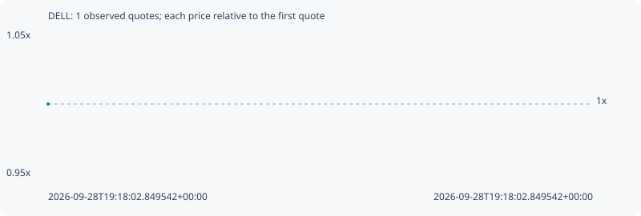

# DELL

**robinhood** / `0x941ae714ec6d8130c7b75d67160ca08f1e7d11dd`

[All tokens](README.md) · [Market window](../README.md)

## Native assessments

This contract is in the quote cohort; it has no native model assessment in this window.

## Series d8855d628010690fb385

Pool: `not supplied`

[Complete series](../series/robinhood/d8855d628010690fb385.json)

Every dot is a captured quote. Lines connect observations; the curve ends at the last available quote.

Fewer than two quotes: return and drawdown are not calculated.

### Complete quote timeline

| Time (UTC) | Price (USD) | Multiple | Evidence |
| --- | ---: | ---: | --- |
| 2026-09-28T19:18:02.849542+00:00 | 543.81 | 1.0000x | `capture:53a348cd-74d6-4031-ba2b-02d70c63e42b:rank:98` |

### Exit-policy timeline

Calculated from captured quotes under the window policy. Native assessments are linked separately above.

| Time (UTC) | Action | Price (USD) | Evidence |
| --- | --- | ---: | --- |
