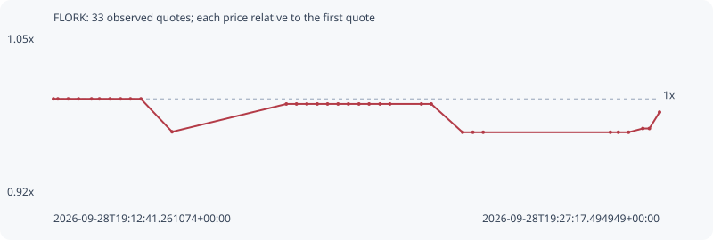

# FLORK

**bsc** / `0xf40592daacb3e5abf358789f5688c0b4f64d7777`

[All tokens](README.md) · [Market window](../README.md)

## Native assessments

This contract is in the quote cohort; it has no native model assessment in this window.

## Series eb3e627b945e21b44169

Pool: `not supplied`

[Complete series](../series/bsc/eb3e627b945e21b44169.json)

Every dot is a captured quote. Lines connect observations; the curve ends at the last available quote.

| Peak | Final | Return | Maximum drawdown |
| ---: | ---: | ---: | ---: |
| 1.0000x | 0.9895x | -1.05% | 2.64% |

### Complete quote timeline

| Time (UTC) | Price (USD) | Multiple | Evidence |
| --- | ---: | ---: | --- |
| 2026-09-28T19:12:41.261074+00:00 | 0.00685984 | 1.0000x | `capture:795a88f0-804c-4f14-a3e8-ce8d9318f6df:rank:73` |
| 2026-09-28T19:12:47.639745+00:00 | 0.00685984 | 1.0000x | `capture:c2d8bd1a-9ed6-4d75-91ae-006bea65a635:rank:69` |
| 2026-09-28T19:13:02.549284+00:00 | 0.00685984 | 1.0000x | `capture:0aa38b41-b2e7-48f5-a3ba-8fd4a983fff8:rank:76` |
| 2026-09-28T19:13:17.511052+00:00 | 0.00685984 | 1.0000x | `capture:87e92f15-0601-4987-bd47-ae2e9f91de16:rank:76` |
| 2026-09-28T19:13:36.268178+00:00 | 0.00685984 | 1.0000x | `capture:577859f6-aadc-4653-b269-a860dbe8c41c:rank:77` |
| 2026-09-28T19:13:47.694462+00:00 | 0.00685984 | 1.0000x | `capture:4e60f1a9-1927-46db-ae10-f1b1530de61d:rank:75` |
| 2026-09-28T19:14:02.894344+00:00 | 0.00685984 | 1.0000x | `capture:6211f86d-6ba6-4eb3-a4e2-2f80b0dffff7:rank:75` |
| 2026-09-28T19:14:18.283251+00:00 | 0.00685984 | 1.0000x | `capture:68440f72-d36c-4c27-867d-03a757db141f:rank:86` |
| 2026-09-28T19:14:32.527710+00:00 | 0.00685984 | 1.0000x | `capture:4f6a3c72-f6f0-49d7-97fe-a760f1872e88:rank:87` |
| 2026-09-28T19:14:47.684789+00:00 | 0.00685984 | 1.0000x | `capture:abe58c43-9edf-4da1-b6d9-c4db72f14d79:rank:88` |
| 2026-09-28T19:15:32.749915+00:00 | 0.00668137 | 0.9740x | `capture:81e75e19-4c52-4e91-ba7d-af89c6539b19:rank:90` |
| 2026-09-28T19:18:17.953086+00:00 | 0.00683223 | 0.9960x | `capture:ca903b0a-a9a8-4246-873f-5115402fbf9c:rank:94` |
| 2026-09-28T19:18:32.607444+00:00 | 0.00683223 | 0.9960x | `capture:86009bbc-85b0-465e-8657-55be8d6c15de:rank:93` |
| 2026-09-28T19:18:47.632598+00:00 | 0.00683223 | 0.9960x | `capture:bfa4352f-2279-41ec-a6fd-d3e101a21181:rank:94` |
| 2026-09-28T19:19:02.666276+00:00 | 0.00683223 | 0.9960x | `capture:6fe1da90-a254-48b3-b112-ab24c6060e81:rank:90` |
| 2026-09-28T19:19:17.488471+00:00 | 0.00683223 | 0.9960x | `capture:b87f439a-4825-4a6f-b17c-0b78464d9310:rank:88` |
| 2026-09-28T19:19:32.672995+00:00 | 0.00683223 | 0.9960x | `capture:ceae4194-4b79-45b3-9a66-758dd19e2a7b:rank:88` |
| 2026-09-28T19:19:47.615151+00:00 | 0.00683223 | 0.9960x | `capture:0dedf968-cc48-4422-8bbf-180ff2103dbf:rank:84` |
| 2026-09-28T19:20:02.835112+00:00 | 0.00683223 | 0.9960x | `capture:adbb19f8-5a81-4d70-8990-a6ffd414f250:rank:86` |
| 2026-09-28T19:20:17.561225+00:00 | 0.00683223 | 0.9960x | `capture:0feecf05-56c0-4db7-a137-f63b427a7830:rank:83` |
| 2026-09-28T19:20:33.351338+00:00 | 0.00683223 | 0.9960x | `capture:5752259a-2bcb-4e27-ac90-6ef5a52d1cf7:rank:97` |
| 2026-09-28T19:20:47.599416+00:00 | 0.00683223 | 0.9960x | `capture:1ab71e23-e150-479b-a1fa-e2a362332d1e:rank:97` |
| 2026-09-28T19:21:33.217678+00:00 | 0.00683223 | 0.9960x | `capture:3a34cabb-e5ee-4ff6-9f92-f0839c39884f:rank:96` |
| 2026-09-28T19:21:47.485842+00:00 | 0.00683223 | 0.9960x | `capture:9e0730ff-182b-409c-b854-c06b993be570:rank:98` |
| 2026-09-28T19:22:32.671189+00:00 | 0.00667898 | 0.9736x | `capture:5d031323-644d-4272-bacc-8a363d4b77cb:rank:80` |
| 2026-09-28T19:22:47.674643+00:00 | 0.00667898 | 0.9736x | `capture:c8838291-6f5a-42d9-9013-9d9421deb79e:rank:75` |
| 2026-09-28T19:23:02.516005+00:00 | 0.00667898 | 0.9736x | `capture:f8b60e63-80ce-442a-9ca7-659f2b5ca21d:rank:82` |
| 2026-09-28T19:26:06.431923+00:00 | 0.00667898 | 0.9736x | `capture:a3278748-b5f3-45be-a966-ab473520d9c2:rank:98` |
| 2026-09-28T19:26:17.917162+00:00 | 0.00667898 | 0.9736x | `capture:3b80c987-c82b-4a3e-8f0b-d3017a78edcb:rank:96` |
| 2026-09-28T19:26:32.687411+00:00 | 0.00667898 | 0.9736x | `capture:d1fef60a-e7ad-4594-a8e8-74ee96c47ae4:rank:97` |
| 2026-09-28T19:26:53.320509+00:00 | 0.00669947 | 0.9766x | `capture:5f09420c-1544-46ff-a2e4-39235f8f73a9:rank:81` |
| 2026-09-28T19:27:02.865937+00:00 | 0.00669947 | 0.9766x | `capture:bd21661a-974d-4bab-9276-4e2f7e7d279a:rank:99` |
| 2026-09-28T19:27:17.494949+00:00 | 0.00678791 | 0.9895x | `capture:c5d9da1a-7d95-4d7f-8cef-ffb660ac56d0:rank:73` |

### Exit-policy timeline

Calculated from captured quotes under the window policy. Native assessments are linked separately above.

| Time (UTC) | Action | Price (USD) | Evidence |
| --- | --- | ---: | --- |
| 2026-09-28T19:12:41.261074+00:00 | BUY | 0.00685984 | `capture:795a88f0-804c-4f14-a3e8-ce8d9318f6df:rank:73` |
| 2026-09-28T19:12:47.639745+00:00 | HOLD | 0.00685984 | `capture:c2d8bd1a-9ed6-4d75-91ae-006bea65a635:rank:69` |
| 2026-09-28T19:13:02.549284+00:00 | HOLD | 0.00685984 | `capture:0aa38b41-b2e7-48f5-a3ba-8fd4a983fff8:rank:76` |
| 2026-09-28T19:13:17.511052+00:00 | HOLD | 0.00685984 | `capture:87e92f15-0601-4987-bd47-ae2e9f91de16:rank:76` |
| 2026-09-28T19:13:36.268178+00:00 | HOLD | 0.00685984 | `capture:577859f6-aadc-4653-b269-a860dbe8c41c:rank:77` |
| 2026-09-28T19:13:47.694462+00:00 | HOLD | 0.00685984 | `capture:4e60f1a9-1927-46db-ae10-f1b1530de61d:rank:75` |
| 2026-09-28T19:14:02.894344+00:00 | HOLD | 0.00685984 | `capture:6211f86d-6ba6-4eb3-a4e2-2f80b0dffff7:rank:75` |
| 2026-09-28T19:14:18.283251+00:00 | HOLD | 0.00685984 | `capture:68440f72-d36c-4c27-867d-03a757db141f:rank:86` |
| 2026-09-28T19:14:32.527710+00:00 | HOLD | 0.00685984 | `capture:4f6a3c72-f6f0-49d7-97fe-a760f1872e88:rank:87` |
| 2026-09-28T19:14:47.684789+00:00 | HOLD | 0.00685984 | `capture:abe58c43-9edf-4da1-b6d9-c4db72f14d79:rank:88` |
| 2026-09-28T19:15:32.749915+00:00 | HOLD | 0.00668137 | `capture:81e75e19-4c52-4e91-ba7d-af89c6539b19:rank:90` |
| 2026-09-28T19:18:17.953086+00:00 | HOLD | 0.00683223 | `capture:ca903b0a-a9a8-4246-873f-5115402fbf9c:rank:94` |
| 2026-09-28T19:18:32.607444+00:00 | HOLD | 0.00683223 | `capture:86009bbc-85b0-465e-8657-55be8d6c15de:rank:93` |
| 2026-09-28T19:18:47.632598+00:00 | HOLD | 0.00683223 | `capture:bfa4352f-2279-41ec-a6fd-d3e101a21181:rank:94` |
| 2026-09-28T19:19:02.666276+00:00 | HOLD | 0.00683223 | `capture:6fe1da90-a254-48b3-b112-ab24c6060e81:rank:90` |
| 2026-09-28T19:19:17.488471+00:00 | HOLD | 0.00683223 | `capture:b87f439a-4825-4a6f-b17c-0b78464d9310:rank:88` |
| 2026-09-28T19:19:32.672995+00:00 | HOLD | 0.00683223 | `capture:ceae4194-4b79-45b3-9a66-758dd19e2a7b:rank:88` |
| 2026-09-28T19:19:47.615151+00:00 | HOLD | 0.00683223 | `capture:0dedf968-cc48-4422-8bbf-180ff2103dbf:rank:84` |
| 2026-09-28T19:20:02.835112+00:00 | HOLD | 0.00683223 | `capture:adbb19f8-5a81-4d70-8990-a6ffd414f250:rank:86` |
| 2026-09-28T19:20:17.561225+00:00 | HOLD | 0.00683223 | `capture:0feecf05-56c0-4db7-a137-f63b427a7830:rank:83` |
| 2026-09-28T19:20:33.351338+00:00 | HOLD | 0.00683223 | `capture:5752259a-2bcb-4e27-ac90-6ef5a52d1cf7:rank:97` |
| 2026-09-28T19:20:47.599416+00:00 | HOLD | 0.00683223 | `capture:1ab71e23-e150-479b-a1fa-e2a362332d1e:rank:97` |
| 2026-09-28T19:21:33.217678+00:00 | HOLD | 0.00683223 | `capture:3a34cabb-e5ee-4ff6-9f92-f0839c39884f:rank:96` |
| 2026-09-28T19:21:47.485842+00:00 | HOLD | 0.00683223 | `capture:9e0730ff-182b-409c-b854-c06b993be570:rank:98` |
| 2026-09-28T19:22:32.671189+00:00 | HOLD | 0.00667898 | `capture:5d031323-644d-4272-bacc-8a363d4b77cb:rank:80` |
| 2026-09-28T19:22:47.674643+00:00 | HOLD | 0.00667898 | `capture:c8838291-6f5a-42d9-9013-9d9421deb79e:rank:75` |
| 2026-09-28T19:23:02.516005+00:00 | HOLD | 0.00667898 | `capture:f8b60e63-80ce-442a-9ca7-659f2b5ca21d:rank:82` |
| 2026-09-28T19:26:06.431923+00:00 | HOLD | 0.00667898 | `capture:a3278748-b5f3-45be-a966-ab473520d9c2:rank:98` |
| 2026-09-28T19:26:17.917162+00:00 | HOLD | 0.00667898 | `capture:3b80c987-c82b-4a3e-8f0b-d3017a78edcb:rank:96` |
| 2026-09-28T19:26:32.687411+00:00 | HOLD | 0.00667898 | `capture:d1fef60a-e7ad-4594-a8e8-74ee96c47ae4:rank:97` |
| 2026-09-28T19:26:53.320509+00:00 | HOLD | 0.00669947 | `capture:5f09420c-1544-46ff-a2e4-39235f8f73a9:rank:81` |
| 2026-09-28T19:27:02.865937+00:00 | HOLD | 0.00669947 | `capture:bd21661a-974d-4bab-9276-4e2f7e7d279a:rank:99` |
| 2026-09-28T19:27:17.494949+00:00 | HOLD | 0.00678791 | `capture:c5d9da1a-7d95-4d7f-8cef-ffb660ac56d0:rank:73` |
