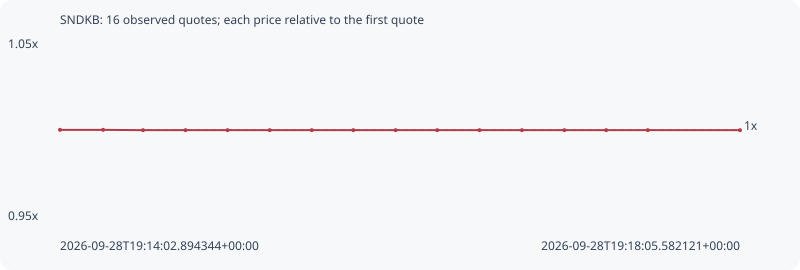

# SNDKB

**bsc** / `0x3ee4df61bd4f867e349beae8bfe07bc31b4850fb`

[All tokens](README.md) · [Market window](../README.md)

## Native assessments

- [2026-09-28T19:14:02.894344Z](../cases/5a7c2eb4f3d5081f.md): source parameters and model answers.

## Series e6cae2dc30d5ac3adabe

Pool: `not supplied`

[Complete series](../series/bsc/e6cae2dc30d5ac3adabe.json)

Every dot is a captured quote. Lines connect observations; the curve ends at the last available quote.

| Peak | Final | Return | Maximum drawdown |
| ---: | ---: | ---: | ---: |
| 1.0000x | 0.9998x | -0.02% | 0.02% |

### Complete quote timeline

| Time (UTC) | Price (USD) | Multiple | Evidence |
| --- | ---: | ---: | --- |
| 2026-09-28T19:14:02.894344+00:00 | 1709.84 | 1.0000x | `capture:6211f86d-6ba6-4eb3-a4e2-2f80b0dffff7:rank:93` |
| 2026-09-28T19:14:18.283251+00:00 | 1709.84 | 1.0000x | `capture:68440f72-d36c-4c27-867d-03a757db141f:rank:93` |
| 2026-09-28T19:14:32.527710+00:00 | 1709.53 | 0.9998x | `capture:4f6a3c72-f6f0-49d7-97fe-a760f1872e88:rank:82` |
| 2026-09-28T19:14:47.684789+00:00 | 1709.53 | 0.9998x | `capture:abe58c43-9edf-4da1-b6d9-c4db72f14d79:rank:86` |
| 2026-09-28T19:15:02.698030+00:00 | 1709.53 | 0.9998x | `capture:d9b7eccd-b77f-4cc6-8305-4a84d44c62e0:rank:89` |
| 2026-09-28T19:15:17.739331+00:00 | 1709.53 | 0.9998x | `capture:08cc1e53-32bc-48e9-9abe-0b7caf40b440:rank:87` |
| 2026-09-28T19:15:32.749915+00:00 | 1709.53 | 0.9998x | `capture:81e75e19-4c52-4e91-ba7d-af89c6539b19:rank:86` |
| 2026-09-28T19:15:47.591170+00:00 | 1709.53 | 0.9998x | `capture:98b3c66b-c70a-4987-9342-10165ae058ec:rank:84` |
| 2026-09-28T19:16:02.665866+00:00 | 1709.53 | 0.9998x | `capture:831c8e00-640d-4942-9ad6-ae68e842f3cf:rank:84` |
| 2026-09-28T19:16:17.512218+00:00 | 1709.53 | 0.9998x | `capture:a4477278-80c9-4a7a-9a8f-66687623072c:rank:86` |
| 2026-09-28T19:16:32.607943+00:00 | 1709.53 | 0.9998x | `capture:4487eb62-651f-462e-aece-4003e9e61067:rank:88` |
| 2026-09-28T19:16:47.751534+00:00 | 1709.53 | 0.9998x | `capture:39d9c9d0-d8a7-439e-86b7-5fff162807b9:rank:88` |
| 2026-09-28T19:17:02.908604+00:00 | 1709.53 | 0.9998x | `capture:16fde76e-cae4-4138-b96e-57b291931df8:rank:88` |
| 2026-09-28T19:17:17.816055+00:00 | 1709.53 | 0.9998x | `capture:7f9359fa-2f23-4e78-9500-f9df7d85a6b2:rank:88` |
| 2026-09-28T19:17:32.654140+00:00 | 1709.53 | 0.9998x | `capture:4e95b3e2-d20d-4729-ac41-d7699561b97b:rank:87` |
| 2026-09-28T19:18:05.582121+00:00 | 1709.53 | 0.9998x | `capture:07127a86-393c-4e05-bde5-d28a70a854fb:rank:95` |

### Exit-policy timeline

Calculated from captured quotes under the window policy. Native assessments are linked separately above.

| Time (UTC) | Action | Price (USD) | Evidence |
| --- | --- | ---: | --- |
| 2026-09-28T19:14:02.894344+00:00 | BUY | 1709.84 | `capture:6211f86d-6ba6-4eb3-a4e2-2f80b0dffff7:rank:93` |
| 2026-09-28T19:14:18.283251+00:00 | HOLD | 1709.84 | `capture:68440f72-d36c-4c27-867d-03a757db141f:rank:93` |
| 2026-09-28T19:14:32.527710+00:00 | HOLD | 1709.53 | `capture:4f6a3c72-f6f0-49d7-97fe-a760f1872e88:rank:82` |
| 2026-09-28T19:14:47.684789+00:00 | HOLD | 1709.53 | `capture:abe58c43-9edf-4da1-b6d9-c4db72f14d79:rank:86` |
| 2026-09-28T19:15:02.698030+00:00 | HOLD | 1709.53 | `capture:d9b7eccd-b77f-4cc6-8305-4a84d44c62e0:rank:89` |
| 2026-09-28T19:15:17.739331+00:00 | HOLD | 1709.53 | `capture:08cc1e53-32bc-48e9-9abe-0b7caf40b440:rank:87` |
| 2026-09-28T19:15:32.749915+00:00 | HOLD | 1709.53 | `capture:81e75e19-4c52-4e91-ba7d-af89c6539b19:rank:86` |
| 2026-09-28T19:15:47.591170+00:00 | HOLD | 1709.53 | `capture:98b3c66b-c70a-4987-9342-10165ae058ec:rank:84` |
| 2026-09-28T19:16:02.665866+00:00 | HOLD | 1709.53 | `capture:831c8e00-640d-4942-9ad6-ae68e842f3cf:rank:84` |
| 2026-09-28T19:16:17.512218+00:00 | HOLD | 1709.53 | `capture:a4477278-80c9-4a7a-9a8f-66687623072c:rank:86` |
| 2026-09-28T19:16:32.607943+00:00 | HOLD | 1709.53 | `capture:4487eb62-651f-462e-aece-4003e9e61067:rank:88` |
| 2026-09-28T19:16:47.751534+00:00 | HOLD | 1709.53 | `capture:39d9c9d0-d8a7-439e-86b7-5fff162807b9:rank:88` |
| 2026-09-28T19:17:02.908604+00:00 | HOLD | 1709.53 | `capture:16fde76e-cae4-4138-b96e-57b291931df8:rank:88` |
| 2026-09-28T19:17:17.816055+00:00 | HOLD | 1709.53 | `capture:7f9359fa-2f23-4e78-9500-f9df7d85a6b2:rank:88` |
| 2026-09-28T19:17:32.654140+00:00 | HOLD | 1709.53 | `capture:4e95b3e2-d20d-4729-ac41-d7699561b97b:rank:87` |
| 2026-09-28T19:18:05.582121+00:00 | HOLD | 1709.53 | `capture:07127a86-393c-4e05-bde5-d28a70a854fb:rank:95` |
