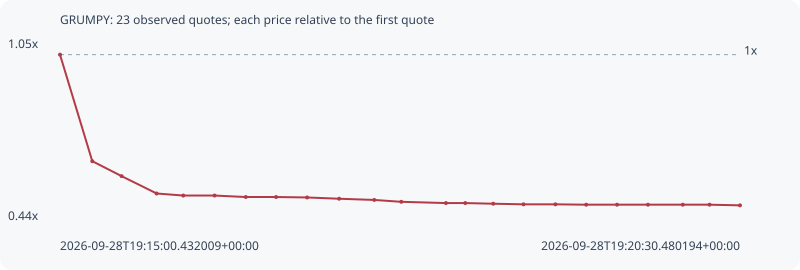

# GRUMPY

**solana** / `Eh5rTGmL7RHtdpRXLLX6xLsHvbSL6htVCa7ifhQVV1bf`

[All tokens](README.md) · [Market window](../README.md)

## Native assessments

This contract is in the quote cohort; it has no native model assessment in this window.

## Series a9d5b3db719c5b916a3a

Pool: `not supplied`

[Complete series](../series/solana/a9d5b3db719c5b916a3a.json)

Every dot is a captured quote. Lines connect observations; the curve ends at the last available quote.

| Peak | Final | Return | Maximum drawdown |
| ---: | ---: | ---: | ---: |
| 1.0000x | 0.4858x | -51.42% | 51.42% |

### Complete quote timeline

| Time (UTC) | Price (USD) | Multiple | Evidence |
| --- | ---: | ---: | --- |
| 2026-09-28T19:15:00.432009+00:00 | 8.53349e-06 | 1.0000x | `capture:797f9a41-958a-44ba-ac57-3b9cacf5d06b:rank:89` |
| 2026-09-28T19:15:16.098308+00:00 | 5.43113e-06 | 0.6364x | `capture:ab2becb9-3f94-4a57-b9e8-472ad0998012:rank:68` |
| 2026-09-28T19:15:30.340579+00:00 | 4.99506e-06 | 0.5853x | `capture:564db5fc-5586-41d3-88fb-a9a955708f1d:rank:65` |
| 2026-09-28T19:15:47.323285+00:00 | 4.49071e-06 | 0.5262x | `capture:65003429-a569-4442-8d4f-b2c93db69061:rank:60` |
| 2026-09-28T19:16:00.259696+00:00 | 4.43091e-06 | 0.5192x | `capture:4236f8d5-90c4-4c9b-a73e-d6443ae3bf32:rank:60` |
| 2026-09-28T19:16:15.455827+00:00 | 4.43091e-06 | 0.5192x | `capture:acc657c6-9a43-46bf-986e-7b907c831cba:rank:61` |
| 2026-09-28T19:16:30.624202+00:00 | 4.38778e-06 | 0.5142x | `capture:0d391072-ec81-4bb7-9be0-0d6bbb801c70:rank:62` |
| 2026-09-28T19:16:45.311485+00:00 | 4.38778e-06 | 0.5142x | `capture:72cccbac-c3fe-4991-8f62-08c53849b146:rank:61` |
| 2026-09-28T19:17:00.368914+00:00 | 4.37504e-06 | 0.5127x | `capture:1232cf18-7088-40a1-9f55-ad9ae22b44f5:rank:64` |
| 2026-09-28T19:17:15.914647+00:00 | 4.33779e-06 | 0.5083x | `capture:9792e199-c0c2-4272-ac95-24501e4a3f79:rank:59` |
| 2026-09-28T19:17:32.965607+00:00 | 4.30269e-06 | 0.5042x | `capture:0f04cfe5-88a0-4a83-ae8d-85c5cb3cdc89:rank:56` |
| 2026-09-28T19:17:46.087880+00:00 | 4.24844e-06 | 0.4979x | `capture:ee91a1c6-bc99-4c7a-9cdc-bd6cb5478a9b:rank:56` |
| 2026-09-28T19:18:07.749963+00:00 | 4.21211e-06 | 0.4936x | `capture:b0fb1b47-4973-472f-9619-8480bc7d294e:rank:56` |
| 2026-09-28T19:18:17.126008+00:00 | 4.21211e-06 | 0.4936x | `capture:5ed98f51-d1e1-422a-81df-4186a8b0a0a2:rank:56` |
| 2026-09-28T19:18:30.722167+00:00 | 4.1925e-06 | 0.4913x | `capture:9f88d118-9108-4dff-bbfc-246eaed5ce38:rank:59` |
| 2026-09-28T19:18:45.386687+00:00 | 4.17541e-06 | 0.4893x | `capture:f533100a-ce62-4457-9107-42e7601ea5d7:rank:57` |
| 2026-09-28T19:19:00.883835+00:00 | 4.17541e-06 | 0.4893x | `capture:a2495d99-5671-4c7e-b87c-48f48d90f2f2:rank:54` |
| 2026-09-28T19:19:15.826416+00:00 | 4.16425e-06 | 0.4880x | `capture:ba1dc6a3-b8b7-461a-8110-8490f03539a5:rank:52` |
| 2026-09-28T19:19:30.814098+00:00 | 4.16425e-06 | 0.4880x | `capture:b25d90dc-c8db-4388-8a2b-d06541e5320f:rank:51` |
| 2026-09-28T19:19:45.817199+00:00 | 4.16425e-06 | 0.4880x | `capture:722d1b7b-ef4f-4ac5-883c-0557bae2b60b:rank:49` |
| 2026-09-28T19:20:02.715590+00:00 | 4.16425e-06 | 0.4880x | `capture:60ff17d8-3b18-4f61-9bc7-006afd324cf2:rank:47` |
| 2026-09-28T19:20:15.699547+00:00 | 4.16425e-06 | 0.4880x | `capture:10a94828-637f-4580-a9f7-2fbd34d8589a:rank:68` |
| 2026-09-28T19:20:30.480194+00:00 | 4.14535e-06 | 0.4858x | `capture:54722132-db1d-4a2b-8c1c-2b0e71d01430:rank:75` |

### Exit-policy timeline

Calculated from captured quotes under the window policy. Native assessments are linked separately above.

| Time (UTC) | Action | Price (USD) | Evidence |
| --- | --- | ---: | --- |
| 2026-09-28T19:15:00.432009+00:00 | BUY | 8.53349e-06 | `capture:797f9a41-958a-44ba-ac57-3b9cacf5d06b:rank:89` |
| 2026-09-28T19:15:16.098308+00:00 | SL | 5.43113e-06 | `capture:ab2becb9-3f94-4a57-b9e8-472ad0998012:rank:68` |
