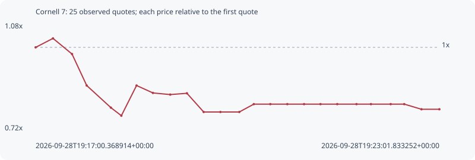

# Cornell 7

**solana** / `Fk9dk53Pw3EhkWYn6cUvHH2PjsyoobTy88bnBSMsYu5p`

[All tokens](README.md) · [Market window](../README.md)

## Native assessments

This contract is in the quote cohort; it has no native model assessment in this window.

## Series 442e2f6d942117f83569

Pool: `not supplied`

[Complete series](../series/solana/442e2f6d942117f83569.json)

Every dot is a captured quote. Lines connect observations; the curve ends at the last available quote.

| Peak | Final | Return | Maximum drawdown |
| ---: | ---: | ---: | ---: |
| 1.0305x | 0.7891x | -21.09% | 25.55% |

### Complete quote timeline

| Time (UTC) | Price (USD) | Multiple | Evidence |
| --- | ---: | ---: | --- |
| 2026-09-28T19:17:00.368914+00:00 | 7.81998e-06 | 1.0000x | `capture:1232cf18-7088-40a1-9f55-ad9ae22b44f5:rank:79` |
| 2026-09-28T19:17:15.914647+00:00 | 8.05887e-06 | 1.0305x | `capture:9792e199-c0c2-4272-ac95-24501e4a3f79:rank:76` |
| 2026-09-28T19:17:32.965607+00:00 | 7.64178e-06 | 0.9772x | `capture:0f04cfe5-88a0-4a83-ae8d-85c5cb3cdc89:rank:76` |
| 2026-09-28T19:17:46.087880+00:00 | 6.8036e-06 | 0.8700x | `capture:ee91a1c6-bc99-4c7a-9cdc-bd6cb5478a9b:rank:70` |
| 2026-09-28T19:18:07.749963+00:00 | 6.21397e-06 | 0.7946x | `capture:b0fb1b47-4973-472f-9619-8480bc7d294e:rank:70` |
| 2026-09-28T19:18:17.126008+00:00 | 5.99964e-06 | 0.7672x | `capture:5ed98f51-d1e1-422a-81df-4186a8b0a0a2:rank:67` |
| 2026-09-28T19:18:30.722167+00:00 | 6.80372e-06 | 0.8700x | `capture:9f88d118-9108-4dff-bbfc-246eaed5ce38:rank:67` |
| 2026-09-28T19:18:45.386687+00:00 | 6.6058e-06 | 0.8447x | `capture:f533100a-ce62-4457-9107-42e7601ea5d7:rank:67` |
| 2026-09-28T19:19:00.883835+00:00 | 6.56195e-06 | 0.8391x | `capture:a2495d99-5671-4c7e-b87c-48f48d90f2f2:rank:67` |
| 2026-09-28T19:19:15.826416+00:00 | 6.59662e-06 | 0.8436x | `capture:ba1dc6a3-b8b7-461a-8110-8490f03539a5:rank:68` |
| 2026-09-28T19:19:30.814098+00:00 | 6.09825e-06 | 0.7798x | `capture:b25d90dc-c8db-4388-8a2b-d06541e5320f:rank:66` |
| 2026-09-28T19:19:45.817199+00:00 | 6.09825e-06 | 0.7798x | `capture:722d1b7b-ef4f-4ac5-883c-0557bae2b60b:rank:63` |
| 2026-09-28T19:20:02.715590+00:00 | 6.09825e-06 | 0.7798x | `capture:60ff17d8-3b18-4f61-9bc7-006afd324cf2:rank:61` |
| 2026-09-28T19:20:15.699547+00:00 | 6.30762e-06 | 0.8066x | `capture:10a94828-637f-4580-a9f7-2fbd34d8589a:rank:58` |
| 2026-09-28T19:20:30.480194+00:00 | 6.30762e-06 | 0.8066x | `capture:54722132-db1d-4a2b-8c1c-2b0e71d01430:rank:59` |
| 2026-09-28T19:20:45.683165+00:00 | 6.30762e-06 | 0.8066x | `capture:17963a37-fd65-46b6-8e1c-350082721f8c:rank:61` |
| 2026-09-28T19:21:00.690136+00:00 | 6.30762e-06 | 0.8066x | `capture:f2ff842d-38e9-4cbe-a281-98c17d5a5672:rank:57` |
| 2026-09-28T19:21:15.372716+00:00 | 6.30762e-06 | 0.8066x | `capture:a923b968-a768-495e-ae33-6de2042c551f:rank:56` |
| 2026-09-28T19:21:30.402460+00:00 | 6.30762e-06 | 0.8066x | `capture:d926629b-2050-4e50-a602-1638c6205870:rank:51` |
| 2026-09-28T19:21:47.649380+00:00 | 6.30762e-06 | 0.8066x | `capture:0799ec6d-0e89-46b5-ae88-5695bf6c5fc3:rank:54` |
| 2026-09-28T19:22:00.569928+00:00 | 6.30762e-06 | 0.8066x | `capture:263cda40-4b31-4b2d-b168-fa4310edb46d:rank:52` |
| 2026-09-28T19:22:18.240717+00:00 | 6.30762e-06 | 0.8066x | `capture:546b2c55-1845-4da7-bc9c-4439cd0ccdba:rank:77` |
| 2026-09-28T19:22:30.371968+00:00 | 6.30762e-06 | 0.8066x | `capture:507d17cb-af67-4a81-a2b2-d5ddfbc40021:rank:82` |
| 2026-09-28T19:22:45.783808+00:00 | 6.17107e-06 | 0.7891x | `capture:9558d322-c429-480b-885f-82f4481c8506:rank:81` |
| 2026-09-28T19:23:01.833252+00:00 | 6.17107e-06 | 0.7891x | `capture:c5462412-2da1-4432-8949-8fcd1492c57f:rank:92` |

### Exit-policy timeline

Calculated from captured quotes under the window policy. Native assessments are linked separately above.

| Time (UTC) | Action | Price (USD) | Evidence |
| --- | --- | ---: | --- |
| 2026-09-28T19:17:00.368914+00:00 | BUY | 7.81998e-06 | `capture:1232cf18-7088-40a1-9f55-ad9ae22b44f5:rank:79` |
| 2026-09-28T19:17:15.914647+00:00 | HOLD | 8.05887e-06 | `capture:9792e199-c0c2-4272-ac95-24501e4a3f79:rank:76` |
| 2026-09-28T19:17:32.965607+00:00 | HOLD | 7.64178e-06 | `capture:0f04cfe5-88a0-4a83-ae8d-85c5cb3cdc89:rank:76` |
| 2026-09-28T19:17:46.087880+00:00 | SL | 6.8036e-06 | `capture:ee91a1c6-bc99-4c7a-9cdc-bd6cb5478a9b:rank:70` |
