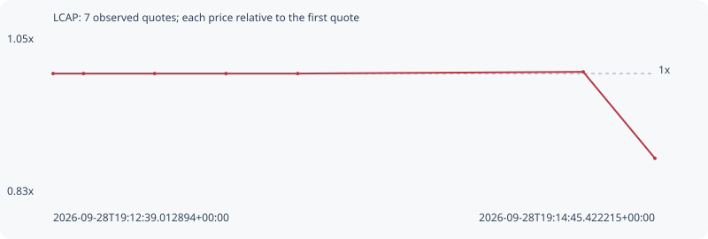

# LCAP

**robinhood** / `0xbca18efee2c63dfb67c374db5ffaacf058426f54`

[All tokens](README.md) · [Market window](../README.md)

## Native assessments

This contract is in the quote cohort; it has no native model assessment in this window.

## Series f119a15e825ac53f0576

Pool: `not supplied`

[Complete series](../series/robinhood/f119a15e825ac53f0576.json)

Every dot is a captured quote. Lines connect observations; the curve ends at the last available quote.

| Peak | Final | Return | Maximum drawdown |
| ---: | ---: | ---: | ---: |
| 1.0023x | 0.8838x | -11.62% | 11.83% |

### Complete quote timeline

| Time (UTC) | Price (USD) | Multiple | Evidence |
| --- | ---: | ---: | --- |
| 2026-09-28T19:12:39.012894+00:00 | 9.55679e-06 | 1.0000x | `capture:fe8ad944-154e-4481-bd56-8ab821bfbfe1:rank:20` |
| 2026-09-28T19:12:45.402569+00:00 | 9.55679e-06 | 1.0000x | `capture:8deb508c-ea33-4c21-a5c5-f0991dd6dcac:rank:20` |
| 2026-09-28T19:13:00.335966+00:00 | 9.55679e-06 | 1.0000x | `capture:ee3ee7f8-576f-4c42-a7e0-cd9f917fdb36:rank:22` |
| 2026-09-28T19:13:15.331879+00:00 | 9.55679e-06 | 1.0000x | `capture:c384257a-4501-4701-8a0c-a6b08fe727d5:rank:23` |
| 2026-09-28T19:13:30.402311+00:00 | 9.55679e-06 | 1.0000x | `capture:44090e9e-d515-41c4-a78f-893390e6f2b0:rank:25` |
| 2026-09-28T19:14:30.367936+00:00 | 9.57909e-06 | 1.0023x | `capture:7a0b9f45-7248-4af6-b349-4bf6d5ef81be:rank:20` |
| 2026-09-28T19:14:45.422215+00:00 | 8.44603e-06 | 0.8838x | `capture:bf6e34c4-c499-472e-8e2b-ebbb151300e2:rank:17` |

### Exit-policy timeline

Calculated from captured quotes under the window policy. Native assessments are linked separately above.

| Time (UTC) | Action | Price (USD) | Evidence |
| --- | --- | ---: | --- |
| 2026-09-28T19:12:39.012894+00:00 | BUY | 9.55679e-06 | `capture:fe8ad944-154e-4481-bd56-8ab821bfbfe1:rank:20` |
| 2026-09-28T19:12:45.402569+00:00 | HOLD | 9.55679e-06 | `capture:8deb508c-ea33-4c21-a5c5-f0991dd6dcac:rank:20` |
| 2026-09-28T19:13:00.335966+00:00 | HOLD | 9.55679e-06 | `capture:ee3ee7f8-576f-4c42-a7e0-cd9f917fdb36:rank:22` |
| 2026-09-28T19:13:15.331879+00:00 | HOLD | 9.55679e-06 | `capture:c384257a-4501-4701-8a0c-a6b08fe727d5:rank:23` |
| 2026-09-28T19:13:30.402311+00:00 | HOLD | 9.55679e-06 | `capture:44090e9e-d515-41c4-a78f-893390e6f2b0:rank:25` |
| 2026-09-28T19:14:30.367936+00:00 | HOLD | 9.57909e-06 | `capture:7a0b9f45-7248-4af6-b349-4bf6d5ef81be:rank:20` |
| 2026-09-28T19:14:45.422215+00:00 | SL | 8.44603e-06 | `capture:bf6e34c4-c499-472e-8e2b-ebbb151300e2:rank:17` |
