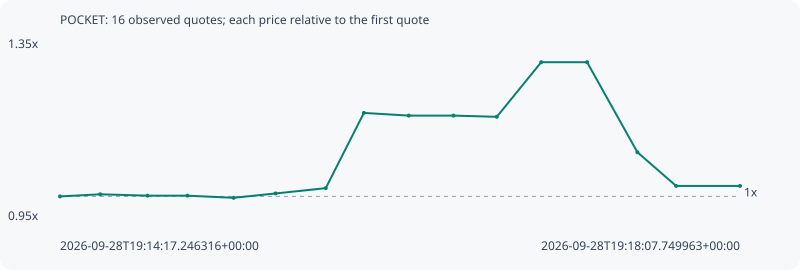

# POCKET

**solana** / `B5QcMFvX3RmkF7StMVvGJDXm1jLo4hdY47uu1QwKpump`

[All tokens](README.md) · [Market window](../README.md)

## Native assessments

This contract is in the quote cohort; it has no native model assessment in this window.

## Series 1b39310b58a56c0a2172

Pool: `not supplied`

[Complete series](../series/solana/1b39310b58a56c0a2172.json)

Every dot is a captured quote. Lines connect observations; the curve ends at the last available quote.

| Peak | Final | Return | Maximum drawdown |
| ---: | ---: | ---: | ---: |
| 1.3023x | 1.0236x | +2.36% | 21.40% |

### Complete quote timeline

| Time (UTC) | Price (USD) | Multiple | Evidence |
| --- | ---: | ---: | --- |
| 2026-09-28T19:14:17.246316+00:00 | 5.39143e-06 | 1.0000x | `capture:7a923cde-d765-4388-a15c-4f47fde0a3b5:rank:47` |
| 2026-09-28T19:14:30.874732+00:00 | 5.417e-06 | 1.0047x | `capture:fa585070-b1ae-4f9d-afbd-aa986f487793:rank:44` |
| 2026-09-28T19:14:46.892387+00:00 | 5.40052e-06 | 1.0017x | `capture:7d9e3e65-8bda-4696-b6d1-7a86825bd98c:rank:43` |
| 2026-09-28T19:15:00.432009+00:00 | 5.40052e-06 | 1.0017x | `capture:797f9a41-958a-44ba-ac57-3b9cacf5d06b:rank:42` |
| 2026-09-28T19:15:16.098308+00:00 | 5.37445e-06 | 0.9969x | `capture:ab2becb9-3f94-4a57-b9e8-472ad0998012:rank:41` |
| 2026-09-28T19:15:30.340579+00:00 | 5.42742e-06 | 1.0067x | `capture:564db5fc-5586-41d3-88fb-a9a955708f1d:rank:43` |
| 2026-09-28T19:15:47.323285+00:00 | 5.49165e-06 | 1.0186x | `capture:65003429-a569-4442-8d4f-b2c93db69061:rank:40` |
| 2026-09-28T19:16:00.259696+00:00 | 6.40558e-06 | 1.1881x | `capture:4236f8d5-90c4-4c9b-a73e-d6443ae3bf32:rank:40` |
| 2026-09-28T19:16:15.455827+00:00 | 6.37287e-06 | 1.1820x | `capture:acc657c6-9a43-46bf-986e-7b907c831cba:rank:43` |
| 2026-09-28T19:16:30.624202+00:00 | 6.37287e-06 | 1.1820x | `capture:0d391072-ec81-4bb7-9be0-0d6bbb801c70:rank:43` |
| 2026-09-28T19:16:45.311485+00:00 | 6.35814e-06 | 1.1793x | `capture:72cccbac-c3fe-4991-8f62-08c53849b146:rank:43` |
| 2026-09-28T19:17:00.368914+00:00 | 7.02151e-06 | 1.3023x | `capture:1232cf18-7088-40a1-9f55-ad9ae22b44f5:rank:43` |
| 2026-09-28T19:17:15.914647+00:00 | 7.02151e-06 | 1.3023x | `capture:9792e199-c0c2-4272-ac95-24501e4a3f79:rank:43` |
| 2026-09-28T19:17:32.965607+00:00 | 5.92778e-06 | 1.0995x | `capture:0f04cfe5-88a0-4a83-ae8d-85c5cb3cdc89:rank:45` |
| 2026-09-28T19:17:46.087880+00:00 | 5.51857e-06 | 1.0236x | `capture:ee91a1c6-bc99-4c7a-9cdc-bd6cb5478a9b:rank:47` |
| 2026-09-28T19:18:07.749963+00:00 | 5.51857e-06 | 1.0236x | `capture:b0fb1b47-4973-472f-9619-8480bc7d294e:rank:58` |

### Exit-policy timeline

Calculated from captured quotes under the window policy. Native assessments are linked separately above.

| Time (UTC) | Action | Price (USD) | Evidence |
| --- | --- | ---: | --- |
| 2026-09-28T19:14:17.246316+00:00 | BUY | 5.39143e-06 | `capture:7a923cde-d765-4388-a15c-4f47fde0a3b5:rank:47` |
| 2026-09-28T19:14:30.874732+00:00 | HOLD | 5.417e-06 | `capture:fa585070-b1ae-4f9d-afbd-aa986f487793:rank:44` |
| 2026-09-28T19:14:46.892387+00:00 | HOLD | 5.40052e-06 | `capture:7d9e3e65-8bda-4696-b6d1-7a86825bd98c:rank:43` |
| 2026-09-28T19:15:00.432009+00:00 | HOLD | 5.40052e-06 | `capture:797f9a41-958a-44ba-ac57-3b9cacf5d06b:rank:42` |
| 2026-09-28T19:15:16.098308+00:00 | HOLD | 5.37445e-06 | `capture:ab2becb9-3f94-4a57-b9e8-472ad0998012:rank:41` |
| 2026-09-28T19:15:30.340579+00:00 | HOLD | 5.42742e-06 | `capture:564db5fc-5586-41d3-88fb-a9a955708f1d:rank:43` |
| 2026-09-28T19:15:47.323285+00:00 | HOLD | 5.49165e-06 | `capture:65003429-a569-4442-8d4f-b2c93db69061:rank:40` |
| 2026-09-28T19:16:00.259696+00:00 | HOLD | 6.40558e-06 | `capture:4236f8d5-90c4-4c9b-a73e-d6443ae3bf32:rank:40` |
| 2026-09-28T19:16:15.455827+00:00 | HOLD | 6.37287e-06 | `capture:acc657c6-9a43-46bf-986e-7b907c831cba:rank:43` |
| 2026-09-28T19:16:30.624202+00:00 | HOLD | 6.37287e-06 | `capture:0d391072-ec81-4bb7-9be0-0d6bbb801c70:rank:43` |
| 2026-09-28T19:16:45.311485+00:00 | HOLD | 6.35814e-06 | `capture:72cccbac-c3fe-4991-8f62-08c53849b146:rank:43` |
| 2026-09-28T19:17:00.368914+00:00 | PROFIT | 7.02151e-06 | `capture:1232cf18-7088-40a1-9f55-ad9ae22b44f5:rank:43` |
| 2026-09-28T19:17:15.914647+00:00 | HOLD_BAG | 7.02151e-06 | `capture:9792e199-c0c2-4272-ac95-24501e4a3f79:rank:43` |
| 2026-09-28T19:17:32.965607+00:00 | HOLD_BAG | 5.92778e-06 | `capture:0f04cfe5-88a0-4a83-ae8d-85c5cb3cdc89:rank:45` |
| 2026-09-28T19:17:46.087880+00:00 | HOLD_BAG | 5.51857e-06 | `capture:ee91a1c6-bc99-4c7a-9cdc-bd6cb5478a9b:rank:47` |
| 2026-09-28T19:18:07.749963+00:00 | HOLD_BAG | 5.51857e-06 | `capture:b0fb1b47-4973-472f-9619-8480bc7d294e:rank:58` |
