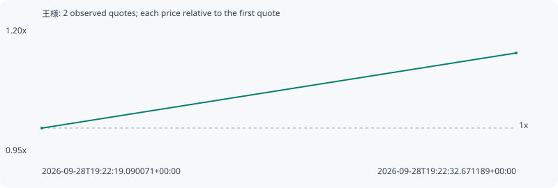

# 王様

**bsc** / `0xadc9c71939ab7b9a010ca72648b4e2f764137777`

[All tokens](README.md) · [Market window](../README.md)

## Native assessments

This contract is in the quote cohort; it has no native model assessment in this window.

## Series 4c35b5403ab340e033b5

Pool: `not supplied`

[Complete series](../series/bsc/4c35b5403ab340e033b5.json)

Every dot is a captured quote. Lines connect observations; the curve ends at the last available quote.

| Peak | Final | Return | Maximum drawdown |
| ---: | ---: | ---: | ---: |
| 1.1496x | 1.1496x | +14.96% | 0.00% |

### Complete quote timeline

| Time (UTC) | Price (USD) | Multiple | Evidence |
| --- | ---: | ---: | --- |
| 2026-09-28T19:22:19.090071+00:00 | 1.59836e-05 | 1.0000x | `capture:30ef0b61-e0e1-4eba-95c6-de3dc48fe868:rank:29` |
| 2026-09-28T19:22:32.671189+00:00 | 1.83749e-05 | 1.1496x | `capture:5d031323-644d-4272-bacc-8a363d4b77cb:rank:27` |

### Exit-policy timeline

Calculated from captured quotes under the window policy. Native assessments are linked separately above.

| Time (UTC) | Action | Price (USD) | Evidence |
| --- | --- | ---: | --- |
| 2026-09-28T19:22:19.090071+00:00 | BUY | 1.59836e-05 | `capture:30ef0b61-e0e1-4eba-95c6-de3dc48fe868:rank:29` |
| 2026-09-28T19:22:32.671189+00:00 | HOLD | 1.83749e-05 | `capture:5d031323-644d-4272-bacc-8a363d4b77cb:rank:27` |
