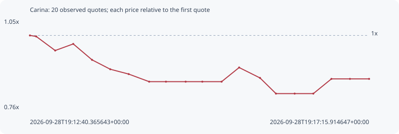

# Carina

**solana** / `EU8FftAh562jQmbxXBsjfpHgxGeHYEKXbeauhun6bxDu`

[All tokens](README.md) · [Market window](../README.md)

## Native assessments

- [2026-09-28T19:12:40.365643Z](../cases/246c87108587ad77.md): source parameters and model answers.

## Series 42d412e286987609a69b

Pool: `not supplied`

[Complete series](../series/solana/42d412e286987609a69b.json)

Every dot is a captured quote. Lines connect observations; the curve ends at the last available quote.

| Peak | Final | Return | Maximum drawdown |
| ---: | ---: | ---: | ---: |
| 1.0000x | 0.8606x | -13.94% | 18.66% |

### Complete quote timeline

| Time (UTC) | Price (USD) | Multiple | Evidence |
| --- | ---: | ---: | --- |
| 2026-09-28T19:12:40.365643+00:00 | 1.55905e-05 | 1.0000x | `capture:3af1faa1-2074-484e-893e-ed2c676e1576:rank:81` |
| 2026-09-28T19:12:45.490977+00:00 | 1.55391e-05 | 0.9967x | `capture:ac0279d6-7dd1-44b6-bf3e-910bf7b8eddf:rank:78` |
| 2026-09-28T19:13:00.884337+00:00 | 1.48367e-05 | 0.9517x | `capture:5867894f-39b4-4bcd-bd87-86394c63aab4:rank:74` |
| 2026-09-28T19:13:15.565374+00:00 | 1.51663e-05 | 0.9728x | `capture:ca31b3d4-ad60-4333-98b3-6d940a196f86:rank:73` |
| 2026-09-28T19:13:30.833894+00:00 | 1.43686e-05 | 0.9216x | `capture:2beb38a4-bfac-4502-bbc3-8c8c0f943007:rank:75` |
| 2026-09-28T19:13:45.640151+00:00 | 1.38996e-05 | 0.8915x | `capture:4d31b656-3ffe-4768-bef6-377adf019420:rank:75` |
| 2026-09-28T19:14:00.595194+00:00 | 1.36573e-05 | 0.8760x | `capture:2c78112b-48e7-4f74-8c2e-1cb8642a79dc:rank:73` |
| 2026-09-28T19:14:17.246316+00:00 | 1.32777e-05 | 0.8517x | `capture:7a923cde-d765-4388-a15c-4f47fde0a3b5:rank:68` |
| 2026-09-28T19:14:30.874732+00:00 | 1.32777e-05 | 0.8517x | `capture:fa585070-b1ae-4f9d-afbd-aa986f487793:rank:71` |
| 2026-09-28T19:14:46.892387+00:00 | 1.32777e-05 | 0.8517x | `capture:7d9e3e65-8bda-4696-b6d1-7a86825bd98c:rank:72` |
| 2026-09-28T19:15:00.432009+00:00 | 1.32777e-05 | 0.8517x | `capture:797f9a41-958a-44ba-ac57-3b9cacf5d06b:rank:74` |
| 2026-09-28T19:15:16.098308+00:00 | 1.32777e-05 | 0.8517x | `capture:ab2becb9-3f94-4a57-b9e8-472ad0998012:rank:71` |
| 2026-09-28T19:15:30.340579+00:00 | 1.39851e-05 | 0.8970x | `capture:564db5fc-5586-41d3-88fb-a9a955708f1d:rank:73` |
| 2026-09-28T19:15:47.323285+00:00 | 1.34634e-05 | 0.8636x | `capture:65003429-a569-4442-8d4f-b2c93db69061:rank:71` |
| 2026-09-28T19:16:00.259696+00:00 | 1.26809e-05 | 0.8134x | `capture:4236f8d5-90c4-4c9b-a73e-d6443ae3bf32:rank:71` |
| 2026-09-28T19:16:15.455827+00:00 | 1.26809e-05 | 0.8134x | `capture:acc657c6-9a43-46bf-986e-7b907c831cba:rank:75` |
| 2026-09-28T19:16:30.624202+00:00 | 1.26809e-05 | 0.8134x | `capture:0d391072-ec81-4bb7-9be0-0d6bbb801c70:rank:73` |
| 2026-09-28T19:16:45.311485+00:00 | 1.34169e-05 | 0.8606x | `capture:72cccbac-c3fe-4991-8f62-08c53849b146:rank:73` |
| 2026-09-28T19:17:00.368914+00:00 | 1.34169e-05 | 0.8606x | `capture:1232cf18-7088-40a1-9f55-ad9ae22b44f5:rank:73` |
| 2026-09-28T19:17:15.914647+00:00 | 1.34169e-05 | 0.8606x | `capture:9792e199-c0c2-4272-ac95-24501e4a3f79:rank:73` |

### Exit-policy timeline

Calculated from captured quotes under the window policy. Native assessments are linked separately above.

| Time (UTC) | Action | Price (USD) | Evidence |
| --- | --- | ---: | --- |
| 2026-09-28T19:12:40.365643+00:00 | BUY | 1.55905e-05 | `capture:3af1faa1-2074-484e-893e-ed2c676e1576:rank:81` |
| 2026-09-28T19:12:45.490977+00:00 | HOLD | 1.55391e-05 | `capture:ac0279d6-7dd1-44b6-bf3e-910bf7b8eddf:rank:78` |
| 2026-09-28T19:13:00.884337+00:00 | HOLD | 1.48367e-05 | `capture:5867894f-39b4-4bcd-bd87-86394c63aab4:rank:74` |
| 2026-09-28T19:13:15.565374+00:00 | HOLD | 1.51663e-05 | `capture:ca31b3d4-ad60-4333-98b3-6d940a196f86:rank:73` |
| 2026-09-28T19:13:30.833894+00:00 | HOLD | 1.43686e-05 | `capture:2beb38a4-bfac-4502-bbc3-8c8c0f943007:rank:75` |
| 2026-09-28T19:13:45.640151+00:00 | SL | 1.38996e-05 | `capture:4d31b656-3ffe-4768-bef6-377adf019420:rank:75` |
