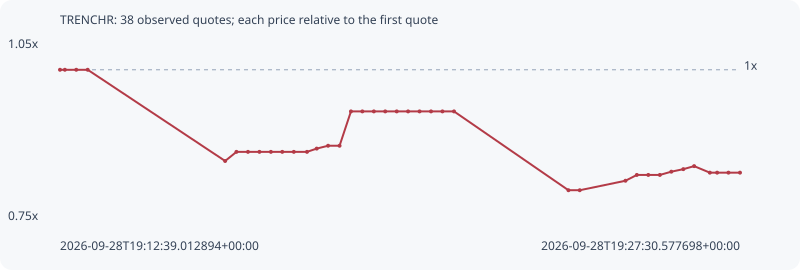

# TRENCHR

**robinhood** / `0x1411ce34688de2fa995a2acb617f5340cb16ee87`

[All tokens](README.md) · [Market window](../README.md)

## Native assessments

This contract is in the quote cohort; it has no native model assessment in this window.

## Series 1635689b9d9eb3247fff

Pool: `not supplied`

[Complete series](../series/robinhood/1635689b9d9eb3247fff.json)

Every dot is a captured quote. Lines connect observations; the curve ends at the last available quote.

| Peak | Final | Return | Maximum drawdown |
| ---: | ---: | ---: | ---: |
| 1.0000x | 0.8272x | -17.28% | 20.23% |

### Complete quote timeline

| Time (UTC) | Price (USD) | Multiple | Evidence |
| --- | ---: | ---: | --- |
| 2026-09-28T19:12:39.012894+00:00 | 2.67924e-05 | 1.0000x | `capture:fe8ad944-154e-4481-bd56-8ab821bfbfe1:rank:80` |
| 2026-09-28T19:12:45.402569+00:00 | 2.67924e-05 | 1.0000x | `capture:8deb508c-ea33-4c21-a5c5-f0991dd6dcac:rank:79` |
| 2026-09-28T19:13:00.335966+00:00 | 2.67924e-05 | 1.0000x | `capture:ee3ee7f8-576f-4c42-a7e0-cd9f917fdb36:rank:80` |
| 2026-09-28T19:13:15.331879+00:00 | 2.67924e-05 | 1.0000x | `capture:c384257a-4501-4701-8a0c-a6b08fe727d5:rank:83` |
| 2026-09-28T19:16:15.518445+00:00 | 2.26877e-05 | 0.8468x | `capture:c193221c-c80a-4a3b-ad88-59f12dcb1689:rank:80` |
| 2026-09-28T19:16:30.344303+00:00 | 2.30986e-05 | 0.8621x | `capture:18d587e7-b24d-4b8d-82f1-0ac2903a3303:rank:69` |
| 2026-09-28T19:16:45.486467+00:00 | 2.30986e-05 | 0.8621x | `capture:4ca26bf7-9d1e-455b-a63e-1b5df831b997:rank:71` |
| 2026-09-28T19:17:00.510014+00:00 | 2.30986e-05 | 0.8621x | `capture:d9309a4d-09d7-45ee-91ce-c4a055e8faac:rank:74` |
| 2026-09-28T19:17:15.523068+00:00 | 2.30986e-05 | 0.8621x | `capture:333d670d-dbd3-4656-95f9-1bc781b271db:rank:72` |
| 2026-09-28T19:17:30.451540+00:00 | 2.30986e-05 | 0.8621x | `capture:e161007c-0751-46e4-acc9-c8e28cd7190a:rank:77` |
| 2026-09-28T19:17:45.582227+00:00 | 2.30986e-05 | 0.8621x | `capture:a3f98285-516a-4bd4-b2c4-63596c968a6b:rank:75` |
| 2026-09-28T19:18:02.849542+00:00 | 2.30986e-05 | 0.8621x | `capture:53a348cd-74d6-4031-ba2b-02d70c63e42b:rank:71` |
| 2026-09-28T19:18:15.585380+00:00 | 2.32455e-05 | 0.8676x | `capture:ea19027f-d2c1-43cc-973f-0d8eb46ed64e:rank:68` |
| 2026-09-28T19:18:30.489414+00:00 | 2.33737e-05 | 0.8724x | `capture:c5cd70df-4ca4-4388-b3c5-f977fa86f8a2:rank:66` |
| 2026-09-28T19:18:45.550203+00:00 | 2.33737e-05 | 0.8724x | `capture:728d4974-5fe3-40a8-8e99-2139c59da3e3:rank:64` |
| 2026-09-28T19:19:00.487408+00:00 | 2.4919e-05 | 0.9301x | `capture:297e4fae-3bb5-49eb-b490-a4f34898851c:rank:52` |
| 2026-09-28T19:19:15.451095+00:00 | 2.4919e-05 | 0.9301x | `capture:0bcc0576-3637-4b2c-b0e4-f9e05871b187:rank:54` |
| 2026-09-28T19:19:30.512866+00:00 | 2.4919e-05 | 0.9301x | `capture:bb499bdc-159a-4072-a450-312045f32cef:rank:55` |
| 2026-09-28T19:19:45.438706+00:00 | 2.4919e-05 | 0.9301x | `capture:59b12f7b-2112-42c7-834a-a2eb9bcaee3d:rank:58` |
| 2026-09-28T19:20:00.494705+00:00 | 2.4919e-05 | 0.9301x | `capture:5b06d6b3-9eca-4487-82fb-6b28820c37d9:rank:62` |
| 2026-09-28T19:20:15.393373+00:00 | 2.4919e-05 | 0.9301x | `capture:17802da9-7cee-48c3-9f5b-5829781be3f6:rank:62` |
| 2026-09-28T19:20:30.417446+00:00 | 2.4919e-05 | 0.9301x | `capture:f2fe9ac4-89a0-4ad3-8f15-5a70d7e1d5f7:rank:61` |
| 2026-09-28T19:20:45.464282+00:00 | 2.4919e-05 | 0.9301x | `capture:26559b75-812f-4386-982b-eba5073faf44:rank:62` |
| 2026-09-28T19:21:00.449260+00:00 | 2.4919e-05 | 0.9301x | `capture:186445b2-8971-4639-85b9-26b2e8fb9d2c:rank:70` |
| 2026-09-28T19:21:15.606838+00:00 | 2.4919e-05 | 0.9301x | `capture:c2a8ab31-038e-42f4-8e33-852fee1b9a24:rank:70` |
| 2026-09-28T19:23:45.643860+00:00 | 2.13721e-05 | 0.7977x | `capture:0b8bbeb9-cbaa-4cb2-a853-2bb146bd23e5:rank:98` |
| 2026-09-28T19:24:00.467430+00:00 | 2.13721e-05 | 0.7977x | `capture:4a231962-827e-445d-ab7d-bb974bfc841b:rank:93` |
| 2026-09-28T19:25:00.412700+00:00 | 2.17992e-05 | 0.8136x | `capture:1dec2f8f-4694-4c32-8be8-eeec3980c853:rank:92` |
| 2026-09-28T19:25:15.316372+00:00 | 2.20601e-05 | 0.8234x | `capture:52eaf5a3-351e-4c29-b00b-a167107703e3:rank:88` |
| 2026-09-28T19:25:30.354898+00:00 | 2.20601e-05 | 0.8234x | `capture:d70b1f6a-3ec3-4ec2-8c88-db476beae4f9:rank:85` |
| 2026-09-28T19:25:45.483791+00:00 | 2.20601e-05 | 0.8234x | `capture:ebb21e05-3dc6-4a8f-a800-fa79ba147200:rank:86` |
| 2026-09-28T19:26:00.522113+00:00 | 2.22064e-05 | 0.8288x | `capture:a33301e4-8f37-4fb5-af69-629635c54fe6:rank:80` |
| 2026-09-28T19:26:16.279485+00:00 | 2.23201e-05 | 0.8331x | `capture:085b2ea9-3985-4608-a1cd-1eddc6b16122:rank:73` |
| 2026-09-28T19:26:30.447392+00:00 | 2.24564e-05 | 0.8382x | `capture:36fd4b46-5420-443d-b1ed-b86b98706671:rank:69` |
| 2026-09-28T19:26:51.039990+00:00 | 2.21626e-05 | 0.8272x | `capture:653b62fa-7a58-45fd-95e9-3b36912dc139:rank:60` |
| 2026-09-28T19:27:00.598930+00:00 | 2.21626e-05 | 0.8272x | `capture:8041f6b0-6188-445c-83ef-3a6fb7daf321:rank:61` |
| 2026-09-28T19:27:15.438746+00:00 | 2.21626e-05 | 0.8272x | `capture:b4c48612-e04d-4782-96a6-e80c2955d3b9:rank:66` |
| 2026-09-28T19:27:30.577698+00:00 | 2.21626e-05 | 0.8272x | `capture:ff6b3949-9c3c-4cdf-b48c-d4010666c140:rank:67` |

### Exit-policy timeline

Calculated from captured quotes under the window policy. Native assessments are linked separately above.

| Time (UTC) | Action | Price (USD) | Evidence |
| --- | --- | ---: | --- |
| 2026-09-28T19:12:39.012894+00:00 | BUY | 2.67924e-05 | `capture:fe8ad944-154e-4481-bd56-8ab821bfbfe1:rank:80` |
| 2026-09-28T19:12:45.402569+00:00 | HOLD | 2.67924e-05 | `capture:8deb508c-ea33-4c21-a5c5-f0991dd6dcac:rank:79` |
| 2026-09-28T19:13:00.335966+00:00 | HOLD | 2.67924e-05 | `capture:ee3ee7f8-576f-4c42-a7e0-cd9f917fdb36:rank:80` |
| 2026-09-28T19:13:15.331879+00:00 | HOLD | 2.67924e-05 | `capture:c384257a-4501-4701-8a0c-a6b08fe727d5:rank:83` |
| 2026-09-28T19:16:15.518445+00:00 | SL | 2.26877e-05 | `capture:c193221c-c80a-4a3b-ad88-59f12dcb1689:rank:80` |
