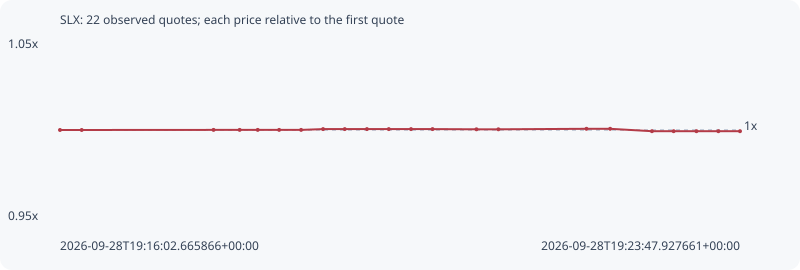

# SLX

**bsc** / `0x02bcc4c181b83a8c0a342bc003389cbecb4bc54d`

[All tokens](README.md) · [Market window](../README.md)

## Native assessments

This contract is in the quote cohort; it has no native model assessment in this window.

## Series c64568386aac25082fbb

Pool: `not supplied`

[Complete series](../series/bsc/c64568386aac25082fbb.json)

Every dot is a captured quote. Lines connect observations; the curve ends at the last available quote.

| Peak | Final | Return | Maximum drawdown |
| ---: | ---: | ---: | ---: |
| 1.0007x | 0.9993x | -0.07% | 0.13% |

### Complete quote timeline

| Time (UTC) | Price (USD) | Multiple | Evidence |
| --- | ---: | ---: | --- |
| 2026-09-28T19:16:02.665866+00:00 | 0.0659143 | 1.0000x | `capture:831c8e00-640d-4942-9ad6-ae68e842f3cf:rank:97` |
| 2026-09-28T19:16:17.512218+00:00 | 0.0659143 | 1.0000x | `capture:a4477278-80c9-4a7a-9a8f-66687623072c:rank:99` |
| 2026-09-28T19:17:47.717594+00:00 | 0.0659178 | 1.0001x | `capture:2cc72c7e-c2ae-4eb2-929b-e80f3d8c4e15:rank:89` |
| 2026-09-28T19:18:05.582121+00:00 | 0.0659178 | 1.0001x | `capture:07127a86-393c-4e05-bde5-d28a70a854fb:rank:89` |
| 2026-09-28T19:18:17.953086+00:00 | 0.0659178 | 1.0001x | `capture:ca903b0a-a9a8-4246-873f-5115402fbf9c:rank:99` |
| 2026-09-28T19:18:32.607444+00:00 | 0.0659178 | 1.0001x | `capture:86009bbc-85b0-465e-8657-55be8d6c15de:rank:98` |
| 2026-09-28T19:18:47.632598+00:00 | 0.0659178 | 1.0001x | `capture:bfa4352f-2279-41ec-a6fd-d3e101a21181:rank:99` |
| 2026-09-28T19:19:02.666276+00:00 | 0.0659476 | 1.0005x | `capture:6fe1da90-a254-48b3-b112-ab24c6060e81:rank:86` |
| 2026-09-28T19:19:17.488471+00:00 | 0.0659476 | 1.0005x | `capture:b87f439a-4825-4a6f-b17c-0b78464d9310:rank:82` |
| 2026-09-28T19:19:32.672995+00:00 | 0.0659476 | 1.0005x | `capture:ceae4194-4b79-45b3-9a66-758dd19e2a7b:rank:94` |
| 2026-09-28T19:19:47.615151+00:00 | 0.0659476 | 1.0005x | `capture:0dedf968-cc48-4422-8bbf-180ff2103dbf:rank:90` |
| 2026-09-28T19:20:02.835112+00:00 | 0.0659476 | 1.0005x | `capture:adbb19f8-5a81-4d70-8990-a6ffd414f250:rank:93` |
| 2026-09-28T19:20:17.561225+00:00 | 0.0659476 | 1.0005x | `capture:0feecf05-56c0-4db7-a137-f63b427a7830:rank:98` |
| 2026-09-28T19:20:47.599416+00:00 | 0.0659399 | 1.0004x | `capture:1ab71e23-e150-479b-a1fa-e2a362332d1e:rank:88` |
| 2026-09-28T19:21:02.616817+00:00 | 0.0659399 | 1.0004x | `capture:ec0d171f-d990-484a-94d1-c335d7f6e8fb:rank:90` |
| 2026-09-28T19:22:02.883000+00:00 | 0.0659584 | 1.0007x | `capture:eb8228cb-dfba-443e-9576-ee214dcd3354:rank:96` |
| 2026-09-28T19:22:19.090071+00:00 | 0.0659584 | 1.0007x | `capture:30ef0b61-e0e1-4eba-95c6-de3dc48fe868:rank:96` |
| 2026-09-28T19:22:47.674643+00:00 | 0.0658694 | 0.9993x | `capture:c8838291-6f5a-42d9-9013-9d9421deb79e:rank:80` |
| 2026-09-28T19:23:02.516005+00:00 | 0.0658694 | 0.9993x | `capture:f8b60e63-80ce-442a-9ca7-659f2b5ca21d:rank:87` |
| 2026-09-28T19:23:18.123882+00:00 | 0.0658694 | 0.9993x | `capture:f689df34-2acf-42e7-a37b-1a7d50808302:rank:83` |
| 2026-09-28T19:23:33.140484+00:00 | 0.0658694 | 0.9993x | `capture:ef2304f7-c374-4b90-a3e4-d8976f05c226:rank:85` |
| 2026-09-28T19:23:47.927661+00:00 | 0.0658694 | 0.9993x | `capture:51aa913c-158f-4059-8727-ff1ace24834c:rank:84` |

### Exit-policy timeline

Calculated from captured quotes under the window policy. Native assessments are linked separately above.

| Time (UTC) | Action | Price (USD) | Evidence |
| --- | --- | ---: | --- |
| 2026-09-28T19:16:02.665866+00:00 | BUY | 0.0659143 | `capture:831c8e00-640d-4942-9ad6-ae68e842f3cf:rank:97` |
| 2026-09-28T19:16:17.512218+00:00 | HOLD | 0.0659143 | `capture:a4477278-80c9-4a7a-9a8f-66687623072c:rank:99` |
| 2026-09-28T19:17:47.717594+00:00 | HOLD | 0.0659178 | `capture:2cc72c7e-c2ae-4eb2-929b-e80f3d8c4e15:rank:89` |
| 2026-09-28T19:18:05.582121+00:00 | HOLD | 0.0659178 | `capture:07127a86-393c-4e05-bde5-d28a70a854fb:rank:89` |
| 2026-09-28T19:18:17.953086+00:00 | HOLD | 0.0659178 | `capture:ca903b0a-a9a8-4246-873f-5115402fbf9c:rank:99` |
| 2026-09-28T19:18:32.607444+00:00 | HOLD | 0.0659178 | `capture:86009bbc-85b0-465e-8657-55be8d6c15de:rank:98` |
| 2026-09-28T19:18:47.632598+00:00 | HOLD | 0.0659178 | `capture:bfa4352f-2279-41ec-a6fd-d3e101a21181:rank:99` |
| 2026-09-28T19:19:02.666276+00:00 | HOLD | 0.0659476 | `capture:6fe1da90-a254-48b3-b112-ab24c6060e81:rank:86` |
| 2026-09-28T19:19:17.488471+00:00 | HOLD | 0.0659476 | `capture:b87f439a-4825-4a6f-b17c-0b78464d9310:rank:82` |
| 2026-09-28T19:19:32.672995+00:00 | HOLD | 0.0659476 | `capture:ceae4194-4b79-45b3-9a66-758dd19e2a7b:rank:94` |
| 2026-09-28T19:19:47.615151+00:00 | HOLD | 0.0659476 | `capture:0dedf968-cc48-4422-8bbf-180ff2103dbf:rank:90` |
| 2026-09-28T19:20:02.835112+00:00 | HOLD | 0.0659476 | `capture:adbb19f8-5a81-4d70-8990-a6ffd414f250:rank:93` |
| 2026-09-28T19:20:17.561225+00:00 | HOLD | 0.0659476 | `capture:0feecf05-56c0-4db7-a137-f63b427a7830:rank:98` |
| 2026-09-28T19:20:47.599416+00:00 | HOLD | 0.0659399 | `capture:1ab71e23-e150-479b-a1fa-e2a362332d1e:rank:88` |
| 2026-09-28T19:21:02.616817+00:00 | HOLD | 0.0659399 | `capture:ec0d171f-d990-484a-94d1-c335d7f6e8fb:rank:90` |
| 2026-09-28T19:22:02.883000+00:00 | HOLD | 0.0659584 | `capture:eb8228cb-dfba-443e-9576-ee214dcd3354:rank:96` |
| 2026-09-28T19:22:19.090071+00:00 | HOLD | 0.0659584 | `capture:30ef0b61-e0e1-4eba-95c6-de3dc48fe868:rank:96` |
| 2026-09-28T19:22:47.674643+00:00 | HOLD | 0.0658694 | `capture:c8838291-6f5a-42d9-9013-9d9421deb79e:rank:80` |
| 2026-09-28T19:23:02.516005+00:00 | HOLD | 0.0658694 | `capture:f8b60e63-80ce-442a-9ca7-659f2b5ca21d:rank:87` |
| 2026-09-28T19:23:18.123882+00:00 | HOLD | 0.0658694 | `capture:f689df34-2acf-42e7-a37b-1a7d50808302:rank:83` |
| 2026-09-28T19:23:33.140484+00:00 | HOLD | 0.0658694 | `capture:ef2304f7-c374-4b90-a3e4-d8976f05c226:rank:85` |
| 2026-09-28T19:23:47.927661+00:00 | HOLD | 0.0658694 | `capture:51aa913c-158f-4059-8727-ff1ace24834c:rank:84` |
