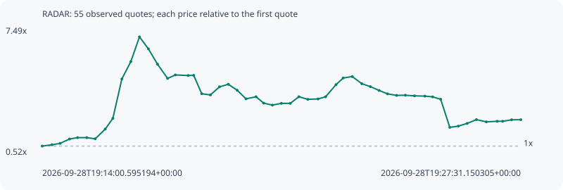

# RADAR

**solana** / `4SYjuST7d74abwTPnBtBgqZ3UmBB1QKEo9W3gCBApump`

[All tokens](README.md) · [Market window](../README.md)

## Native assessments

This contract is in the quote cohort; it has no native model assessment in this window.

## Series 2980b614bba3d3a11242

Pool: `not supplied`

[Complete series](../series/solana/2980b614bba3d3a11242.json)

Every dot is a captured quote. Lines connect observations; the curve ends at the last available quote.

| Peak | Final | Return | Maximum drawdown |
| ---: | ---: | ---: | ---: |
| 7.0136x | 2.4532x | +145.32% | 71.03% |

### Complete quote timeline

| Time (UTC) | Price (USD) | Multiple | Evidence |
| --- | ---: | ---: | --- |
| 2026-09-28T19:14:00.595194+00:00 | 9.76703e-06 | 1.0000x | `capture:2c78112b-48e7-4f74-8c2e-1cb8642a79dc:rank:72` |
| 2026-09-28T19:14:17.246316+00:00 | 1.04754e-05 | 1.0725x | `capture:7a923cde-d765-4388-a15c-4f47fde0a3b5:rank:73` |
| 2026-09-28T19:14:30.874732+00:00 | 1.12214e-05 | 1.1489x | `capture:fa585070-b1ae-4f9d-afbd-aa986f487793:rank:69` |
| 2026-09-28T19:14:46.892387+00:00 | 1.35685e-05 | 1.3892x | `capture:7d9e3e65-8bda-4696-b6d1-7a86825bd98c:rank:67` |
| 2026-09-28T19:15:00.432009+00:00 | 1.42993e-05 | 1.4640x | `capture:797f9a41-958a-44ba-ac57-3b9cacf5d06b:rank:71` |
| 2026-09-28T19:15:16.098308+00:00 | 1.42993e-05 | 1.4640x | `capture:ab2becb9-3f94-4a57-b9e8-472ad0998012:rank:74` |
| 2026-09-28T19:15:30.340579+00:00 | 1.36758e-05 | 1.4002x | `capture:564db5fc-5586-41d3-88fb-a9a955708f1d:rank:74` |
| 2026-09-28T19:15:47.323285+00:00 | 1.88976e-05 | 1.9348x | `capture:65003429-a569-4442-8d4f-b2c93db69061:rank:62` |
| 2026-09-28T19:16:00.259696+00:00 | 2.46953e-05 | 2.5284x | `capture:4236f8d5-90c4-4c9b-a73e-d6443ae3bf32:rank:59` |
| 2026-09-28T19:16:15.455827+00:00 | 4.5863e-05 | 4.6957x | `capture:acc657c6-9a43-46bf-986e-7b907c831cba:rank:49` |
| 2026-09-28T19:16:30.624202+00:00 | 5.51841e-05 | 5.6500x | `capture:0d391072-ec81-4bb7-9be0-0d6bbb801c70:rank:25` |
| 2026-09-28T19:16:45.311485+00:00 | 6.85016e-05 | 7.0136x | `capture:72cccbac-c3fe-4991-8f62-08c53849b146:rank:20` |
| 2026-09-28T19:17:00.368914+00:00 | 6.20765e-05 | 6.3557x | `capture:1232cf18-7088-40a1-9f55-ad9ae22b44f5:rank:17` |
| 2026-09-28T19:17:15.914647+00:00 | 5.37673e-05 | 5.5050x | `capture:9792e199-c0c2-4272-ac95-24501e4a3f79:rank:13` |
| 2026-09-28T19:17:32.965607+00:00 | 4.61601e-05 | 4.7261x | `capture:0f04cfe5-88a0-4a83-ae8d-85c5cb3cdc89:rank:14` |
| 2026-09-28T19:17:46.087880+00:00 | 4.80249e-05 | 4.9170x | `capture:ee91a1c6-bc99-4c7a-9cdc-bd6cb5478a9b:rank:15` |
| 2026-09-28T19:18:07.749963+00:00 | 4.7728e-05 | 4.8866x | `capture:b0fb1b47-4973-472f-9619-8480bc7d294e:rank:18` |
| 2026-09-28T19:18:17.126008+00:00 | 4.78196e-05 | 4.8960x | `capture:5ed98f51-d1e1-422a-81df-4186a8b0a0a2:rank:18` |
| 2026-09-28T19:18:30.722167+00:00 | 3.79364e-05 | 3.8841x | `capture:9f88d118-9108-4dff-bbfc-246eaed5ce38:rank:18` |
| 2026-09-28T19:18:45.386687+00:00 | 3.72653e-05 | 3.8154x | `capture:f533100a-ce62-4457-9107-42e7601ea5d7:rank:17` |
| 2026-09-28T19:19:00.883835+00:00 | 4.16489e-05 | 4.2642x | `capture:a2495d99-5671-4c7e-b87c-48f48d90f2f2:rank:15` |
| 2026-09-28T19:19:15.826416+00:00 | 4.30086e-05 | 4.4034x | `capture:ba1dc6a3-b8b7-461a-8110-8490f03539a5:rank:14` |
| 2026-09-28T19:19:30.814098+00:00 | 3.97858e-05 | 4.0735x | `capture:b25d90dc-c8db-4388-8a2b-d06541e5320f:rank:14` |
| 2026-09-28T19:19:45.817199+00:00 | 3.51674e-05 | 3.6006x | `capture:722d1b7b-ef4f-4ac5-883c-0557bae2b60b:rank:13` |
| 2026-09-28T19:20:02.715590+00:00 | 3.63008e-05 | 3.7167x | `capture:60ff17d8-3b18-4f61-9bc7-006afd324cf2:rank:13` |
| 2026-09-28T19:20:15.699547+00:00 | 3.28586e-05 | 3.3642x | `capture:10a94828-637f-4580-a9f7-2fbd34d8589a:rank:13` |
| 2026-09-28T19:20:30.480194+00:00 | 3.18069e-05 | 3.2566x | `capture:54722132-db1d-4a2b-8c1c-2b0e71d01430:rank:13` |
| 2026-09-28T19:20:45.683165+00:00 | 3.27494e-05 | 3.3531x | `capture:17963a37-fd65-46b6-8e1c-350082721f8c:rank:13` |
| 2026-09-28T19:21:00.690136+00:00 | 3.27428e-05 | 3.3524x | `capture:f2ff842d-38e9-4cbe-a281-98c17d5a5672:rank:13` |
| 2026-09-28T19:21:15.372716+00:00 | 3.63029e-05 | 3.7169x | `capture:a923b968-a768-495e-ae33-6de2042c551f:rank:11` |
| 2026-09-28T19:21:30.402460+00:00 | 3.48995e-05 | 3.5732x | `capture:d926629b-2050-4e50-a602-1638c6205870:rank:12` |
| 2026-09-28T19:21:47.649380+00:00 | 3.51148e-05 | 3.5952x | `capture:0799ec6d-0e89-46b5-ae88-5695bf6c5fc3:rank:20` |
| 2026-09-28T19:22:00.569928+00:00 | 3.62903e-05 | 3.7156x | `capture:263cda40-4b31-4b2d-b168-fa4310edb46d:rank:20` |
| 2026-09-28T19:22:18.240717+00:00 | 4.2816e-05 | 4.3837x | `capture:546b2c55-1845-4da7-bc9c-4439cd0ccdba:rank:20` |
| 2026-09-28T19:22:30.371968+00:00 | 4.63774e-05 | 4.7484x | `capture:507d17cb-af67-4a81-a2b2-d5ddfbc40021:rank:20` |
| 2026-09-28T19:22:45.783808+00:00 | 4.71721e-05 | 4.8297x | `capture:9558d322-c429-480b-885f-82f4481c8506:rank:23` |
| 2026-09-28T19:23:01.833252+00:00 | 4.33427e-05 | 4.4377x | `capture:c5462412-2da1-4432-8949-8fcd1492c57f:rank:24` |
| 2026-09-28T19:23:16.460099+00:00 | 4.17404e-05 | 4.2736x | `capture:2d456a2a-6755-4e1d-9a80-b6e3b2d44ec1:rank:25` |
| 2026-09-28T19:23:31.092727+00:00 | 3.96971e-05 | 4.0644x | `capture:0e687519-8b01-4d7e-b48c-e2ec34135d17:rank:26` |
| 2026-09-28T19:23:45.375171+00:00 | 3.78522e-05 | 3.8755x | `capture:1b404fa0-870b-4e7c-bafd-c3ef241c5093:rank:27` |
| 2026-09-28T19:24:00.852400+00:00 | 3.70358e-05 | 3.7919x | `capture:5205c587-4734-452c-b758-46c4814dded1:rank:28` |
| 2026-09-28T19:24:15.655418+00:00 | 3.71211e-05 | 3.8007x | `capture:5b9df0f6-51c0-4dbb-9de7-7df7a46bfee0:rank:28` |
| 2026-09-28T19:24:31.056437+00:00 | 3.67818e-05 | 3.7659x | `capture:971b5dda-397d-4fe7-b49e-94713bb088df:rank:28` |
| 2026-09-28T19:24:48.687179+00:00 | 3.66407e-05 | 3.7515x | `capture:feb72cbd-a170-4ba3-8a11-eb1df1686719:rank:30` |
| 2026-09-28T19:25:01.877958+00:00 | 3.62447e-05 | 3.7109x | `capture:fd6d01ae-d246-439e-ac58-27ae75880eb9:rank:32` |
| 2026-09-28T19:25:15.488701+00:00 | 3.49471e-05 | 3.5781x | `capture:b8fee87c-9981-475c-930b-99c255910a9f:rank:32` |
| 2026-09-28T19:25:30.900173+00:00 | 1.98456e-05 | 2.0319x | `capture:7f757769-25c3-429a-81d0-c6b2ee45ee15:rank:29` |
| 2026-09-28T19:25:45.342895+00:00 | 2.05067e-05 | 2.0996x | `capture:0ca3656d-ce8c-444b-8f77-acf34c08a1f4:rank:29` |
| 2026-09-28T19:26:00.340634+00:00 | 2.19643e-05 | 2.2488x | `capture:5b3728c5-aff9-43f3-bbb5-25b251825caa:rank:30` |
| 2026-09-28T19:26:16.031602+00:00 | 2.39974e-05 | 2.4570x | `capture:bb8d4bfc-85e1-4d55-a2ff-e47193bcce5f:rank:32` |
| 2026-09-28T19:26:32.771713+00:00 | 2.28054e-05 | 2.3349x | `capture:2fed7296-b3d1-4ba6-8398-799ee55f1f2b:rank:34` |
| 2026-09-28T19:26:51.267717+00:00 | 2.31076e-05 | 2.3659x | `capture:4cc162c2-aa4a-403b-a901-4bb5058380d6:rank:36` |
| 2026-09-28T19:27:00.453239+00:00 | 2.31076e-05 | 2.3659x | `capture:4273fbb8-5342-4e37-8d61-ced6b88e542d:rank:37` |
| 2026-09-28T19:27:15.715818+00:00 | 2.391e-05 | 2.4480x | `capture:d04c9116-4617-4b61-8b98-5489321cd1cc:rank:36` |
| 2026-09-28T19:27:31.150305+00:00 | 2.39602e-05 | 2.4532x | `capture:7cad37e8-83d3-4438-8055-245db6707e2e:rank:37` |

### Exit-policy timeline

Calculated from captured quotes under the window policy. Native assessments are linked separately above.

| Time (UTC) | Action | Price (USD) | Evidence |
| --- | --- | ---: | --- |
| 2026-09-28T19:14:00.595194+00:00 | BUY | 9.76703e-06 | `capture:2c78112b-48e7-4f74-8c2e-1cb8642a79dc:rank:72` |
| 2026-09-28T19:14:17.246316+00:00 | HOLD | 1.04754e-05 | `capture:7a923cde-d765-4388-a15c-4f47fde0a3b5:rank:73` |
| 2026-09-28T19:14:30.874732+00:00 | HOLD | 1.12214e-05 | `capture:fa585070-b1ae-4f9d-afbd-aa986f487793:rank:69` |
| 2026-09-28T19:14:46.892387+00:00 | PROFIT | 1.35685e-05 | `capture:7d9e3e65-8bda-4696-b6d1-7a86825bd98c:rank:67` |
| 2026-09-28T19:15:00.432009+00:00 | HOLD_BAG | 1.42993e-05 | `capture:797f9a41-958a-44ba-ac57-3b9cacf5d06b:rank:71` |
| 2026-09-28T19:15:16.098308+00:00 | HOLD_BAG | 1.42993e-05 | `capture:ab2becb9-3f94-4a57-b9e8-472ad0998012:rank:74` |
| 2026-09-28T19:15:30.340579+00:00 | HOLD_BAG | 1.36758e-05 | `capture:564db5fc-5586-41d3-88fb-a9a955708f1d:rank:74` |
| 2026-09-28T19:15:47.323285+00:00 | TP | 1.88976e-05 | `capture:65003429-a569-4442-8d4f-b2c93db69061:rank:62` |
