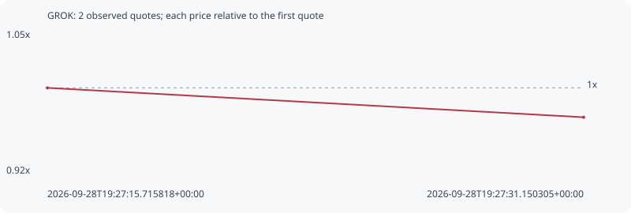

# GROK

**solana** / `6HU4CmRb15C2nQDx8Ld2f2W2wTdmog6aZiiXdrT5Pzi8`

[All tokens](README.md) · [Market window](../README.md)

## Native assessments

This contract is in the quote cohort; it has no native model assessment in this window.

## Series 1d0350624d177f3d503a

Pool: `not supplied`

[Complete series](../series/solana/1d0350624d177f3d503a.json)

Every dot is a captured quote. Lines connect observations; the curve ends at the last available quote.

| Peak | Final | Return | Maximum drawdown |
| ---: | ---: | ---: | ---: |
| 1.0000x | 0.9739x | -2.61% | 2.61% |

### Complete quote timeline

| Time (UTC) | Price (USD) | Multiple | Evidence |
| --- | ---: | ---: | --- |
| 2026-09-28T19:27:15.715818+00:00 | 0.00145358 | 1.0000x | `capture:d04c9116-4617-4b61-8b98-5489321cd1cc:rank:95` |
| 2026-09-28T19:27:31.150305+00:00 | 0.00141565 | 0.9739x | `capture:7cad37e8-83d3-4438-8055-245db6707e2e:rank:90` |

### Exit-policy timeline

Calculated from captured quotes under the window policy. Native assessments are linked separately above.

| Time (UTC) | Action | Price (USD) | Evidence |
| --- | --- | ---: | --- |
| 2026-09-28T19:27:15.715818+00:00 | BUY | 0.00145358 | `capture:d04c9116-4617-4b61-8b98-5489321cd1cc:rank:95` |
| 2026-09-28T19:27:31.150305+00:00 | HOLD | 0.00141565 | `capture:7cad37e8-83d3-4438-8055-245db6707e2e:rank:90` |
