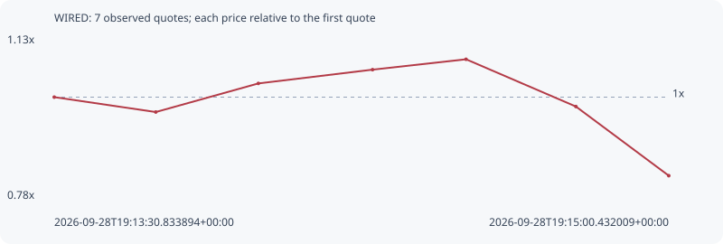

# WIRED

**solana** / `W1REDXeQNwEjbX648217XGsErfPrw866iFX4fB1qGKT`

[All tokens](README.md) · [Market window](../README.md)

## Native assessments

This contract is in the quote cohort; it has no native model assessment in this window.

## Series 65d20d9c74cf5c557823

Pool: `not supplied`

[Complete series](../series/solana/65d20d9c74cf5c557823.json)

Every dot is a captured quote. Lines connect observations; the curve ends at the last available quote.

| Peak | Final | Return | Maximum drawdown |
| ---: | ---: | ---: | ---: |
| 1.0818x | 0.8302x | -16.98% | 23.26% |

### Complete quote timeline

| Time (UTC) | Price (USD) | Multiple | Evidence |
| --- | ---: | ---: | --- |
| 2026-09-28T19:13:30.833894+00:00 | 1.1935e-05 | 1.0000x | `capture:2beb38a4-bfac-4502-bbc3-8c8c0f943007:rank:70` |
| 2026-09-28T19:13:45.640151+00:00 | 1.15502e-05 | 0.9678x | `capture:4d31b656-3ffe-4768-bef6-377adf019420:rank:59` |
| 2026-09-28T19:14:00.595194+00:00 | 1.22887e-05 | 1.0296x | `capture:2c78112b-48e7-4f74-8c2e-1cb8642a79dc:rank:58` |
| 2026-09-28T19:14:17.246316+00:00 | 1.2644e-05 | 1.0594x | `capture:7a923cde-d765-4388-a15c-4f47fde0a3b5:rank:57` |
| 2026-09-28T19:14:30.874732+00:00 | 1.29117e-05 | 1.0818x | `capture:fa585070-b1ae-4f9d-afbd-aa986f487793:rank:53` |
| 2026-09-28T19:14:46.892387+00:00 | 1.16921e-05 | 0.9796x | `capture:7d9e3e65-8bda-4696-b6d1-7a86825bd98c:rank:48` |
| 2026-09-28T19:15:00.432009+00:00 | 9.90804e-06 | 0.8302x | `capture:797f9a41-958a-44ba-ac57-3b9cacf5d06b:rank:47` |

### Exit-policy timeline

Calculated from captured quotes under the window policy. Native assessments are linked separately above.

| Time (UTC) | Action | Price (USD) | Evidence |
| --- | --- | ---: | --- |
| 2026-09-28T19:13:30.833894+00:00 | BUY | 1.1935e-05 | `capture:2beb38a4-bfac-4502-bbc3-8c8c0f943007:rank:70` |
| 2026-09-28T19:13:45.640151+00:00 | HOLD | 1.15502e-05 | `capture:4d31b656-3ffe-4768-bef6-377adf019420:rank:59` |
| 2026-09-28T19:14:00.595194+00:00 | HOLD | 1.22887e-05 | `capture:2c78112b-48e7-4f74-8c2e-1cb8642a79dc:rank:58` |
| 2026-09-28T19:14:17.246316+00:00 | HOLD | 1.2644e-05 | `capture:7a923cde-d765-4388-a15c-4f47fde0a3b5:rank:57` |
| 2026-09-28T19:14:30.874732+00:00 | HOLD | 1.29117e-05 | `capture:fa585070-b1ae-4f9d-afbd-aa986f487793:rank:53` |
| 2026-09-28T19:14:46.892387+00:00 | HOLD | 1.16921e-05 | `capture:7d9e3e65-8bda-4696-b6d1-7a86825bd98c:rank:48` |
| 2026-09-28T19:15:00.432009+00:00 | SL | 9.90804e-06 | `capture:797f9a41-958a-44ba-ac57-3b9cacf5d06b:rank:47` |
