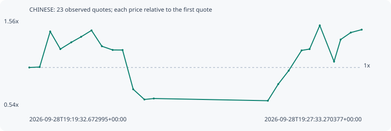

# CHINESE

**bsc** / `0x518962f1b37217980111c2443dd9a698bac27777`

[All tokens](README.md) · [Market window](../README.md)

## Native assessments

This contract is in the quote cohort; it has no native model assessment in this window.

## Series f2ff106f4b685833da87

Pool: `not supplied`

[Complete series](../series/bsc/f2ff106f4b685833da87.json)

Every dot is a captured quote. Lines connect observations; the curve ends at the last available quote.

| Peak | Final | Return | Maximum drawdown |
| ---: | ---: | ---: | ---: |
| 1.4878x | 1.4389x | +43.89% | 57.03% |

### Complete quote timeline

| Time (UTC) | Price (USD) | Multiple | Evidence |
| --- | ---: | ---: | --- |
| 2026-09-28T19:19:32.672995+00:00 | 1.42856e-05 | 1.0000x | `capture:ceae4194-4b79-45b3-9a66-758dd19e2a7b:rank:9` |
| 2026-09-28T19:19:47.615151+00:00 | 1.43604e-05 | 1.0052x | `capture:0dedf968-cc48-4422-8bbf-180ff2103dbf:rank:9` |
| 2026-09-28T19:20:02.835112+00:00 | 2.02483e-05 | 1.4174x | `capture:adbb19f8-5a81-4d70-8990-a6ffd414f250:rank:5` |
| 2026-09-28T19:20:17.561225+00:00 | 1.73345e-05 | 1.2134x | `capture:0feecf05-56c0-4db7-a137-f63b427a7830:rank:5` |
| 2026-09-28T19:20:33.351338+00:00 | 1.84559e-05 | 1.2919x | `capture:5752259a-2bcb-4e27-ac90-6ef5a52d1cf7:rank:4` |
| 2026-09-28T19:20:47.599416+00:00 | 1.93735e-05 | 1.3562x | `capture:1ab71e23-e150-479b-a1fa-e2a362332d1e:rank:4` |
| 2026-09-28T19:21:02.616817+00:00 | 2.04295e-05 | 1.4301x | `capture:ec0d171f-d990-484a-94d1-c335d7f6e8fb:rank:4` |
| 2026-09-28T19:21:17.612081+00:00 | 1.78042e-05 | 1.2463x | `capture:cc46cbda-0be4-42ba-bcf4-4a03c9e7e894:rank:4` |
| 2026-09-28T19:21:33.217678+00:00 | 1.719e-05 | 1.2033x | `capture:3a34cabb-e5ee-4ff6-9f92-f0839c39884f:rank:4` |
| 2026-09-28T19:21:47.485842+00:00 | 1.71773e-05 | 1.2024x | `capture:9e0730ff-182b-409c-b854-c06b993be570:rank:4` |
| 2026-09-28T19:22:02.883000+00:00 | 1.06744e-05 | 0.7472x | `capture:eb8228cb-dfba-443e-9576-ee214dcd3354:rank:4` |
| 2026-09-28T19:22:19.090071+00:00 | 8.98264e-06 | 0.6288x | `capture:30ef0b61-e0e1-4eba-95c6-de3dc48fe868:rank:3` |
| 2026-09-28T19:22:32.671189+00:00 | 9.14371e-06 | 0.6401x | `capture:5d031323-644d-4272-bacc-8a363d4b77cb:rank:3` |
| 2026-09-28T19:25:17.566680+00:00 | 8.778e-06 | 0.6145x | `capture:89c3d45d-a145-4312-88dc-a4340e727616:rank:5` |
| 2026-09-28T19:25:32.640282+00:00 | 1.15319e-05 | 0.8072x | `capture:a41f01eb-b1b7-4ed5-a604-19b71e522502:rank:5` |
| 2026-09-28T19:25:47.745538+00:00 | 1.37638e-05 | 0.9635x | `capture:b20e5ea5-a03d-4b94-91ce-404a72f5de9b:rank:5` |
| 2026-09-28T19:26:06.431923+00:00 | 1.71168e-05 | 1.1982x | `capture:a3278748-b5f3-45be-a966-ab473520d9c2:rank:5` |
| 2026-09-28T19:26:17.917162+00:00 | 1.73343e-05 | 1.2134x | `capture:3b80c987-c82b-4a3e-8f0b-d3017a78edcb:rank:4` |
| 2026-09-28T19:26:32.687411+00:00 | 2.12539e-05 | 1.4878x | `capture:d1fef60a-e7ad-4594-a8e8-74ee96c47ae4:rank:5` |
| 2026-09-28T19:26:53.320509+00:00 | 1.52697e-05 | 1.0689x | `capture:5f09420c-1544-46ff-a2e4-39235f8f73a9:rank:4` |
| 2026-09-28T19:27:02.865937+00:00 | 1.89159e-05 | 1.3241x | `capture:bd21661a-974d-4bab-9276-4e2f7e7d279a:rank:4` |
| 2026-09-28T19:27:17.494949+00:00 | 2.00706e-05 | 1.4050x | `capture:c5d9da1a-7d95-4d7f-8cef-ffb660ac56d0:rank:4` |
| 2026-09-28T19:27:33.270377+00:00 | 2.05549e-05 | 1.4389x | `capture:1cb6d037-a95b-477e-be82-4cc75b729c8b:rank:4` |

### Exit-policy timeline

Calculated from captured quotes under the window policy. Native assessments are linked separately above.

| Time (UTC) | Action | Price (USD) | Evidence |
| --- | --- | ---: | --- |
| 2026-09-28T19:19:32.672995+00:00 | BUY | 1.42856e-05 | `capture:ceae4194-4b79-45b3-9a66-758dd19e2a7b:rank:9` |
| 2026-09-28T19:19:47.615151+00:00 | HOLD | 1.43604e-05 | `capture:0dedf968-cc48-4422-8bbf-180ff2103dbf:rank:9` |
| 2026-09-28T19:20:02.835112+00:00 | PROFIT | 2.02483e-05 | `capture:adbb19f8-5a81-4d70-8990-a6ffd414f250:rank:5` |
| 2026-09-28T19:20:17.561225+00:00 | HOLD_BAG | 1.73345e-05 | `capture:0feecf05-56c0-4db7-a137-f63b427a7830:rank:5` |
| 2026-09-28T19:20:33.351338+00:00 | HOLD_BAG | 1.84559e-05 | `capture:5752259a-2bcb-4e27-ac90-6ef5a52d1cf7:rank:4` |
| 2026-09-28T19:20:47.599416+00:00 | HOLD_BAG | 1.93735e-05 | `capture:1ab71e23-e150-479b-a1fa-e2a362332d1e:rank:4` |
| 2026-09-28T19:21:02.616817+00:00 | HOLD_BAG | 2.04295e-05 | `capture:ec0d171f-d990-484a-94d1-c335d7f6e8fb:rank:4` |
| 2026-09-28T19:21:17.612081+00:00 | HOLD_BAG | 1.78042e-05 | `capture:cc46cbda-0be4-42ba-bcf4-4a03c9e7e894:rank:4` |
| 2026-09-28T19:21:33.217678+00:00 | HOLD_BAG | 1.719e-05 | `capture:3a34cabb-e5ee-4ff6-9f92-f0839c39884f:rank:4` |
| 2026-09-28T19:21:47.485842+00:00 | HOLD_BAG | 1.71773e-05 | `capture:9e0730ff-182b-409c-b854-c06b993be570:rank:4` |
| 2026-09-28T19:22:02.883000+00:00 | SL | 1.06744e-05 | `capture:eb8228cb-dfba-443e-9576-ee214dcd3354:rank:4` |
