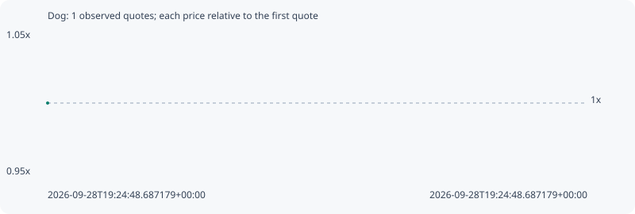

# Dog

**solana** / `33y9V2nzdfM5CEdtzyv37SGEz42m3H35oDpwfS9Q3dfV`

[All tokens](README.md) · [Market window](../README.md)

## Native assessments

This contract is in the quote cohort; it has no native model assessment in this window.

## Series 754c9ff9908aafed8c2d

Pool: `not supplied`

[Complete series](../series/solana/754c9ff9908aafed8c2d.json)

Every dot is a captured quote. Lines connect observations; the curve ends at the last available quote.

Fewer than two quotes: return and drawdown are not calculated.

### Complete quote timeline

| Time (UTC) | Price (USD) | Multiple | Evidence |
| --- | ---: | ---: | --- |
| 2026-09-28T19:24:48.687179+00:00 | 8.25477e-06 | 1.0000x | `capture:feb72cbd-a170-4ba3-8a11-eb1df1686719:rank:84` |

### Exit-policy timeline

Calculated from captured quotes under the window policy. Native assessments are linked separately above.

| Time (UTC) | Action | Price (USD) | Evidence |
| --- | --- | ---: | --- |
