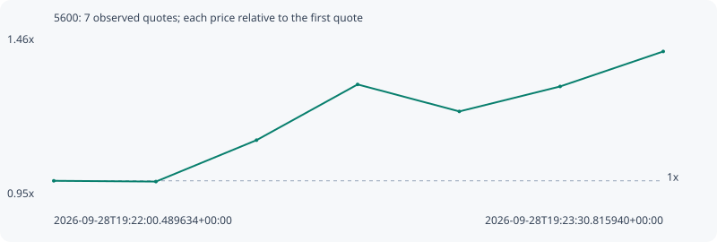

# 5600

**robinhood** / `0x0b98987748ade6f8b51141e3c08025aa6394d6ce`

[All tokens](README.md) · [Market window](../README.md)

## Native assessments

This contract is in the quote cohort; it has no native model assessment in this window.

## Series 9cc0e56ec907af71a838

Pool: `not supplied`

[Complete series](../series/robinhood/9cc0e56ec907af71a838.json)

Every dot is a captured quote. Lines connect observations; the curve ends at the last available quote.

| Peak | Final | Return | Maximum drawdown |
| ---: | ---: | ---: | ---: |
| 1.4145x | 1.4145x | +41.45% | 6.61% |

### Complete quote timeline

| Time (UTC) | Price (USD) | Multiple | Evidence |
| --- | ---: | ---: | --- |
| 2026-09-28T19:22:00.489634+00:00 | 1.01338e-05 | 1.0000x | `capture:d6c64542-18c5-48a0-a6c9-f0e2a9c54b41:rank:76` |
| 2026-09-28T19:22:15.632268+00:00 | 1.01086e-05 | 0.9975x | `capture:13e6d33e-e854-4b87-b3da-49aedec6950e:rank:19` |
| 2026-09-28T19:22:30.535979+00:00 | 1.1454e-05 | 1.1303x | `capture:091fb4d2-10fc-4d5f-9c22-af9f55e90e4a:rank:18` |
| 2026-09-28T19:22:45.520851+00:00 | 1.32637e-05 | 1.3089x | `capture:128617a9-4055-4a8d-8b04-c8876bad9c70:rank:14` |
| 2026-09-28T19:23:00.594785+00:00 | 1.23869e-05 | 1.2223x | `capture:b6c633f1-3960-4db3-a2ca-34618f913368:rank:11` |
| 2026-09-28T19:23:15.534636+00:00 | 1.31977e-05 | 1.3023x | `capture:d5a0d1a4-a366-4985-80da-e34160e2f58c:rank:10` |
| 2026-09-28T19:23:30.815940+00:00 | 1.43346e-05 | 1.4145x | `capture:c6f23ed9-c47c-4f73-bf08-86a494a11aa2:rank:7` |

### Exit-policy timeline

Calculated from captured quotes under the window policy. Native assessments are linked separately above.

| Time (UTC) | Action | Price (USD) | Evidence |
| --- | --- | ---: | --- |
| 2026-09-28T19:22:00.489634+00:00 | BUY | 1.01338e-05 | `capture:d6c64542-18c5-48a0-a6c9-f0e2a9c54b41:rank:76` |
| 2026-09-28T19:22:15.632268+00:00 | HOLD | 1.01086e-05 | `capture:13e6d33e-e854-4b87-b3da-49aedec6950e:rank:19` |
| 2026-09-28T19:22:30.535979+00:00 | HOLD | 1.1454e-05 | `capture:091fb4d2-10fc-4d5f-9c22-af9f55e90e4a:rank:18` |
| 2026-09-28T19:22:45.520851+00:00 | PROFIT | 1.32637e-05 | `capture:128617a9-4055-4a8d-8b04-c8876bad9c70:rank:14` |
| 2026-09-28T19:23:00.594785+00:00 | HOLD_BAG | 1.23869e-05 | `capture:b6c633f1-3960-4db3-a2ca-34618f913368:rank:11` |
| 2026-09-28T19:23:15.534636+00:00 | HOLD_BAG | 1.31977e-05 | `capture:d5a0d1a4-a366-4985-80da-e34160e2f58c:rank:10` |
| 2026-09-28T19:23:30.815940+00:00 | HOLD_BAG | 1.43346e-05 | `capture:c6f23ed9-c47c-4f73-bf08-86a494a11aa2:rank:7` |
