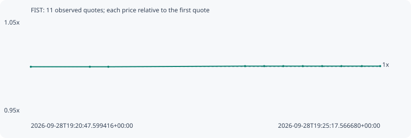

# FIST

**bsc** / `0xc9882def23bc42d53895b8361d0b1edc7570bc6a`

[All tokens](README.md) · [Market window](../README.md)

## Native assessments

This contract is in the quote cohort; it has no native model assessment in this window.

## Series 726f73bb007142f80d42

Pool: `not supplied`

[Complete series](../series/bsc/726f73bb007142f80d42.json)

Every dot is a captured quote. Lines connect observations; the curve ends at the last available quote.

| Peak | Final | Return | Maximum drawdown |
| ---: | ---: | ---: | ---: |
| 1.0007x | 1.0007x | +0.07% | 0.00% |

### Complete quote timeline

| Time (UTC) | Price (USD) | Multiple | Evidence |
| --- | ---: | ---: | --- |
| 2026-09-28T19:20:47.599416+00:00 | 0.247281 | 1.0000x | `capture:1ab71e23-e150-479b-a1fa-e2a362332d1e:rank:99` |
| 2026-09-28T19:21:33.217678+00:00 | 0.247281 | 1.0000x | `capture:3a34cabb-e5ee-4ff6-9f92-f0839c39884f:rank:97` |
| 2026-09-28T19:21:47.485842+00:00 | 0.247281 | 1.0000x | `capture:9e0730ff-182b-409c-b854-c06b993be570:rank:99` |
| 2026-09-28T19:23:33.140484+00:00 | 0.247455 | 1.0007x | `capture:ef2304f7-c374-4b90-a3e4-d8976f05c226:rank:98` |
| 2026-09-28T19:23:47.927661+00:00 | 0.247455 | 1.0007x | `capture:51aa913c-158f-4059-8727-ff1ace24834c:rank:96` |
| 2026-09-28T19:24:02.684719+00:00 | 0.247455 | 1.0007x | `capture:77fa5264-b080-4409-8d15-3f5504293a7d:rank:92` |
| 2026-09-28T19:24:17.754261+00:00 | 0.247455 | 1.0007x | `capture:9e642626-a894-4304-aad8-bfad3e85b1e6:rank:93` |
| 2026-09-28T19:24:32.694463+00:00 | 0.247455 | 1.0007x | `capture:2934d705-4adf-40dc-b5ef-2f9f3edbbe61:rank:94` |
| 2026-09-28T19:24:47.591753+00:00 | 0.247455 | 1.0007x | `capture:1cb45dcb-fe83-4fcc-8cfd-c5de8d369858:rank:95` |
| 2026-09-28T19:25:03.394485+00:00 | 0.247455 | 1.0007x | `capture:f1b0620f-7caf-483d-8db4-440b4d786962:rank:95` |
| 2026-09-28T19:25:17.566680+00:00 | 0.247455 | 1.0007x | `capture:89c3d45d-a145-4312-88dc-a4340e727616:rank:98` |

### Exit-policy timeline

Calculated from captured quotes under the window policy. Native assessments are linked separately above.

| Time (UTC) | Action | Price (USD) | Evidence |
| --- | --- | ---: | --- |
| 2026-09-28T19:20:47.599416+00:00 | BUY | 0.247281 | `capture:1ab71e23-e150-479b-a1fa-e2a362332d1e:rank:99` |
| 2026-09-28T19:21:33.217678+00:00 | HOLD | 0.247281 | `capture:3a34cabb-e5ee-4ff6-9f92-f0839c39884f:rank:97` |
| 2026-09-28T19:21:47.485842+00:00 | HOLD | 0.247281 | `capture:9e0730ff-182b-409c-b854-c06b993be570:rank:99` |
| 2026-09-28T19:23:33.140484+00:00 | HOLD | 0.247455 | `capture:ef2304f7-c374-4b90-a3e4-d8976f05c226:rank:98` |
| 2026-09-28T19:23:47.927661+00:00 | HOLD | 0.247455 | `capture:51aa913c-158f-4059-8727-ff1ace24834c:rank:96` |
| 2026-09-28T19:24:02.684719+00:00 | HOLD | 0.247455 | `capture:77fa5264-b080-4409-8d15-3f5504293a7d:rank:92` |
| 2026-09-28T19:24:17.754261+00:00 | HOLD | 0.247455 | `capture:9e642626-a894-4304-aad8-bfad3e85b1e6:rank:93` |
| 2026-09-28T19:24:32.694463+00:00 | HOLD | 0.247455 | `capture:2934d705-4adf-40dc-b5ef-2f9f3edbbe61:rank:94` |
| 2026-09-28T19:24:47.591753+00:00 | HOLD | 0.247455 | `capture:1cb45dcb-fe83-4fcc-8cfd-c5de8d369858:rank:95` |
| 2026-09-28T19:25:03.394485+00:00 | HOLD | 0.247455 | `capture:f1b0620f-7caf-483d-8db4-440b4d786962:rank:95` |
| 2026-09-28T19:25:17.566680+00:00 | HOLD | 0.247455 | `capture:89c3d45d-a145-4312-88dc-a4340e727616:rank:98` |
