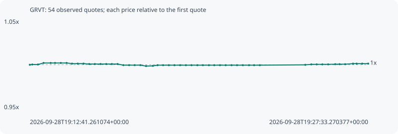

# GRVT

**bsc** / `0x46f2564e0fa8248d15125e7e54173cfbdef91be7`

[All tokens](README.md) · [Market window](../README.md)

## Native assessments

This contract is in the quote cohort; it has no native model assessment in this window.

## Series e95d2a499e5d471c07b1

Pool: `not supplied`

[Complete series](../series/bsc/e95d2a499e5d471c07b1.json)

Every dot is a captured quote. Lines connect observations; the curve ends at the last available quote.

| Peak | Final | Return | Maximum drawdown |
| ---: | ---: | ---: | ---: |
| 1.0021x | 1.0013x | +0.13% | 0.36% |

### Complete quote timeline

| Time (UTC) | Price (USD) | Multiple | Evidence |
| --- | ---: | ---: | --- |
| 2026-09-28T19:12:41.261074+00:00 | 0.199904 | 1.0000x | `capture:795a88f0-804c-4f14-a3e8-ce8d9318f6df:rank:40` |
| 2026-09-28T19:12:47.639745+00:00 | 0.199968 | 1.0003x | `capture:c2d8bd1a-9ed6-4d75-91ae-006bea65a635:rank:41` |
| 2026-09-28T19:13:02.549284+00:00 | 0.199968 | 1.0003x | `capture:0aa38b41-b2e7-48f5-a3ba-8fd4a983fff8:rank:42` |
| 2026-09-28T19:13:17.511052+00:00 | 0.200322 | 1.0021x | `capture:87e92f15-0601-4987-bd47-ae2e9f91de16:rank:41` |
| 2026-09-28T19:13:36.268178+00:00 | 0.200322 | 1.0021x | `capture:577859f6-aadc-4653-b269-a860dbe8c41c:rank:37` |
| 2026-09-28T19:13:47.694462+00:00 | 0.200322 | 1.0021x | `capture:4e60f1a9-1927-46db-ae10-f1b1530de61d:rank:38` |
| 2026-09-28T19:14:02.894344+00:00 | 0.200322 | 1.0021x | `capture:6211f86d-6ba6-4eb3-a4e2-2f80b0dffff7:rank:42` |
| 2026-09-28T19:14:18.283251+00:00 | 0.200322 | 1.0021x | `capture:68440f72-d36c-4c27-867d-03a757db141f:rank:42` |
| 2026-09-28T19:14:32.527710+00:00 | 0.200172 | 1.0013x | `capture:4f6a3c72-f6f0-49d7-97fe-a760f1872e88:rank:38` |
| 2026-09-28T19:14:47.684789+00:00 | 0.200172 | 1.0013x | `capture:abe58c43-9edf-4da1-b6d9-c4db72f14d79:rank:47` |
| 2026-09-28T19:15:02.698030+00:00 | 0.200172 | 1.0013x | `capture:d9b7eccd-b77f-4cc6-8305-4a84d44c62e0:rank:72` |
| 2026-09-28T19:15:17.739331+00:00 | 0.200077 | 1.0009x | `capture:08cc1e53-32bc-48e9-9abe-0b7caf40b440:rank:73` |
| 2026-09-28T19:15:32.749915+00:00 | 0.200077 | 1.0009x | `capture:81e75e19-4c52-4e91-ba7d-af89c6539b19:rank:74` |
| 2026-09-28T19:15:47.591170+00:00 | 0.200077 | 1.0009x | `capture:98b3c66b-c70a-4987-9342-10165ae058ec:rank:75` |
| 2026-09-28T19:16:02.665866+00:00 | 0.200077 | 1.0009x | `capture:831c8e00-640d-4942-9ad6-ae68e842f3cf:rank:75` |
| 2026-09-28T19:16:17.512218+00:00 | 0.200077 | 1.0009x | `capture:a4477278-80c9-4a7a-9a8f-66687623072c:rank:78` |
| 2026-09-28T19:16:32.607943+00:00 | 0.200077 | 1.0009x | `capture:4487eb62-651f-462e-aece-4003e9e61067:rank:80` |
| 2026-09-28T19:16:47.751534+00:00 | 0.199818 | 0.9996x | `capture:39d9c9d0-d8a7-439e-86b7-5fff162807b9:rank:72` |
| 2026-09-28T19:17:02.908604+00:00 | 0.199818 | 0.9996x | `capture:16fde76e-cae4-4138-b96e-57b291931df8:rank:72` |
| 2026-09-28T19:17:17.816055+00:00 | 0.199818 | 0.9996x | `capture:7f9359fa-2f23-4e78-9500-f9df7d85a6b2:rank:72` |
| 2026-09-28T19:17:32.654140+00:00 | 0.199818 | 0.9996x | `capture:4e95b3e2-d20d-4729-ac41-d7699561b97b:rank:72` |
| 2026-09-28T19:17:47.717594+00:00 | 0.199602 | 0.9985x | `capture:2cc72c7e-c2ae-4eb2-929b-e80f3d8c4e15:rank:64` |
| 2026-09-28T19:18:05.582121+00:00 | 0.199649 | 0.9987x | `capture:07127a86-393c-4e05-bde5-d28a70a854fb:rank:67` |
| 2026-09-28T19:18:17.953086+00:00 | 0.199809 | 0.9995x | `capture:ca903b0a-a9a8-4246-873f-5115402fbf9c:rank:67` |
| 2026-09-28T19:18:32.607444+00:00 | 0.199809 | 0.9995x | `capture:86009bbc-85b0-465e-8657-55be8d6c15de:rank:66` |
| 2026-09-28T19:18:47.632598+00:00 | 0.199809 | 0.9995x | `capture:bfa4352f-2279-41ec-a6fd-d3e101a21181:rank:61` |
| 2026-09-28T19:19:02.666276+00:00 | 0.199809 | 0.9995x | `capture:6fe1da90-a254-48b3-b112-ab24c6060e81:rank:61` |
| 2026-09-28T19:19:17.488471+00:00 | 0.199809 | 0.9995x | `capture:b87f439a-4825-4a6f-b17c-0b78464d9310:rank:56` |
| 2026-09-28T19:19:32.672995+00:00 | 0.199809 | 0.9995x | `capture:ceae4194-4b79-45b3-9a66-758dd19e2a7b:rank:62` |
| 2026-09-28T19:19:47.615151+00:00 | 0.199809 | 0.9995x | `capture:0dedf968-cc48-4422-8bbf-180ff2103dbf:rank:62` |
| 2026-09-28T19:20:02.835112+00:00 | 0.199809 | 0.9995x | `capture:adbb19f8-5a81-4d70-8990-a6ffd414f250:rank:61` |
| 2026-09-28T19:20:17.561225+00:00 | 0.199809 | 0.9995x | `capture:0feecf05-56c0-4db7-a137-f63b427a7830:rank:60` |
| 2026-09-28T19:20:33.351338+00:00 | 0.199809 | 0.9995x | `capture:5752259a-2bcb-4e27-ac90-6ef5a52d1cf7:rank:57` |
| 2026-09-28T19:20:47.599416+00:00 | 0.199809 | 0.9995x | `capture:1ab71e23-e150-479b-a1fa-e2a362332d1e:rank:55` |
| 2026-09-28T19:21:02.616817+00:00 | 0.199809 | 0.9995x | `capture:ec0d171f-d990-484a-94d1-c335d7f6e8fb:rank:55` |
| 2026-09-28T19:21:17.612081+00:00 | 0.199809 | 0.9995x | `capture:cc46cbda-0be4-42ba-bcf4-4a03c9e7e894:rank:52` |
| 2026-09-28T19:21:33.217678+00:00 | 0.199809 | 0.9995x | `capture:3a34cabb-e5ee-4ff6-9f92-f0839c39884f:rank:54` |
| 2026-09-28T19:21:47.485842+00:00 | 0.199809 | 0.9995x | `capture:9e0730ff-182b-409c-b854-c06b993be570:rank:61` |
| 2026-09-28T19:22:02.883000+00:00 | 0.199809 | 0.9995x | `capture:eb8228cb-dfba-443e-9576-ee214dcd3354:rank:59` |
| 2026-09-28T19:22:19.090071+00:00 | 0.199809 | 0.9995x | `capture:30ef0b61-e0e1-4eba-95c6-de3dc48fe868:rank:61` |
| 2026-09-28T19:22:32.671189+00:00 | 0.199809 | 0.9995x | `capture:5d031323-644d-4272-bacc-8a363d4b77cb:rank:63` |
| 2026-09-28T19:22:47.674643+00:00 | 0.199809 | 0.9995x | `capture:c8838291-6f5a-42d9-9013-9d9421deb79e:rank:81` |
| 2026-09-28T19:24:47.591753+00:00 | 0.199893 | 0.9999x | `capture:1cb45dcb-fe83-4fcc-8cfd-c5de8d369858:rank:84` |
| 2026-09-28T19:25:03.394485+00:00 | 0.199997 | 1.0005x | `capture:f1b0620f-7caf-483d-8db4-440b4d786962:rank:71` |
| 2026-09-28T19:25:17.566680+00:00 | 0.199997 | 1.0005x | `capture:89c3d45d-a145-4312-88dc-a4340e727616:rank:74` |
| 2026-09-28T19:25:32.640282+00:00 | 0.199997 | 1.0005x | `capture:a41f01eb-b1b7-4ed5-a604-19b71e522502:rank:73` |
| 2026-09-28T19:25:47.745538+00:00 | 0.199997 | 1.0005x | `capture:b20e5ea5-a03d-4b94-91ce-404a72f5de9b:rank:71` |
| 2026-09-28T19:26:06.431923+00:00 | 0.200037 | 1.0007x | `capture:a3278748-b5f3-45be-a966-ab473520d9c2:rank:56` |
| 2026-09-28T19:26:17.917162+00:00 | 0.200037 | 1.0007x | `capture:3b80c987-c82b-4a3e-8f0b-d3017a78edcb:rank:54` |
| 2026-09-28T19:26:32.687411+00:00 | 0.200037 | 1.0007x | `capture:d1fef60a-e7ad-4594-a8e8-74ee96c47ae4:rank:57` |
| 2026-09-28T19:26:53.320509+00:00 | 0.200168 | 1.0013x | `capture:5f09420c-1544-46ff-a2e4-39235f8f73a9:rank:49` |
| 2026-09-28T19:27:02.865937+00:00 | 0.200168 | 1.0013x | `capture:bd21661a-974d-4bab-9276-4e2f7e7d279a:rank:49` |
| 2026-09-28T19:27:17.494949+00:00 | 0.200168 | 1.0013x | `capture:c5d9da1a-7d95-4d7f-8cef-ffb660ac56d0:rank:51` |
| 2026-09-28T19:27:33.270377+00:00 | 0.200168 | 1.0013x | `capture:1cb6d037-a95b-477e-be82-4cc75b729c8b:rank:51` |

### Exit-policy timeline

Calculated from captured quotes under the window policy. Native assessments are linked separately above.

| Time (UTC) | Action | Price (USD) | Evidence |
| --- | --- | ---: | --- |
| 2026-09-28T19:12:41.261074+00:00 | BUY | 0.199904 | `capture:795a88f0-804c-4f14-a3e8-ce8d9318f6df:rank:40` |
| 2026-09-28T19:12:47.639745+00:00 | HOLD | 0.199968 | `capture:c2d8bd1a-9ed6-4d75-91ae-006bea65a635:rank:41` |
| 2026-09-28T19:13:02.549284+00:00 | HOLD | 0.199968 | `capture:0aa38b41-b2e7-48f5-a3ba-8fd4a983fff8:rank:42` |
| 2026-09-28T19:13:17.511052+00:00 | HOLD | 0.200322 | `capture:87e92f15-0601-4987-bd47-ae2e9f91de16:rank:41` |
| 2026-09-28T19:13:36.268178+00:00 | HOLD | 0.200322 | `capture:577859f6-aadc-4653-b269-a860dbe8c41c:rank:37` |
| 2026-09-28T19:13:47.694462+00:00 | HOLD | 0.200322 | `capture:4e60f1a9-1927-46db-ae10-f1b1530de61d:rank:38` |
| 2026-09-28T19:14:02.894344+00:00 | HOLD | 0.200322 | `capture:6211f86d-6ba6-4eb3-a4e2-2f80b0dffff7:rank:42` |
| 2026-09-28T19:14:18.283251+00:00 | HOLD | 0.200322 | `capture:68440f72-d36c-4c27-867d-03a757db141f:rank:42` |
| 2026-09-28T19:14:32.527710+00:00 | HOLD | 0.200172 | `capture:4f6a3c72-f6f0-49d7-97fe-a760f1872e88:rank:38` |
| 2026-09-28T19:14:47.684789+00:00 | HOLD | 0.200172 | `capture:abe58c43-9edf-4da1-b6d9-c4db72f14d79:rank:47` |
| 2026-09-28T19:15:02.698030+00:00 | HOLD | 0.200172 | `capture:d9b7eccd-b77f-4cc6-8305-4a84d44c62e0:rank:72` |
| 2026-09-28T19:15:17.739331+00:00 | HOLD | 0.200077 | `capture:08cc1e53-32bc-48e9-9abe-0b7caf40b440:rank:73` |
| 2026-09-28T19:15:32.749915+00:00 | HOLD | 0.200077 | `capture:81e75e19-4c52-4e91-ba7d-af89c6539b19:rank:74` |
| 2026-09-28T19:15:47.591170+00:00 | HOLD | 0.200077 | `capture:98b3c66b-c70a-4987-9342-10165ae058ec:rank:75` |
| 2026-09-28T19:16:02.665866+00:00 | HOLD | 0.200077 | `capture:831c8e00-640d-4942-9ad6-ae68e842f3cf:rank:75` |
| 2026-09-28T19:16:17.512218+00:00 | HOLD | 0.200077 | `capture:a4477278-80c9-4a7a-9a8f-66687623072c:rank:78` |
| 2026-09-28T19:16:32.607943+00:00 | HOLD | 0.200077 | `capture:4487eb62-651f-462e-aece-4003e9e61067:rank:80` |
| 2026-09-28T19:16:47.751534+00:00 | HOLD | 0.199818 | `capture:39d9c9d0-d8a7-439e-86b7-5fff162807b9:rank:72` |
| 2026-09-28T19:17:02.908604+00:00 | HOLD | 0.199818 | `capture:16fde76e-cae4-4138-b96e-57b291931df8:rank:72` |
| 2026-09-28T19:17:17.816055+00:00 | HOLD | 0.199818 | `capture:7f9359fa-2f23-4e78-9500-f9df7d85a6b2:rank:72` |
| 2026-09-28T19:17:32.654140+00:00 | HOLD | 0.199818 | `capture:4e95b3e2-d20d-4729-ac41-d7699561b97b:rank:72` |
| 2026-09-28T19:17:47.717594+00:00 | HOLD | 0.199602 | `capture:2cc72c7e-c2ae-4eb2-929b-e80f3d8c4e15:rank:64` |
| 2026-09-28T19:18:05.582121+00:00 | HOLD | 0.199649 | `capture:07127a86-393c-4e05-bde5-d28a70a854fb:rank:67` |
| 2026-09-28T19:18:17.953086+00:00 | HOLD | 0.199809 | `capture:ca903b0a-a9a8-4246-873f-5115402fbf9c:rank:67` |
| 2026-09-28T19:18:32.607444+00:00 | HOLD | 0.199809 | `capture:86009bbc-85b0-465e-8657-55be8d6c15de:rank:66` |
| 2026-09-28T19:18:47.632598+00:00 | HOLD | 0.199809 | `capture:bfa4352f-2279-41ec-a6fd-d3e101a21181:rank:61` |
| 2026-09-28T19:19:02.666276+00:00 | HOLD | 0.199809 | `capture:6fe1da90-a254-48b3-b112-ab24c6060e81:rank:61` |
| 2026-09-28T19:19:17.488471+00:00 | HOLD | 0.199809 | `capture:b87f439a-4825-4a6f-b17c-0b78464d9310:rank:56` |
| 2026-09-28T19:19:32.672995+00:00 | HOLD | 0.199809 | `capture:ceae4194-4b79-45b3-9a66-758dd19e2a7b:rank:62` |
| 2026-09-28T19:19:47.615151+00:00 | HOLD | 0.199809 | `capture:0dedf968-cc48-4422-8bbf-180ff2103dbf:rank:62` |
| 2026-09-28T19:20:02.835112+00:00 | HOLD | 0.199809 | `capture:adbb19f8-5a81-4d70-8990-a6ffd414f250:rank:61` |
| 2026-09-28T19:20:17.561225+00:00 | HOLD | 0.199809 | `capture:0feecf05-56c0-4db7-a137-f63b427a7830:rank:60` |
| 2026-09-28T19:20:33.351338+00:00 | HOLD | 0.199809 | `capture:5752259a-2bcb-4e27-ac90-6ef5a52d1cf7:rank:57` |
| 2026-09-28T19:20:47.599416+00:00 | HOLD | 0.199809 | `capture:1ab71e23-e150-479b-a1fa-e2a362332d1e:rank:55` |
| 2026-09-28T19:21:02.616817+00:00 | HOLD | 0.199809 | `capture:ec0d171f-d990-484a-94d1-c335d7f6e8fb:rank:55` |
| 2026-09-28T19:21:17.612081+00:00 | HOLD | 0.199809 | `capture:cc46cbda-0be4-42ba-bcf4-4a03c9e7e894:rank:52` |
| 2026-09-28T19:21:33.217678+00:00 | HOLD | 0.199809 | `capture:3a34cabb-e5ee-4ff6-9f92-f0839c39884f:rank:54` |
| 2026-09-28T19:21:47.485842+00:00 | HOLD | 0.199809 | `capture:9e0730ff-182b-409c-b854-c06b993be570:rank:61` |
| 2026-09-28T19:22:02.883000+00:00 | HOLD | 0.199809 | `capture:eb8228cb-dfba-443e-9576-ee214dcd3354:rank:59` |
| 2026-09-28T19:22:19.090071+00:00 | HOLD | 0.199809 | `capture:30ef0b61-e0e1-4eba-95c6-de3dc48fe868:rank:61` |
| 2026-09-28T19:22:32.671189+00:00 | HOLD | 0.199809 | `capture:5d031323-644d-4272-bacc-8a363d4b77cb:rank:63` |
| 2026-09-28T19:22:47.674643+00:00 | HOLD | 0.199809 | `capture:c8838291-6f5a-42d9-9013-9d9421deb79e:rank:81` |
| 2026-09-28T19:24:47.591753+00:00 | HOLD | 0.199893 | `capture:1cb45dcb-fe83-4fcc-8cfd-c5de8d369858:rank:84` |
| 2026-09-28T19:25:03.394485+00:00 | HOLD | 0.199997 | `capture:f1b0620f-7caf-483d-8db4-440b4d786962:rank:71` |
| 2026-09-28T19:25:17.566680+00:00 | HOLD | 0.199997 | `capture:89c3d45d-a145-4312-88dc-a4340e727616:rank:74` |
| 2026-09-28T19:25:32.640282+00:00 | HOLD | 0.199997 | `capture:a41f01eb-b1b7-4ed5-a604-19b71e522502:rank:73` |
| 2026-09-28T19:25:47.745538+00:00 | HOLD | 0.199997 | `capture:b20e5ea5-a03d-4b94-91ce-404a72f5de9b:rank:71` |
| 2026-09-28T19:26:06.431923+00:00 | HOLD | 0.200037 | `capture:a3278748-b5f3-45be-a966-ab473520d9c2:rank:56` |
| 2026-09-28T19:26:17.917162+00:00 | HOLD | 0.200037 | `capture:3b80c987-c82b-4a3e-8f0b-d3017a78edcb:rank:54` |
| 2026-09-28T19:26:32.687411+00:00 | HOLD | 0.200037 | `capture:d1fef60a-e7ad-4594-a8e8-74ee96c47ae4:rank:57` |
| 2026-09-28T19:26:53.320509+00:00 | HOLD | 0.200168 | `capture:5f09420c-1544-46ff-a2e4-39235f8f73a9:rank:49` |
| 2026-09-28T19:27:02.865937+00:00 | HOLD | 0.200168 | `capture:bd21661a-974d-4bab-9276-4e2f7e7d279a:rank:49` |
| 2026-09-28T19:27:17.494949+00:00 | HOLD | 0.200168 | `capture:c5d9da1a-7d95-4d7f-8cef-ffb660ac56d0:rank:51` |
| 2026-09-28T19:27:33.270377+00:00 | HOLD | 0.200168 | `capture:1cb6d037-a95b-477e-be82-4cc75b729c8b:rank:51` |
