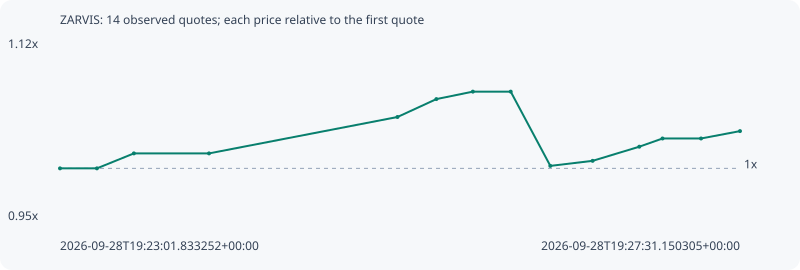

# ZARVIS

**solana** / `Gp5rC1aHeT9WfAVvf6UEaEpuSzsKSt4j42Gbm4PZwVDs`

[All tokens](README.md) · [Market window](../README.md)

## Native assessments

This contract is in the quote cohort; it has no native model assessment in this window.

## Series 38c96cb98c8793c58a62

Pool: `not supplied`

[Complete series](../series/solana/38c96cb98c8793c58a62.json)

Every dot is a captured quote. Lines connect observations; the curve ends at the last available quote.

| Peak | Final | Return | Maximum drawdown |
| ---: | ---: | ---: | ---: |
| 1.0743x | 1.0361x | +3.61% | 6.69% |

### Complete quote timeline

| Time (UTC) | Price (USD) | Multiple | Evidence |
| --- | ---: | ---: | --- |
| 2026-09-28T19:23:01.833252+00:00 | 1.86706e-05 | 1.0000x | `capture:c5462412-2da1-4432-8949-8fcd1492c57f:rank:98` |
| 2026-09-28T19:23:16.460099+00:00 | 1.86706e-05 | 1.0000x | `capture:2d456a2a-6755-4e1d-9a80-b6e3b2d44ec1:rank:97` |
| 2026-09-28T19:23:31.092727+00:00 | 1.89412e-05 | 1.0145x | `capture:0e687519-8b01-4d7e-b48c-e2ec34135d17:rank:94` |
| 2026-09-28T19:24:00.852400+00:00 | 1.89412e-05 | 1.0145x | `capture:5205c587-4734-452c-b758-46c4814dded1:rank:98` |
| 2026-09-28T19:25:15.488701+00:00 | 1.95993e-05 | 1.0497x | `capture:b8fee87c-9981-475c-930b-99c255910a9f:rank:97` |
| 2026-09-28T19:25:30.900173+00:00 | 1.9923e-05 | 1.0671x | `capture:7f757769-25c3-429a-81d0-c6b2ee45ee15:rank:94` |
| 2026-09-28T19:25:45.342895+00:00 | 2.00577e-05 | 1.0743x | `capture:0ca3656d-ce8c-444b-8f77-acf34c08a1f4:rank:90` |
| 2026-09-28T19:26:00.340634+00:00 | 2.00577e-05 | 1.0743x | `capture:5b3728c5-aff9-43f3-bbb5-25b251825caa:rank:91` |
| 2026-09-28T19:26:16.031602+00:00 | 1.87154e-05 | 1.0024x | `capture:bb8d4bfc-85e1-4d55-a2ff-e47193bcce5f:rank:87` |
| 2026-09-28T19:26:32.771713+00:00 | 1.88066e-05 | 1.0073x | `capture:2fed7296-b3d1-4ba6-8398-799ee55f1f2b:rank:91` |
| 2026-09-28T19:26:51.267717+00:00 | 1.90623e-05 | 1.0210x | `capture:4cc162c2-aa4a-403b-a901-4bb5058380d6:rank:86` |
| 2026-09-28T19:27:00.453239+00:00 | 1.92107e-05 | 1.0289x | `capture:4273fbb8-5342-4e37-8d61-ced6b88e542d:rank:89` |
| 2026-09-28T19:27:15.715818+00:00 | 1.92107e-05 | 1.0289x | `capture:d04c9116-4617-4b61-8b98-5489321cd1cc:rank:88` |
| 2026-09-28T19:27:31.150305+00:00 | 1.93443e-05 | 1.0361x | `capture:7cad37e8-83d3-4438-8055-245db6707e2e:rank:91` |

### Exit-policy timeline

Calculated from captured quotes under the window policy. Native assessments are linked separately above.

| Time (UTC) | Action | Price (USD) | Evidence |
| --- | --- | ---: | --- |
| 2026-09-28T19:23:01.833252+00:00 | BUY | 1.86706e-05 | `capture:c5462412-2da1-4432-8949-8fcd1492c57f:rank:98` |
| 2026-09-28T19:23:16.460099+00:00 | HOLD | 1.86706e-05 | `capture:2d456a2a-6755-4e1d-9a80-b6e3b2d44ec1:rank:97` |
| 2026-09-28T19:23:31.092727+00:00 | HOLD | 1.89412e-05 | `capture:0e687519-8b01-4d7e-b48c-e2ec34135d17:rank:94` |
| 2026-09-28T19:24:00.852400+00:00 | HOLD | 1.89412e-05 | `capture:5205c587-4734-452c-b758-46c4814dded1:rank:98` |
| 2026-09-28T19:25:15.488701+00:00 | HOLD | 1.95993e-05 | `capture:b8fee87c-9981-475c-930b-99c255910a9f:rank:97` |
| 2026-09-28T19:25:30.900173+00:00 | HOLD | 1.9923e-05 | `capture:7f757769-25c3-429a-81d0-c6b2ee45ee15:rank:94` |
| 2026-09-28T19:25:45.342895+00:00 | HOLD | 2.00577e-05 | `capture:0ca3656d-ce8c-444b-8f77-acf34c08a1f4:rank:90` |
| 2026-09-28T19:26:00.340634+00:00 | HOLD | 2.00577e-05 | `capture:5b3728c5-aff9-43f3-bbb5-25b251825caa:rank:91` |
| 2026-09-28T19:26:16.031602+00:00 | HOLD | 1.87154e-05 | `capture:bb8d4bfc-85e1-4d55-a2ff-e47193bcce5f:rank:87` |
| 2026-09-28T19:26:32.771713+00:00 | HOLD | 1.88066e-05 | `capture:2fed7296-b3d1-4ba6-8398-799ee55f1f2b:rank:91` |
| 2026-09-28T19:26:51.267717+00:00 | HOLD | 1.90623e-05 | `capture:4cc162c2-aa4a-403b-a901-4bb5058380d6:rank:86` |
| 2026-09-28T19:27:00.453239+00:00 | HOLD | 1.92107e-05 | `capture:4273fbb8-5342-4e37-8d61-ced6b88e542d:rank:89` |
| 2026-09-28T19:27:15.715818+00:00 | HOLD | 1.92107e-05 | `capture:d04c9116-4617-4b61-8b98-5489321cd1cc:rank:88` |
| 2026-09-28T19:27:31.150305+00:00 | HOLD | 1.93443e-05 | `capture:7cad37e8-83d3-4438-8055-245db6707e2e:rank:91` |
