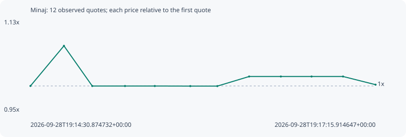

# Minaj

**solana** / `Cgpfxk6Xe9W2XY5VsBhNs7QYijQGH38Tdz3UAVSjpump`

[All tokens](README.md) · [Market window](../README.md)

## Native assessments

This contract is in the quote cohort; it has no native model assessment in this window.

## Series 25dadeffaad36ca78861

Pool: `not supplied`

[Complete series](../series/solana/25dadeffaad36ca78861.json)

Every dot is a captured quote. Lines connect observations; the curve ends at the last available quote.

| Peak | Final | Return | Maximum drawdown |
| ---: | ---: | ---: | ---: |
| 1.0785x | 1.0025x | +0.25% | 7.31% |

### Complete quote timeline

| Time (UTC) | Price (USD) | Multiple | Evidence |
| --- | ---: | ---: | --- |
| 2026-09-28T19:14:30.874732+00:00 | 5.24548e-06 | 1.0000x | `capture:fa585070-b1ae-4f9d-afbd-aa986f487793:rank:72` |
| 2026-09-28T19:14:46.892387+00:00 | 5.65751e-06 | 1.0785x | `capture:7d9e3e65-8bda-4696-b6d1-7a86825bd98c:rank:73` |
| 2026-09-28T19:15:00.432009+00:00 | 5.24491e-06 | 0.9999x | `capture:797f9a41-958a-44ba-ac57-3b9cacf5d06b:rank:76` |
| 2026-09-28T19:15:16.098308+00:00 | 5.24491e-06 | 0.9999x | `capture:ab2becb9-3f94-4a57-b9e8-472ad0998012:rank:77` |
| 2026-09-28T19:15:30.340579+00:00 | 5.24491e-06 | 0.9999x | `capture:564db5fc-5586-41d3-88fb-a9a955708f1d:rank:77` |
| 2026-09-28T19:15:47.323285+00:00 | 5.24404e-06 | 0.9997x | `capture:65003429-a569-4442-8d4f-b2c93db69061:rank:75` |
| 2026-09-28T19:16:00.259696+00:00 | 5.24404e-06 | 0.9997x | `capture:4236f8d5-90c4-4c9b-a73e-d6443ae3bf32:rank:81` |
| 2026-09-28T19:16:15.455827+00:00 | 5.34257e-06 | 1.0185x | `capture:acc657c6-9a43-46bf-986e-7b907c831cba:rank:88` |
| 2026-09-28T19:16:30.624202+00:00 | 5.34257e-06 | 1.0185x | `capture:0d391072-ec81-4bb7-9be0-0d6bbb801c70:rank:93` |
| 2026-09-28T19:16:45.311485+00:00 | 5.34257e-06 | 1.0185x | `capture:72cccbac-c3fe-4991-8f62-08c53849b146:rank:94` |
| 2026-09-28T19:17:00.368914+00:00 | 5.34257e-06 | 1.0185x | `capture:1232cf18-7088-40a1-9f55-ad9ae22b44f5:rank:96` |
| 2026-09-28T19:17:15.914647+00:00 | 5.25859e-06 | 1.0025x | `capture:9792e199-c0c2-4272-ac95-24501e4a3f79:rank:98` |

### Exit-policy timeline

Calculated from captured quotes under the window policy. Native assessments are linked separately above.

| Time (UTC) | Action | Price (USD) | Evidence |
| --- | --- | ---: | --- |
| 2026-09-28T19:14:30.874732+00:00 | BUY | 5.24548e-06 | `capture:fa585070-b1ae-4f9d-afbd-aa986f487793:rank:72` |
| 2026-09-28T19:14:46.892387+00:00 | HOLD | 5.65751e-06 | `capture:7d9e3e65-8bda-4696-b6d1-7a86825bd98c:rank:73` |
| 2026-09-28T19:15:00.432009+00:00 | HOLD | 5.24491e-06 | `capture:797f9a41-958a-44ba-ac57-3b9cacf5d06b:rank:76` |
| 2026-09-28T19:15:16.098308+00:00 | HOLD | 5.24491e-06 | `capture:ab2becb9-3f94-4a57-b9e8-472ad0998012:rank:77` |
| 2026-09-28T19:15:30.340579+00:00 | HOLD | 5.24491e-06 | `capture:564db5fc-5586-41d3-88fb-a9a955708f1d:rank:77` |
| 2026-09-28T19:15:47.323285+00:00 | HOLD | 5.24404e-06 | `capture:65003429-a569-4442-8d4f-b2c93db69061:rank:75` |
| 2026-09-28T19:16:00.259696+00:00 | HOLD | 5.24404e-06 | `capture:4236f8d5-90c4-4c9b-a73e-d6443ae3bf32:rank:81` |
| 2026-09-28T19:16:15.455827+00:00 | HOLD | 5.34257e-06 | `capture:acc657c6-9a43-46bf-986e-7b907c831cba:rank:88` |
| 2026-09-28T19:16:30.624202+00:00 | HOLD | 5.34257e-06 | `capture:0d391072-ec81-4bb7-9be0-0d6bbb801c70:rank:93` |
| 2026-09-28T19:16:45.311485+00:00 | HOLD | 5.34257e-06 | `capture:72cccbac-c3fe-4991-8f62-08c53849b146:rank:94` |
| 2026-09-28T19:17:00.368914+00:00 | HOLD | 5.34257e-06 | `capture:1232cf18-7088-40a1-9f55-ad9ae22b44f5:rank:96` |
| 2026-09-28T19:17:15.914647+00:00 | HOLD | 5.25859e-06 | `capture:9792e199-c0c2-4272-ac95-24501e4a3f79:rank:98` |
