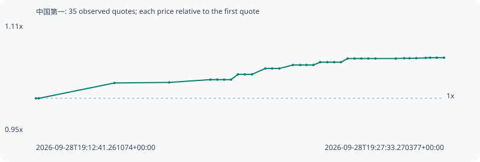

# 中国第一

**bsc** / `0xc0bffa353b4712c171eff93ade372ee80f697777`

[All tokens](README.md) · [Market window](../README.md)

## Native assessments

This contract is in the quote cohort; it has no native model assessment in this window.

## Series be7006937f8de29ed54a

Pool: `not supplied`

[Complete series](../series/bsc/be7006937f8de29ed54a.json)

Every dot is a captured quote. Lines connect observations; the curve ends at the last available quote.

| Peak | Final | Return | Maximum drawdown |
| ---: | ---: | ---: | ---: |
| 1.0602x | 1.0602x | +6.02% | 0.00% |

### Complete quote timeline

| Time (UTC) | Price (USD) | Multiple | Evidence |
| --- | ---: | ---: | --- |
| 2026-09-28T19:12:41.261074+00:00 | 9.39986e-05 | 1.0000x | `capture:795a88f0-804c-4f14-a3e8-ce8d9318f6df:rank:97` |
| 2026-09-28T19:12:47.639745+00:00 | 9.39986e-05 | 1.0000x | `capture:c2d8bd1a-9ed6-4d75-91ae-006bea65a635:rank:97` |
| 2026-09-28T19:15:32.749915+00:00 | 9.61371e-05 | 1.0228x | `capture:81e75e19-4c52-4e91-ba7d-af89c6539b19:rank:96` |
| 2026-09-28T19:17:32.654140+00:00 | 9.62144e-05 | 1.0236x | `capture:4e95b3e2-d20d-4729-ac41-d7699561b97b:rank:99` |
| 2026-09-28T19:19:02.666276+00:00 | 9.6602e-05 | 1.0277x | `capture:6fe1da90-a254-48b3-b112-ab24c6060e81:rank:91` |
| 2026-09-28T19:19:17.488471+00:00 | 9.6602e-05 | 1.0277x | `capture:b87f439a-4825-4a6f-b17c-0b78464d9310:rank:90` |
| 2026-09-28T19:19:32.672995+00:00 | 9.6602e-05 | 1.0277x | `capture:ceae4194-4b79-45b3-9a66-758dd19e2a7b:rank:90` |
| 2026-09-28T19:19:47.615151+00:00 | 9.6602e-05 | 1.0277x | `capture:0dedf968-cc48-4422-8bbf-180ff2103dbf:rank:87` |
| 2026-09-28T19:20:02.835112+00:00 | 9.73367e-05 | 1.0355x | `capture:adbb19f8-5a81-4d70-8990-a6ffd414f250:rank:75` |
| 2026-09-28T19:20:17.561225+00:00 | 9.73367e-05 | 1.0355x | `capture:0feecf05-56c0-4db7-a137-f63b427a7830:rank:74` |
| 2026-09-28T19:20:33.351338+00:00 | 9.73367e-05 | 1.0355x | `capture:5752259a-2bcb-4e27-ac90-6ef5a52d1cf7:rank:99` |
| 2026-09-28T19:21:02.616817+00:00 | 9.81569e-05 | 1.0442x | `capture:ec0d171f-d990-484a-94d1-c335d7f6e8fb:rank:86` |
| 2026-09-28T19:21:17.612081+00:00 | 9.81569e-05 | 1.0442x | `capture:cc46cbda-0be4-42ba-bcf4-4a03c9e7e894:rank:91` |
| 2026-09-28T19:21:33.217678+00:00 | 9.81569e-05 | 1.0442x | `capture:3a34cabb-e5ee-4ff6-9f92-f0839c39884f:rank:98` |
| 2026-09-28T19:22:02.883000+00:00 | 9.86409e-05 | 1.0494x | `capture:eb8228cb-dfba-443e-9576-ee214dcd3354:rank:92` |
| 2026-09-28T19:22:19.090071+00:00 | 9.86409e-05 | 1.0494x | `capture:30ef0b61-e0e1-4eba-95c6-de3dc48fe868:rank:90` |
| 2026-09-28T19:22:32.671189+00:00 | 9.86409e-05 | 1.0494x | `capture:5d031323-644d-4272-bacc-8a363d4b77cb:rank:95` |
| 2026-09-28T19:22:47.674643+00:00 | 9.86409e-05 | 1.0494x | `capture:c8838291-6f5a-42d9-9013-9d9421deb79e:rank:90` |
| 2026-09-28T19:23:02.516005+00:00 | 9.90386e-05 | 1.0536x | `capture:f8b60e63-80ce-442a-9ca7-659f2b5ca21d:rank:85` |
| 2026-09-28T19:23:18.123882+00:00 | 9.90386e-05 | 1.0536x | `capture:f689df34-2acf-42e7-a37b-1a7d50808302:rank:81` |
| 2026-09-28T19:23:33.140484+00:00 | 9.90386e-05 | 1.0536x | `capture:ef2304f7-c374-4b90-a3e4-d8976f05c226:rank:81` |
| 2026-09-28T19:23:47.927661+00:00 | 9.90386e-05 | 1.0536x | `capture:51aa913c-158f-4059-8727-ff1ace24834c:rank:81` |
| 2026-09-28T19:24:02.684719+00:00 | 9.95453e-05 | 1.0590x | `capture:77fa5264-b080-4409-8d15-3f5504293a7d:rank:82` |
| 2026-09-28T19:24:17.754261+00:00 | 9.95453e-05 | 1.0590x | `capture:9e642626-a894-4304-aad8-bfad3e85b1e6:rank:80` |
| 2026-09-28T19:24:32.694463+00:00 | 9.95453e-05 | 1.0590x | `capture:2934d705-4adf-40dc-b5ef-2f9f3edbbe61:rank:80` |
| 2026-09-28T19:24:47.591753+00:00 | 9.95453e-05 | 1.0590x | `capture:1cb45dcb-fe83-4fcc-8cfd-c5de8d369858:rank:80` |
| 2026-09-28T19:25:03.394485+00:00 | 9.95453e-05 | 1.0590x | `capture:f1b0620f-7caf-483d-8db4-440b4d786962:rank:97` |
| 2026-09-28T19:25:47.745538+00:00 | 9.95453e-05 | 1.0590x | `capture:b20e5ea5-a03d-4b94-91ce-404a72f5de9b:rank:95` |
| 2026-09-28T19:26:06.431923+00:00 | 9.95808e-05 | 1.0594x | `capture:a3278748-b5f3-45be-a966-ab473520d9c2:rank:78` |
| 2026-09-28T19:26:17.917162+00:00 | 9.95808e-05 | 1.0594x | `capture:3b80c987-c82b-4a3e-8f0b-d3017a78edcb:rank:89` |
| 2026-09-28T19:26:32.687411+00:00 | 9.95904e-05 | 1.0595x | `capture:d1fef60a-e7ad-4594-a8e8-74ee96c47ae4:rank:76` |
| 2026-09-28T19:26:53.320509+00:00 | 9.96354e-05 | 1.0600x | `capture:5f09420c-1544-46ff-a2e4-39235f8f73a9:rank:63` |
| 2026-09-28T19:27:02.865937+00:00 | 9.96599e-05 | 1.0602x | `capture:bd21661a-974d-4bab-9276-4e2f7e7d279a:rank:61` |
| 2026-09-28T19:27:17.494949+00:00 | 9.96599e-05 | 1.0602x | `capture:c5d9da1a-7d95-4d7f-8cef-ffb660ac56d0:rank:60` |
| 2026-09-28T19:27:33.270377+00:00 | 9.96599e-05 | 1.0602x | `capture:1cb6d037-a95b-477e-be82-4cc75b729c8b:rank:64` |

### Exit-policy timeline

Calculated from captured quotes under the window policy. Native assessments are linked separately above.

| Time (UTC) | Action | Price (USD) | Evidence |
| --- | --- | ---: | --- |
| 2026-09-28T19:12:41.261074+00:00 | BUY | 9.39986e-05 | `capture:795a88f0-804c-4f14-a3e8-ce8d9318f6df:rank:97` |
| 2026-09-28T19:12:47.639745+00:00 | HOLD | 9.39986e-05 | `capture:c2d8bd1a-9ed6-4d75-91ae-006bea65a635:rank:97` |
| 2026-09-28T19:15:32.749915+00:00 | HOLD | 9.61371e-05 | `capture:81e75e19-4c52-4e91-ba7d-af89c6539b19:rank:96` |
| 2026-09-28T19:17:32.654140+00:00 | HOLD | 9.62144e-05 | `capture:4e95b3e2-d20d-4729-ac41-d7699561b97b:rank:99` |
| 2026-09-28T19:19:02.666276+00:00 | HOLD | 9.6602e-05 | `capture:6fe1da90-a254-48b3-b112-ab24c6060e81:rank:91` |
| 2026-09-28T19:19:17.488471+00:00 | HOLD | 9.6602e-05 | `capture:b87f439a-4825-4a6f-b17c-0b78464d9310:rank:90` |
| 2026-09-28T19:19:32.672995+00:00 | HOLD | 9.6602e-05 | `capture:ceae4194-4b79-45b3-9a66-758dd19e2a7b:rank:90` |
| 2026-09-28T19:19:47.615151+00:00 | HOLD | 9.6602e-05 | `capture:0dedf968-cc48-4422-8bbf-180ff2103dbf:rank:87` |
| 2026-09-28T19:20:02.835112+00:00 | HOLD | 9.73367e-05 | `capture:adbb19f8-5a81-4d70-8990-a6ffd414f250:rank:75` |
| 2026-09-28T19:20:17.561225+00:00 | HOLD | 9.73367e-05 | `capture:0feecf05-56c0-4db7-a137-f63b427a7830:rank:74` |
| 2026-09-28T19:20:33.351338+00:00 | HOLD | 9.73367e-05 | `capture:5752259a-2bcb-4e27-ac90-6ef5a52d1cf7:rank:99` |
| 2026-09-28T19:21:02.616817+00:00 | HOLD | 9.81569e-05 | `capture:ec0d171f-d990-484a-94d1-c335d7f6e8fb:rank:86` |
| 2026-09-28T19:21:17.612081+00:00 | HOLD | 9.81569e-05 | `capture:cc46cbda-0be4-42ba-bcf4-4a03c9e7e894:rank:91` |
| 2026-09-28T19:21:33.217678+00:00 | HOLD | 9.81569e-05 | `capture:3a34cabb-e5ee-4ff6-9f92-f0839c39884f:rank:98` |
| 2026-09-28T19:22:02.883000+00:00 | HOLD | 9.86409e-05 | `capture:eb8228cb-dfba-443e-9576-ee214dcd3354:rank:92` |
| 2026-09-28T19:22:19.090071+00:00 | HOLD | 9.86409e-05 | `capture:30ef0b61-e0e1-4eba-95c6-de3dc48fe868:rank:90` |
| 2026-09-28T19:22:32.671189+00:00 | HOLD | 9.86409e-05 | `capture:5d031323-644d-4272-bacc-8a363d4b77cb:rank:95` |
| 2026-09-28T19:22:47.674643+00:00 | HOLD | 9.86409e-05 | `capture:c8838291-6f5a-42d9-9013-9d9421deb79e:rank:90` |
| 2026-09-28T19:23:02.516005+00:00 | HOLD | 9.90386e-05 | `capture:f8b60e63-80ce-442a-9ca7-659f2b5ca21d:rank:85` |
| 2026-09-28T19:23:18.123882+00:00 | HOLD | 9.90386e-05 | `capture:f689df34-2acf-42e7-a37b-1a7d50808302:rank:81` |
| 2026-09-28T19:23:33.140484+00:00 | HOLD | 9.90386e-05 | `capture:ef2304f7-c374-4b90-a3e4-d8976f05c226:rank:81` |
| 2026-09-28T19:23:47.927661+00:00 | HOLD | 9.90386e-05 | `capture:51aa913c-158f-4059-8727-ff1ace24834c:rank:81` |
| 2026-09-28T19:24:02.684719+00:00 | HOLD | 9.95453e-05 | `capture:77fa5264-b080-4409-8d15-3f5504293a7d:rank:82` |
| 2026-09-28T19:24:17.754261+00:00 | HOLD | 9.95453e-05 | `capture:9e642626-a894-4304-aad8-bfad3e85b1e6:rank:80` |
| 2026-09-28T19:24:32.694463+00:00 | HOLD | 9.95453e-05 | `capture:2934d705-4adf-40dc-b5ef-2f9f3edbbe61:rank:80` |
| 2026-09-28T19:24:47.591753+00:00 | HOLD | 9.95453e-05 | `capture:1cb45dcb-fe83-4fcc-8cfd-c5de8d369858:rank:80` |
| 2026-09-28T19:25:03.394485+00:00 | HOLD | 9.95453e-05 | `capture:f1b0620f-7caf-483d-8db4-440b4d786962:rank:97` |
| 2026-09-28T19:25:47.745538+00:00 | HOLD | 9.95453e-05 | `capture:b20e5ea5-a03d-4b94-91ce-404a72f5de9b:rank:95` |
| 2026-09-28T19:26:06.431923+00:00 | HOLD | 9.95808e-05 | `capture:a3278748-b5f3-45be-a966-ab473520d9c2:rank:78` |
| 2026-09-28T19:26:17.917162+00:00 | HOLD | 9.95808e-05 | `capture:3b80c987-c82b-4a3e-8f0b-d3017a78edcb:rank:89` |
| 2026-09-28T19:26:32.687411+00:00 | HOLD | 9.95904e-05 | `capture:d1fef60a-e7ad-4594-a8e8-74ee96c47ae4:rank:76` |
| 2026-09-28T19:26:53.320509+00:00 | HOLD | 9.96354e-05 | `capture:5f09420c-1544-46ff-a2e4-39235f8f73a9:rank:63` |
| 2026-09-28T19:27:02.865937+00:00 | HOLD | 9.96599e-05 | `capture:bd21661a-974d-4bab-9276-4e2f7e7d279a:rank:61` |
| 2026-09-28T19:27:17.494949+00:00 | HOLD | 9.96599e-05 | `capture:c5d9da1a-7d95-4d7f-8cef-ffb660ac56d0:rank:60` |
| 2026-09-28T19:27:33.270377+00:00 | HOLD | 9.96599e-05 | `capture:1cb6d037-a95b-477e-be82-4cc75b729c8b:rank:64` |
