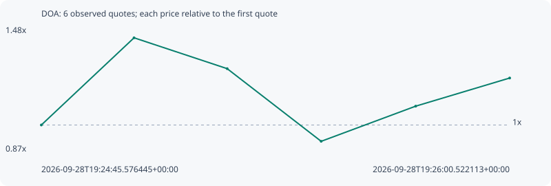

# DOA

**robinhood** / `0x7c74e367d6d17e60bc551db65b689d512b7b1e18`

[All tokens](README.md) · [Market window](../README.md)

## Native assessments

This contract is in the quote cohort; it has no native model assessment in this window.

## Series dab00dce155f2640a805

Pool: `not supplied`

[Complete series](../series/robinhood/dab00dce155f2640a805.json)

Every dot is a captured quote. Lines connect observations; the curve ends at the last available quote.

| Peak | Final | Return | Maximum drawdown |
| ---: | ---: | ---: | ---: |
| 1.4254x | 1.2292x | +22.92% | 35.43% |

### Complete quote timeline

| Time (UTC) | Price (USD) | Multiple | Evidence |
| --- | ---: | ---: | --- |
| 2026-09-28T19:24:45.576445+00:00 | 3.52501e-05 | 1.0000x | `capture:da07dfaa-56d9-4a51-99df-1ad071803eb0:rank:12` |
| 2026-09-28T19:25:00.412700+00:00 | 5.02442e-05 | 1.4254x | `capture:1dec2f8f-4694-4c32-8be8-eeec3980c853:rank:8` |
| 2026-09-28T19:25:15.316372+00:00 | 4.49372e-05 | 1.2748x | `capture:52eaf5a3-351e-4c29-b00b-a167107703e3:rank:7` |
| 2026-09-28T19:25:30.354898+00:00 | 3.24445e-05 | 0.9204x | `capture:d70b1f6a-3ec3-4ec2-8c88-db476beae4f9:rank:7` |
| 2026-09-28T19:25:45.483791+00:00 | 3.84907e-05 | 1.0919x | `capture:ebb21e05-3dc6-4a8f-a800-fa79ba147200:rank:5` |
| 2026-09-28T19:26:00.522113+00:00 | 4.33292e-05 | 1.2292x | `capture:a33301e4-8f37-4fb5-af69-629635c54fe6:rank:5` |

### Exit-policy timeline

Calculated from captured quotes under the window policy. Native assessments are linked separately above.

| Time (UTC) | Action | Price (USD) | Evidence |
| --- | --- | ---: | --- |
| 2026-09-28T19:24:45.576445+00:00 | BUY | 3.52501e-05 | `capture:da07dfaa-56d9-4a51-99df-1ad071803eb0:rank:12` |
| 2026-09-28T19:25:00.412700+00:00 | PROFIT | 5.02442e-05 | `capture:1dec2f8f-4694-4c32-8be8-eeec3980c853:rank:8` |
| 2026-09-28T19:25:15.316372+00:00 | HOLD_BAG | 4.49372e-05 | `capture:52eaf5a3-351e-4c29-b00b-a167107703e3:rank:7` |
| 2026-09-28T19:25:30.354898+00:00 | HOLD_BAG | 3.24445e-05 | `capture:d70b1f6a-3ec3-4ec2-8c88-db476beae4f9:rank:7` |
| 2026-09-28T19:25:45.483791+00:00 | HOLD_BAG | 3.84907e-05 | `capture:ebb21e05-3dc6-4a8f-a800-fa79ba147200:rank:5` |
| 2026-09-28T19:26:00.522113+00:00 | HOLD_BAG | 4.33292e-05 | `capture:a33301e4-8f37-4fb5-af69-629635c54fe6:rank:5` |
