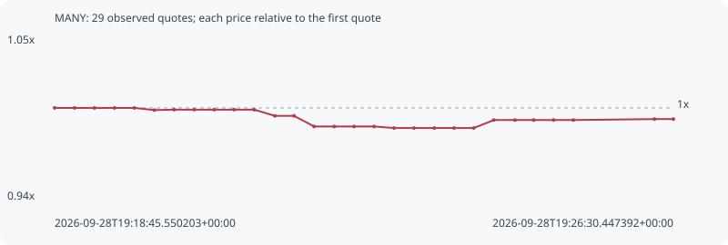

# MANY

**robinhood** / `0xa26992c4268a8a78a4d872fe4bdad2ed03ac287d`

[All tokens](README.md) · [Market window](../README.md)

## Native assessments

This contract is in the quote cohort; it has no native model assessment in this window.

## Series 321050990274c260ed58

Pool: `not supplied`

[Complete series](../series/robinhood/321050990274c260ed58.json)

Every dot is a captured quote. Lines connect observations; the curve ends at the last available quote.

| Peak | Final | Return | Maximum drawdown |
| ---: | ---: | ---: | ---: |
| 1.0000x | 0.9922x | -0.78% | 1.40% |

### Complete quote timeline

| Time (UTC) | Price (USD) | Multiple | Evidence |
| --- | ---: | ---: | --- |
| 2026-09-28T19:18:45.550203+00:00 | 0.00289298 | 1.0000x | `capture:728d4974-5fe3-40a8-8e99-2139c59da3e3:rank:86` |
| 2026-09-28T19:19:00.487408+00:00 | 0.00289298 | 1.0000x | `capture:297e4fae-3bb5-49eb-b490-a4f34898851c:rank:92` |
| 2026-09-28T19:19:15.451095+00:00 | 0.00289298 | 1.0000x | `capture:0bcc0576-3637-4b2c-b0e4-f9e05871b187:rank:90` |
| 2026-09-28T19:19:30.512866+00:00 | 0.00289298 | 1.0000x | `capture:bb499bdc-159a-4072-a450-312045f32cef:rank:96` |
| 2026-09-28T19:19:45.438706+00:00 | 0.00289298 | 1.0000x | `capture:59b12f7b-2112-42c7-834a-a2eb9bcaee3d:rank:93` |
| 2026-09-28T19:20:00.494705+00:00 | 0.00288861 | 0.9985x | `capture:5b06d6b3-9eca-4487-82fb-6b28820c37d9:rank:83` |
| 2026-09-28T19:20:15.393373+00:00 | 0.00288942 | 0.9988x | `capture:17802da9-7cee-48c3-9f5b-5829781be3f6:rank:68` |
| 2026-09-28T19:20:30.417446+00:00 | 0.00288942 | 0.9988x | `capture:f2fe9ac4-89a0-4ad3-8f15-5a70d7e1d5f7:rank:67` |
| 2026-09-28T19:20:45.464282+00:00 | 0.00288942 | 0.9988x | `capture:26559b75-812f-4386-982b-eba5073faf44:rank:67` |
| 2026-09-28T19:21:00.449260+00:00 | 0.00288942 | 0.9988x | `capture:186445b2-8971-4639-85b9-26b2e8fb9d2c:rank:65` |
| 2026-09-28T19:21:15.606838+00:00 | 0.00288942 | 0.9988x | `capture:c2a8ab31-038e-42f4-8e33-852fee1b9a24:rank:65` |
| 2026-09-28T19:21:30.959683+00:00 | 0.00287699 | 0.9945x | `capture:300e0f35-12d4-46a9-a17e-17adbe8e1059:rank:56` |
| 2026-09-28T19:21:45.420062+00:00 | 0.00287699 | 0.9945x | `capture:ec22b61b-732a-44d2-be85-c577051928eb:rank:61` |
| 2026-09-28T19:22:00.489634+00:00 | 0.00285551 | 0.9870x | `capture:d6c64542-18c5-48a0-a6c9-f0e2a9c54b41:rank:55` |
| 2026-09-28T19:22:15.632268+00:00 | 0.00285551 | 0.9870x | `capture:13e6d33e-e854-4b87-b3da-49aedec6950e:rank:53` |
| 2026-09-28T19:22:30.535979+00:00 | 0.00285551 | 0.9870x | `capture:091fb4d2-10fc-4d5f-9c22-af9f55e90e4a:rank:55` |
| 2026-09-28T19:22:45.520851+00:00 | 0.00285551 | 0.9870x | `capture:128617a9-4055-4a8d-8b04-c8876bad9c70:rank:73` |
| 2026-09-28T19:23:00.594785+00:00 | 0.00285241 | 0.9860x | `capture:b6c633f1-3960-4db3-a2ca-34618f913368:rank:68` |
| 2026-09-28T19:23:15.534636+00:00 | 0.00285241 | 0.9860x | `capture:d5a0d1a4-a366-4985-80da-e34160e2f58c:rank:72` |
| 2026-09-28T19:23:30.815940+00:00 | 0.00285241 | 0.9860x | `capture:c6f23ed9-c47c-4f73-bf08-86a494a11aa2:rank:73` |
| 2026-09-28T19:23:45.643860+00:00 | 0.00285241 | 0.9860x | `capture:0b8bbeb9-cbaa-4cb2-a853-2bb146bd23e5:rank:71` |
| 2026-09-28T19:24:00.467430+00:00 | 0.00285241 | 0.9860x | `capture:4a231962-827e-445d-ab7d-bb974bfc841b:rank:90` |
| 2026-09-28T19:24:15.505143+00:00 | 0.0028685 | 0.9915x | `capture:b7273a78-8f87-4dcc-877e-f47f549e0fe8:rank:83` |
| 2026-09-28T19:24:31.344409+00:00 | 0.0028685 | 0.9915x | `capture:85f4db1c-c852-45c3-99aa-4320f3839031:rank:88` |
| 2026-09-28T19:24:45.576445+00:00 | 0.0028685 | 0.9915x | `capture:da07dfaa-56d9-4a51-99df-1ad071803eb0:rank:90` |
| 2026-09-28T19:25:00.412700+00:00 | 0.0028685 | 0.9915x | `capture:1dec2f8f-4694-4c32-8be8-eeec3980c853:rank:90` |
| 2026-09-28T19:25:15.316372+00:00 | 0.0028685 | 0.9915x | `capture:52eaf5a3-351e-4c29-b00b-a167107703e3:rank:97` |
| 2026-09-28T19:26:16.279485+00:00 | 0.00287045 | 0.9922x | `capture:085b2ea9-3985-4608-a1cd-1eddc6b16122:rank:89` |
| 2026-09-28T19:26:30.447392+00:00 | 0.00287045 | 0.9922x | `capture:36fd4b46-5420-443d-b1ed-b86b98706671:rank:90` |

### Exit-policy timeline

Calculated from captured quotes under the window policy. Native assessments are linked separately above.

| Time (UTC) | Action | Price (USD) | Evidence |
| --- | --- | ---: | --- |
| 2026-09-28T19:18:45.550203+00:00 | BUY | 0.00289298 | `capture:728d4974-5fe3-40a8-8e99-2139c59da3e3:rank:86` |
| 2026-09-28T19:19:00.487408+00:00 | HOLD | 0.00289298 | `capture:297e4fae-3bb5-49eb-b490-a4f34898851c:rank:92` |
| 2026-09-28T19:19:15.451095+00:00 | HOLD | 0.00289298 | `capture:0bcc0576-3637-4b2c-b0e4-f9e05871b187:rank:90` |
| 2026-09-28T19:19:30.512866+00:00 | HOLD | 0.00289298 | `capture:bb499bdc-159a-4072-a450-312045f32cef:rank:96` |
| 2026-09-28T19:19:45.438706+00:00 | HOLD | 0.00289298 | `capture:59b12f7b-2112-42c7-834a-a2eb9bcaee3d:rank:93` |
| 2026-09-28T19:20:00.494705+00:00 | HOLD | 0.00288861 | `capture:5b06d6b3-9eca-4487-82fb-6b28820c37d9:rank:83` |
| 2026-09-28T19:20:15.393373+00:00 | HOLD | 0.00288942 | `capture:17802da9-7cee-48c3-9f5b-5829781be3f6:rank:68` |
| 2026-09-28T19:20:30.417446+00:00 | HOLD | 0.00288942 | `capture:f2fe9ac4-89a0-4ad3-8f15-5a70d7e1d5f7:rank:67` |
| 2026-09-28T19:20:45.464282+00:00 | HOLD | 0.00288942 | `capture:26559b75-812f-4386-982b-eba5073faf44:rank:67` |
| 2026-09-28T19:21:00.449260+00:00 | HOLD | 0.00288942 | `capture:186445b2-8971-4639-85b9-26b2e8fb9d2c:rank:65` |
| 2026-09-28T19:21:15.606838+00:00 | HOLD | 0.00288942 | `capture:c2a8ab31-038e-42f4-8e33-852fee1b9a24:rank:65` |
| 2026-09-28T19:21:30.959683+00:00 | HOLD | 0.00287699 | `capture:300e0f35-12d4-46a9-a17e-17adbe8e1059:rank:56` |
| 2026-09-28T19:21:45.420062+00:00 | HOLD | 0.00287699 | `capture:ec22b61b-732a-44d2-be85-c577051928eb:rank:61` |
| 2026-09-28T19:22:00.489634+00:00 | HOLD | 0.00285551 | `capture:d6c64542-18c5-48a0-a6c9-f0e2a9c54b41:rank:55` |
| 2026-09-28T19:22:15.632268+00:00 | HOLD | 0.00285551 | `capture:13e6d33e-e854-4b87-b3da-49aedec6950e:rank:53` |
| 2026-09-28T19:22:30.535979+00:00 | HOLD | 0.00285551 | `capture:091fb4d2-10fc-4d5f-9c22-af9f55e90e4a:rank:55` |
| 2026-09-28T19:22:45.520851+00:00 | HOLD | 0.00285551 | `capture:128617a9-4055-4a8d-8b04-c8876bad9c70:rank:73` |
| 2026-09-28T19:23:00.594785+00:00 | HOLD | 0.00285241 | `capture:b6c633f1-3960-4db3-a2ca-34618f913368:rank:68` |
| 2026-09-28T19:23:15.534636+00:00 | HOLD | 0.00285241 | `capture:d5a0d1a4-a366-4985-80da-e34160e2f58c:rank:72` |
| 2026-09-28T19:23:30.815940+00:00 | HOLD | 0.00285241 | `capture:c6f23ed9-c47c-4f73-bf08-86a494a11aa2:rank:73` |
| 2026-09-28T19:23:45.643860+00:00 | HOLD | 0.00285241 | `capture:0b8bbeb9-cbaa-4cb2-a853-2bb146bd23e5:rank:71` |
| 2026-09-28T19:24:00.467430+00:00 | HOLD | 0.00285241 | `capture:4a231962-827e-445d-ab7d-bb974bfc841b:rank:90` |
| 2026-09-28T19:24:15.505143+00:00 | HOLD | 0.0028685 | `capture:b7273a78-8f87-4dcc-877e-f47f549e0fe8:rank:83` |
| 2026-09-28T19:24:31.344409+00:00 | HOLD | 0.0028685 | `capture:85f4db1c-c852-45c3-99aa-4320f3839031:rank:88` |
| 2026-09-28T19:24:45.576445+00:00 | HOLD | 0.0028685 | `capture:da07dfaa-56d9-4a51-99df-1ad071803eb0:rank:90` |
| 2026-09-28T19:25:00.412700+00:00 | HOLD | 0.0028685 | `capture:1dec2f8f-4694-4c32-8be8-eeec3980c853:rank:90` |
| 2026-09-28T19:25:15.316372+00:00 | HOLD | 0.0028685 | `capture:52eaf5a3-351e-4c29-b00b-a167107703e3:rank:97` |
| 2026-09-28T19:26:16.279485+00:00 | HOLD | 0.00287045 | `capture:085b2ea9-3985-4608-a1cd-1eddc6b16122:rank:89` |
| 2026-09-28T19:26:30.447392+00:00 | HOLD | 0.00287045 | `capture:36fd4b46-5420-443d-b1ed-b86b98706671:rank:90` |
