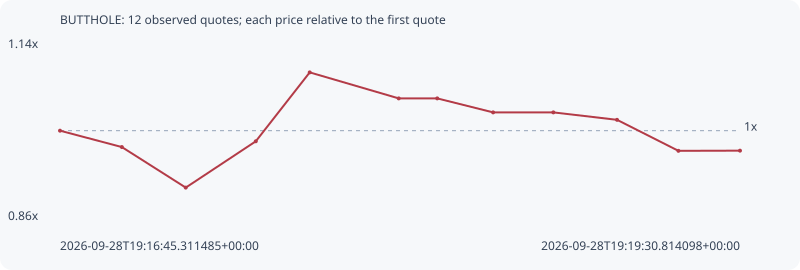

# BUTTHOLE

**solana** / `E7zxuLbeXWdujdArhk2FZFJHqTFcihv5DDkw6NCeEtKR`

[All tokens](README.md) · [Market window](../README.md)

## Native assessments

This contract is in the quote cohort; it has no native model assessment in this window.

## Series febf348357c0cdb97df9

Pool: `not supplied`

[Complete series](../series/solana/febf348357c0cdb97df9.json)

Every dot is a captured quote. Lines connect observations; the curve ends at the last available quote.

| Peak | Final | Return | Maximum drawdown |
| ---: | ---: | ---: | ---: |
| 1.0900x | 0.9692x | -3.08% | 11.11% |

### Complete quote timeline

| Time (UTC) | Price (USD) | Multiple | Evidence |
| --- | ---: | ---: | --- |
| 2026-09-28T19:16:45.311485+00:00 | 5.66057e-06 | 1.0000x | `capture:72cccbac-c3fe-4991-8f62-08c53849b146:rank:63` |
| 2026-09-28T19:17:00.368914+00:00 | 5.51751e-06 | 0.9747x | `capture:1232cf18-7088-40a1-9f55-ad9ae22b44f5:rank:53` |
| 2026-09-28T19:17:15.914647+00:00 | 5.16325e-06 | 0.9121x | `capture:9792e199-c0c2-4272-ac95-24501e4a3f79:rank:45` |
| 2026-09-28T19:17:32.965607+00:00 | 5.56795e-06 | 0.9836x | `capture:0f04cfe5-88a0-4a83-ae8d-85c5cb3cdc89:rank:43` |
| 2026-09-28T19:17:46.087880+00:00 | 6.16993e-06 | 1.0900x | `capture:ee91a1c6-bc99-4c7a-9cdc-bd6cb5478a9b:rank:44` |
| 2026-09-28T19:18:07.749963+00:00 | 5.9427e-06 | 1.0498x | `capture:b0fb1b47-4973-472f-9619-8480bc7d294e:rank:46` |
| 2026-09-28T19:18:17.126008+00:00 | 5.9427e-06 | 1.0498x | `capture:5ed98f51-d1e1-422a-81df-4186a8b0a0a2:rank:45` |
| 2026-09-28T19:18:30.722167+00:00 | 5.8205e-06 | 1.0283x | `capture:9f88d118-9108-4dff-bbfc-246eaed5ce38:rank:45` |
| 2026-09-28T19:18:45.386687+00:00 | 5.8205e-06 | 1.0283x | `capture:f533100a-ce62-4457-9107-42e7601ea5d7:rank:47` |
| 2026-09-28T19:19:00.883835+00:00 | 5.75548e-06 | 1.0168x | `capture:a2495d99-5671-4c7e-b87c-48f48d90f2f2:rank:42` |
| 2026-09-28T19:19:15.826416+00:00 | 5.48465e-06 | 0.9689x | `capture:ba1dc6a3-b8b7-461a-8110-8490f03539a5:rank:41` |
| 2026-09-28T19:19:30.814098+00:00 | 5.48603e-06 | 0.9692x | `capture:b25d90dc-c8db-4388-8a2b-d06541e5320f:rank:41` |

### Exit-policy timeline

Calculated from captured quotes under the window policy. Native assessments are linked separately above.

| Time (UTC) | Action | Price (USD) | Evidence |
| --- | --- | ---: | --- |
| 2026-09-28T19:16:45.311485+00:00 | BUY | 5.66057e-06 | `capture:72cccbac-c3fe-4991-8f62-08c53849b146:rank:63` |
| 2026-09-28T19:17:00.368914+00:00 | HOLD | 5.51751e-06 | `capture:1232cf18-7088-40a1-9f55-ad9ae22b44f5:rank:53` |
| 2026-09-28T19:17:15.914647+00:00 | HOLD | 5.16325e-06 | `capture:9792e199-c0c2-4272-ac95-24501e4a3f79:rank:45` |
| 2026-09-28T19:17:32.965607+00:00 | HOLD | 5.56795e-06 | `capture:0f04cfe5-88a0-4a83-ae8d-85c5cb3cdc89:rank:43` |
| 2026-09-28T19:17:46.087880+00:00 | HOLD | 6.16993e-06 | `capture:ee91a1c6-bc99-4c7a-9cdc-bd6cb5478a9b:rank:44` |
| 2026-09-28T19:18:07.749963+00:00 | HOLD | 5.9427e-06 | `capture:b0fb1b47-4973-472f-9619-8480bc7d294e:rank:46` |
| 2026-09-28T19:18:17.126008+00:00 | HOLD | 5.9427e-06 | `capture:5ed98f51-d1e1-422a-81df-4186a8b0a0a2:rank:45` |
| 2026-09-28T19:18:30.722167+00:00 | HOLD | 5.8205e-06 | `capture:9f88d118-9108-4dff-bbfc-246eaed5ce38:rank:45` |
| 2026-09-28T19:18:45.386687+00:00 | HOLD | 5.8205e-06 | `capture:f533100a-ce62-4457-9107-42e7601ea5d7:rank:47` |
| 2026-09-28T19:19:00.883835+00:00 | HOLD | 5.75548e-06 | `capture:a2495d99-5671-4c7e-b87c-48f48d90f2f2:rank:42` |
| 2026-09-28T19:19:15.826416+00:00 | HOLD | 5.48465e-06 | `capture:ba1dc6a3-b8b7-461a-8110-8490f03539a5:rank:41` |
| 2026-09-28T19:19:30.814098+00:00 | HOLD | 5.48603e-06 | `capture:b25d90dc-c8db-4388-8a2b-d06541e5320f:rank:41` |
