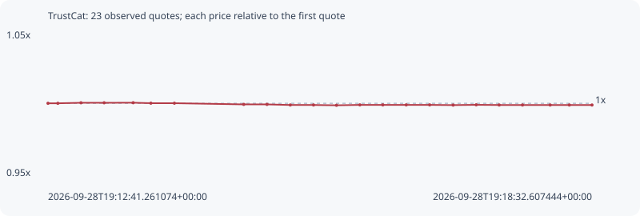

# TrustCat

**bsc** / `0x75b364916b65f1e8959fa0210a6922c2ee237777`

[All tokens](README.md) · [Market window](../README.md)

## Native assessments

- [2026-09-28T19:12:41.261074Z](../cases/9757f43c33606e3d.md): source parameters and model answers.

## Series f9ceea8e4cb530365218

Pool: `not supplied`

[Complete series](../series/bsc/f9ceea8e4cb530365218.json)

Every dot is a captured quote. Lines connect observations; the curve ends at the last available quote.

| Peak | Final | Return | Maximum drawdown |
| ---: | ---: | ---: | ---: |
| 1.0004x | 0.9988x | -0.12% | 0.18% |

### Complete quote timeline

| Time (UTC) | Price (USD) | Multiple | Evidence |
| --- | ---: | ---: | --- |
| 2026-09-28T19:12:41.261074+00:00 | 6.44192e-05 | 1.0000x | `capture:795a88f0-804c-4f14-a3e8-ce8d9318f6df:rank:44` |
| 2026-09-28T19:12:47.639745+00:00 | 6.44192e-05 | 1.0000x | `capture:c2d8bd1a-9ed6-4d75-91ae-006bea65a635:rank:43` |
| 2026-09-28T19:13:02.549284+00:00 | 6.44423e-05 | 1.0004x | `capture:0aa38b41-b2e7-48f5-a3ba-8fd4a983fff8:rank:44` |
| 2026-09-28T19:13:17.511052+00:00 | 6.44423e-05 | 1.0004x | `capture:87e92f15-0601-4987-bd47-ae2e9f91de16:rank:52` |
| 2026-09-28T19:13:36.268178+00:00 | 6.44452e-05 | 1.0004x | `capture:577859f6-aadc-4653-b269-a860dbe8c41c:rank:54` |
| 2026-09-28T19:13:47.694462+00:00 | 6.44242e-05 | 1.0001x | `capture:4e60f1a9-1927-46db-ae10-f1b1530de61d:rank:43` |
| 2026-09-28T19:14:02.894344+00:00 | 6.4423e-05 | 1.0001x | `capture:6211f86d-6ba6-4eb3-a4e2-2f80b0dffff7:rank:33` |
| 2026-09-28T19:14:47.684789+00:00 | 6.43689e-05 | 0.9992x | `capture:abe58c43-9edf-4da1-b6d9-c4db72f14d79:rank:21` |
| 2026-09-28T19:15:02.698030+00:00 | 6.43689e-05 | 0.9992x | `capture:d9b7eccd-b77f-4cc6-8305-4a84d44c62e0:rank:21` |
| 2026-09-28T19:15:17.739331+00:00 | 6.43417e-05 | 0.9988x | `capture:08cc1e53-32bc-48e9-9abe-0b7caf40b440:rank:21` |
| 2026-09-28T19:15:32.749915+00:00 | 6.43417e-05 | 0.9988x | `capture:81e75e19-4c52-4e91-ba7d-af89c6539b19:rank:22` |
| 2026-09-28T19:15:47.591170+00:00 | 6.43278e-05 | 0.9986x | `capture:98b3c66b-c70a-4987-9342-10165ae058ec:rank:21` |
| 2026-09-28T19:16:02.665866+00:00 | 6.43461e-05 | 0.9989x | `capture:831c8e00-640d-4942-9ad6-ae68e842f3cf:rank:22` |
| 2026-09-28T19:16:17.512218+00:00 | 6.43461e-05 | 0.9989x | `capture:a4477278-80c9-4a7a-9a8f-66687623072c:rank:21` |
| 2026-09-28T19:16:32.607943+00:00 | 6.43461e-05 | 0.9989x | `capture:4487eb62-651f-462e-aece-4003e9e61067:rank:25` |
| 2026-09-28T19:16:47.751534+00:00 | 6.43461e-05 | 0.9989x | `capture:39d9c9d0-d8a7-439e-86b7-5fff162807b9:rank:28` |
| 2026-09-28T19:17:02.908604+00:00 | 6.43366e-05 | 0.9987x | `capture:16fde76e-cae4-4138-b96e-57b291931df8:rank:26` |
| 2026-09-28T19:17:17.816055+00:00 | 6.43492e-05 | 0.9989x | `capture:7f9359fa-2f23-4e78-9500-f9df7d85a6b2:rank:26` |
| 2026-09-28T19:17:32.654140+00:00 | 6.43409e-05 | 0.9988x | `capture:4e95b3e2-d20d-4729-ac41-d7699561b97b:rank:26` |
| 2026-09-28T19:17:47.717594+00:00 | 6.43409e-05 | 0.9988x | `capture:2cc72c7e-c2ae-4eb2-929b-e80f3d8c4e15:rank:23` |
| 2026-09-28T19:18:05.582121+00:00 | 6.43409e-05 | 0.9988x | `capture:07127a86-393c-4e05-bde5-d28a70a854fb:rank:26` |
| 2026-09-28T19:18:17.953086+00:00 | 6.43409e-05 | 0.9988x | `capture:ca903b0a-a9a8-4246-873f-5115402fbf9c:rank:24` |
| 2026-09-28T19:18:32.607444+00:00 | 6.43409e-05 | 0.9988x | `capture:86009bbc-85b0-465e-8657-55be8d6c15de:rank:28` |

### Exit-policy timeline

Calculated from captured quotes under the window policy. Native assessments are linked separately above.

| Time (UTC) | Action | Price (USD) | Evidence |
| --- | --- | ---: | --- |
| 2026-09-28T19:12:41.261074+00:00 | BUY | 6.44192e-05 | `capture:795a88f0-804c-4f14-a3e8-ce8d9318f6df:rank:44` |
| 2026-09-28T19:12:47.639745+00:00 | HOLD | 6.44192e-05 | `capture:c2d8bd1a-9ed6-4d75-91ae-006bea65a635:rank:43` |
| 2026-09-28T19:13:02.549284+00:00 | HOLD | 6.44423e-05 | `capture:0aa38b41-b2e7-48f5-a3ba-8fd4a983fff8:rank:44` |
| 2026-09-28T19:13:17.511052+00:00 | HOLD | 6.44423e-05 | `capture:87e92f15-0601-4987-bd47-ae2e9f91de16:rank:52` |
| 2026-09-28T19:13:36.268178+00:00 | HOLD | 6.44452e-05 | `capture:577859f6-aadc-4653-b269-a860dbe8c41c:rank:54` |
| 2026-09-28T19:13:47.694462+00:00 | HOLD | 6.44242e-05 | `capture:4e60f1a9-1927-46db-ae10-f1b1530de61d:rank:43` |
| 2026-09-28T19:14:02.894344+00:00 | HOLD | 6.4423e-05 | `capture:6211f86d-6ba6-4eb3-a4e2-2f80b0dffff7:rank:33` |
| 2026-09-28T19:14:47.684789+00:00 | HOLD | 6.43689e-05 | `capture:abe58c43-9edf-4da1-b6d9-c4db72f14d79:rank:21` |
| 2026-09-28T19:15:02.698030+00:00 | HOLD | 6.43689e-05 | `capture:d9b7eccd-b77f-4cc6-8305-4a84d44c62e0:rank:21` |
| 2026-09-28T19:15:17.739331+00:00 | HOLD | 6.43417e-05 | `capture:08cc1e53-32bc-48e9-9abe-0b7caf40b440:rank:21` |
| 2026-09-28T19:15:32.749915+00:00 | HOLD | 6.43417e-05 | `capture:81e75e19-4c52-4e91-ba7d-af89c6539b19:rank:22` |
| 2026-09-28T19:15:47.591170+00:00 | HOLD | 6.43278e-05 | `capture:98b3c66b-c70a-4987-9342-10165ae058ec:rank:21` |
| 2026-09-28T19:16:02.665866+00:00 | HOLD | 6.43461e-05 | `capture:831c8e00-640d-4942-9ad6-ae68e842f3cf:rank:22` |
| 2026-09-28T19:16:17.512218+00:00 | HOLD | 6.43461e-05 | `capture:a4477278-80c9-4a7a-9a8f-66687623072c:rank:21` |
| 2026-09-28T19:16:32.607943+00:00 | HOLD | 6.43461e-05 | `capture:4487eb62-651f-462e-aece-4003e9e61067:rank:25` |
| 2026-09-28T19:16:47.751534+00:00 | HOLD | 6.43461e-05 | `capture:39d9c9d0-d8a7-439e-86b7-5fff162807b9:rank:28` |
| 2026-09-28T19:17:02.908604+00:00 | HOLD | 6.43366e-05 | `capture:16fde76e-cae4-4138-b96e-57b291931df8:rank:26` |
| 2026-09-28T19:17:17.816055+00:00 | HOLD | 6.43492e-05 | `capture:7f9359fa-2f23-4e78-9500-f9df7d85a6b2:rank:26` |
| 2026-09-28T19:17:32.654140+00:00 | HOLD | 6.43409e-05 | `capture:4e95b3e2-d20d-4729-ac41-d7699561b97b:rank:26` |
| 2026-09-28T19:17:47.717594+00:00 | HOLD | 6.43409e-05 | `capture:2cc72c7e-c2ae-4eb2-929b-e80f3d8c4e15:rank:23` |
| 2026-09-28T19:18:05.582121+00:00 | HOLD | 6.43409e-05 | `capture:07127a86-393c-4e05-bde5-d28a70a854fb:rank:26` |
| 2026-09-28T19:18:17.953086+00:00 | HOLD | 6.43409e-05 | `capture:ca903b0a-a9a8-4246-873f-5115402fbf9c:rank:24` |
| 2026-09-28T19:18:32.607444+00:00 | HOLD | 6.43409e-05 | `capture:86009bbc-85b0-465e-8657-55be8d6c15de:rank:28` |
