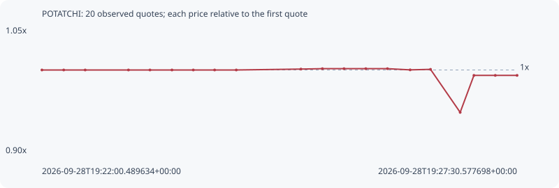

# POTATCHI

**robinhood** / `0xfad17d7cc41d9c9ca4a459da798a4446dd217974`

[All tokens](README.md) · [Market window](../README.md)

## Native assessments

This contract is in the quote cohort; it has no native model assessment in this window.

## Series ad2a42207c383cb1d651

Pool: `not supplied`

[Complete series](../series/robinhood/ad2a42207c383cb1d651.json)

Every dot is a captured quote. Lines connect observations; the curve ends at the last available quote.

| Peak | Final | Return | Maximum drawdown |
| ---: | ---: | ---: | ---: |
| 1.0016x | 0.9934x | -0.66% | 5.34% |

### Complete quote timeline

| Time (UTC) | Price (USD) | Multiple | Evidence |
| --- | ---: | ---: | --- |
| 2026-09-28T19:22:00.489634+00:00 | 0.00094717 | 1.0000x | `capture:d6c64542-18c5-48a0-a6c9-f0e2a9c54b41:rank:95` |
| 2026-09-28T19:22:15.632268+00:00 | 0.00094717 | 1.0000x | `capture:13e6d33e-e854-4b87-b3da-49aedec6950e:rank:93` |
| 2026-09-28T19:22:30.535979+00:00 | 0.00094717 | 1.0000x | `capture:091fb4d2-10fc-4d5f-9c22-af9f55e90e4a:rank:98` |
| 2026-09-28T19:23:00.594785+00:00 | 0.00094717 | 1.0000x | `capture:b6c633f1-3960-4db3-a2ca-34618f913368:rank:99` |
| 2026-09-28T19:23:15.534636+00:00 | 0.00094717 | 1.0000x | `capture:d5a0d1a4-a366-4985-80da-e34160e2f58c:rank:99` |
| 2026-09-28T19:23:30.815940+00:00 | 0.00094717 | 1.0000x | `capture:c6f23ed9-c47c-4f73-bf08-86a494a11aa2:rank:93` |
| 2026-09-28T19:23:45.643860+00:00 | 0.00094717 | 1.0000x | `capture:0b8bbeb9-cbaa-4cb2-a853-2bb146bd23e5:rank:99` |
| 2026-09-28T19:24:00.467430+00:00 | 0.00094717 | 1.0000x | `capture:4a231962-827e-445d-ab7d-bb974bfc841b:rank:98` |
| 2026-09-28T19:24:15.505143+00:00 | 0.00094717 | 1.0000x | `capture:b7273a78-8f87-4dcc-877e-f47f549e0fe8:rank:98` |
| 2026-09-28T19:25:00.412700+00:00 | 0.000948215 | 1.0011x | `capture:1dec2f8f-4694-4c32-8be8-eeec3980c853:rank:94` |
| 2026-09-28T19:25:15.316372+00:00 | 0.00094868 | 1.0016x | `capture:52eaf5a3-351e-4c29-b00b-a167107703e3:rank:90` |
| 2026-09-28T19:25:30.354898+00:00 | 0.00094868 | 1.0016x | `capture:d70b1f6a-3ec3-4ec2-8c88-db476beae4f9:rank:92` |
| 2026-09-28T19:25:45.483791+00:00 | 0.00094868 | 1.0016x | `capture:ebb21e05-3dc6-4a8f-a800-fa79ba147200:rank:92` |
| 2026-09-28T19:26:00.522113+00:00 | 0.00094868 | 1.0016x | `capture:a33301e4-8f37-4fb5-af69-629635c54fe6:rank:93` |
| 2026-09-28T19:26:16.279485+00:00 | 0.000947308 | 1.0001x | `capture:085b2ea9-3985-4608-a1cd-1eddc6b16122:rank:87` |
| 2026-09-28T19:26:30.447392+00:00 | 0.000947897 | 1.0008x | `capture:36fd4b46-5420-443d-b1ed-b86b98706671:rank:95` |
| 2026-09-28T19:26:51.039990+00:00 | 0.000898 | 0.9481x | `capture:653b62fa-7a58-45fd-95e9-3b36912dc139:rank:94` |
| 2026-09-28T19:27:00.598930+00:00 | 0.000940892 | 0.9934x | `capture:8041f6b0-6188-445c-83ef-3a6fb7daf321:rank:88` |
| 2026-09-28T19:27:15.438746+00:00 | 0.000940892 | 0.9934x | `capture:b4c48612-e04d-4782-96a6-e80c2955d3b9:rank:93` |
| 2026-09-28T19:27:30.577698+00:00 | 0.000940892 | 0.9934x | `capture:ff6b3949-9c3c-4cdf-b48c-d4010666c140:rank:93` |

### Exit-policy timeline

Calculated from captured quotes under the window policy. Native assessments are linked separately above.

| Time (UTC) | Action | Price (USD) | Evidence |
| --- | --- | ---: | --- |
| 2026-09-28T19:22:00.489634+00:00 | BUY | 0.00094717 | `capture:d6c64542-18c5-48a0-a6c9-f0e2a9c54b41:rank:95` |
| 2026-09-28T19:22:15.632268+00:00 | HOLD | 0.00094717 | `capture:13e6d33e-e854-4b87-b3da-49aedec6950e:rank:93` |
| 2026-09-28T19:22:30.535979+00:00 | HOLD | 0.00094717 | `capture:091fb4d2-10fc-4d5f-9c22-af9f55e90e4a:rank:98` |
| 2026-09-28T19:23:00.594785+00:00 | HOLD | 0.00094717 | `capture:b6c633f1-3960-4db3-a2ca-34618f913368:rank:99` |
| 2026-09-28T19:23:15.534636+00:00 | HOLD | 0.00094717 | `capture:d5a0d1a4-a366-4985-80da-e34160e2f58c:rank:99` |
| 2026-09-28T19:23:30.815940+00:00 | HOLD | 0.00094717 | `capture:c6f23ed9-c47c-4f73-bf08-86a494a11aa2:rank:93` |
| 2026-09-28T19:23:45.643860+00:00 | HOLD | 0.00094717 | `capture:0b8bbeb9-cbaa-4cb2-a853-2bb146bd23e5:rank:99` |
| 2026-09-28T19:24:00.467430+00:00 | HOLD | 0.00094717 | `capture:4a231962-827e-445d-ab7d-bb974bfc841b:rank:98` |
| 2026-09-28T19:24:15.505143+00:00 | HOLD | 0.00094717 | `capture:b7273a78-8f87-4dcc-877e-f47f549e0fe8:rank:98` |
| 2026-09-28T19:25:00.412700+00:00 | HOLD | 0.000948215 | `capture:1dec2f8f-4694-4c32-8be8-eeec3980c853:rank:94` |
| 2026-09-28T19:25:15.316372+00:00 | HOLD | 0.00094868 | `capture:52eaf5a3-351e-4c29-b00b-a167107703e3:rank:90` |
| 2026-09-28T19:25:30.354898+00:00 | HOLD | 0.00094868 | `capture:d70b1f6a-3ec3-4ec2-8c88-db476beae4f9:rank:92` |
| 2026-09-28T19:25:45.483791+00:00 | HOLD | 0.00094868 | `capture:ebb21e05-3dc6-4a8f-a800-fa79ba147200:rank:92` |
| 2026-09-28T19:26:00.522113+00:00 | HOLD | 0.00094868 | `capture:a33301e4-8f37-4fb5-af69-629635c54fe6:rank:93` |
| 2026-09-28T19:26:16.279485+00:00 | HOLD | 0.000947308 | `capture:085b2ea9-3985-4608-a1cd-1eddc6b16122:rank:87` |
| 2026-09-28T19:26:30.447392+00:00 | HOLD | 0.000947897 | `capture:36fd4b46-5420-443d-b1ed-b86b98706671:rank:95` |
| 2026-09-28T19:26:51.039990+00:00 | HOLD | 0.000898 | `capture:653b62fa-7a58-45fd-95e9-3b36912dc139:rank:94` |
| 2026-09-28T19:27:00.598930+00:00 | HOLD | 0.000940892 | `capture:8041f6b0-6188-445c-83ef-3a6fb7daf321:rank:88` |
| 2026-09-28T19:27:15.438746+00:00 | HOLD | 0.000940892 | `capture:b4c48612-e04d-4782-96a6-e80c2955d3b9:rank:93` |
| 2026-09-28T19:27:30.577698+00:00 | HOLD | 0.000940892 | `capture:ff6b3949-9c3c-4cdf-b48c-d4010666c140:rank:93` |
