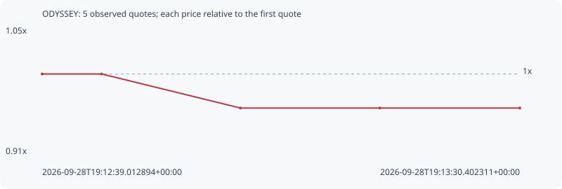

# ODYSSEY

**robinhood** / `0x87a91420200989e6da9e33d5400683be04a386d7`

[All tokens](README.md) · [Market window](../README.md)

## Native assessments

This contract is in the quote cohort; it has no native model assessment in this window.

## Series 460db3f4bb3a60822d9d

Pool: `not supplied`

[Complete series](../series/robinhood/460db3f4bb3a60822d9d.json)

Every dot is a captured quote. Lines connect observations; the curve ends at the last available quote.

| Peak | Final | Return | Maximum drawdown |
| ---: | ---: | ---: | ---: |
| 1.0000x | 0.9630x | -3.70% | 3.70% |

### Complete quote timeline

| Time (UTC) | Price (USD) | Multiple | Evidence |
| --- | ---: | ---: | --- |
| 2026-09-28T19:12:39.012894+00:00 | 3.02067e-06 | 1.0000x | `capture:fe8ad944-154e-4481-bd56-8ab821bfbfe1:rank:89` |
| 2026-09-28T19:12:45.402569+00:00 | 3.02067e-06 | 1.0000x | `capture:8deb508c-ea33-4c21-a5c5-f0991dd6dcac:rank:90` |
| 2026-09-28T19:13:00.335966+00:00 | 2.90876e-06 | 0.9630x | `capture:ee3ee7f8-576f-4c42-a7e0-cd9f917fdb36:rank:86` |
| 2026-09-28T19:13:15.331879+00:00 | 2.90876e-06 | 0.9630x | `capture:c384257a-4501-4701-8a0c-a6b08fe727d5:rank:91` |
| 2026-09-28T19:13:30.402311+00:00 | 2.90876e-06 | 0.9630x | `capture:44090e9e-d515-41c4-a78f-893390e6f2b0:rank:98` |

### Exit-policy timeline

Calculated from captured quotes under the window policy. Native assessments are linked separately above.

| Time (UTC) | Action | Price (USD) | Evidence |
| --- | --- | ---: | --- |
| 2026-09-28T19:12:39.012894+00:00 | BUY | 3.02067e-06 | `capture:fe8ad944-154e-4481-bd56-8ab821bfbfe1:rank:89` |
| 2026-09-28T19:12:45.402569+00:00 | HOLD | 3.02067e-06 | `capture:8deb508c-ea33-4c21-a5c5-f0991dd6dcac:rank:90` |
| 2026-09-28T19:13:00.335966+00:00 | HOLD | 2.90876e-06 | `capture:ee3ee7f8-576f-4c42-a7e0-cd9f917fdb36:rank:86` |
| 2026-09-28T19:13:15.331879+00:00 | HOLD | 2.90876e-06 | `capture:c384257a-4501-4701-8a0c-a6b08fe727d5:rank:91` |
| 2026-09-28T19:13:30.402311+00:00 | HOLD | 2.90876e-06 | `capture:44090e9e-d515-41c4-a78f-893390e6f2b0:rank:98` |
