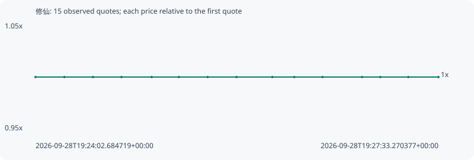

# 修仙

**bsc** / `0x44443dd87ec4d1bea3425acc118adb023f07f91b`

[All tokens](README.md) · [Market window](../README.md)

## Native assessments

This contract is in the quote cohort; it has no native model assessment in this window.

## Series b788c00920249634ec3b

Pool: `not supplied`

[Complete series](../series/bsc/b788c00920249634ec3b.json)

Every dot is a captured quote. Lines connect observations; the curve ends at the last available quote.

| Peak | Final | Return | Maximum drawdown |
| ---: | ---: | ---: | ---: |
| 1.0000x | 1.0000x | +0.00% | 0.00% |

### Complete quote timeline

| Time (UTC) | Price (USD) | Multiple | Evidence |
| --- | ---: | ---: | --- |
| 2026-09-28T19:24:02.684719+00:00 | 0.000812908 | 1.0000x | `capture:77fa5264-b080-4409-8d15-3f5504293a7d:rank:54` |
| 2026-09-28T19:24:17.754261+00:00 | 0.000812908 | 1.0000x | `capture:9e642626-a894-4304-aad8-bfad3e85b1e6:rank:53` |
| 2026-09-28T19:24:32.694463+00:00 | 0.000812908 | 1.0000x | `capture:2934d705-4adf-40dc-b5ef-2f9f3edbbe61:rank:53` |
| 2026-09-28T19:24:47.591753+00:00 | 0.000812908 | 1.0000x | `capture:1cb45dcb-fe83-4fcc-8cfd-c5de8d369858:rank:51` |
| 2026-09-28T19:25:03.394485+00:00 | 0.000812908 | 1.0000x | `capture:f1b0620f-7caf-483d-8db4-440b4d786962:rank:52` |
| 2026-09-28T19:25:17.566680+00:00 | 0.000812908 | 1.0000x | `capture:89c3d45d-a145-4312-88dc-a4340e727616:rank:52` |
| 2026-09-28T19:25:32.640282+00:00 | 0.000812908 | 1.0000x | `capture:a41f01eb-b1b7-4ed5-a604-19b71e522502:rank:54` |
| 2026-09-28T19:25:47.745538+00:00 | 0.000812908 | 1.0000x | `capture:b20e5ea5-a03d-4b94-91ce-404a72f5de9b:rank:54` |
| 2026-09-28T19:26:06.431923+00:00 | 0.000812908 | 1.0000x | `capture:a3278748-b5f3-45be-a966-ab473520d9c2:rank:53` |
| 2026-09-28T19:26:17.917162+00:00 | 0.000812908 | 1.0000x | `capture:3b80c987-c82b-4a3e-8f0b-d3017a78edcb:rank:51` |
| 2026-09-28T19:26:32.687411+00:00 | 0.000812908 | 1.0000x | `capture:d1fef60a-e7ad-4594-a8e8-74ee96c47ae4:rank:49` |
| 2026-09-28T19:26:53.320509+00:00 | 0.000812908 | 1.0000x | `capture:5f09420c-1544-46ff-a2e4-39235f8f73a9:rank:52` |
| 2026-09-28T19:27:02.865937+00:00 | 0.000812908 | 1.0000x | `capture:bd21661a-974d-4bab-9276-4e2f7e7d279a:rank:52` |
| 2026-09-28T19:27:17.494949+00:00 | 0.000812908 | 1.0000x | `capture:c5d9da1a-7d95-4d7f-8cef-ffb660ac56d0:rank:53` |
| 2026-09-28T19:27:33.270377+00:00 | 0.000812908 | 1.0000x | `capture:1cb6d037-a95b-477e-be82-4cc75b729c8b:rank:54` |

### Exit-policy timeline

Calculated from captured quotes under the window policy. Native assessments are linked separately above.

| Time (UTC) | Action | Price (USD) | Evidence |
| --- | --- | ---: | --- |
| 2026-09-28T19:24:02.684719+00:00 | BUY | 0.000812908 | `capture:77fa5264-b080-4409-8d15-3f5504293a7d:rank:54` |
| 2026-09-28T19:24:17.754261+00:00 | HOLD | 0.000812908 | `capture:9e642626-a894-4304-aad8-bfad3e85b1e6:rank:53` |
| 2026-09-28T19:24:32.694463+00:00 | HOLD | 0.000812908 | `capture:2934d705-4adf-40dc-b5ef-2f9f3edbbe61:rank:53` |
| 2026-09-28T19:24:47.591753+00:00 | HOLD | 0.000812908 | `capture:1cb45dcb-fe83-4fcc-8cfd-c5de8d369858:rank:51` |
| 2026-09-28T19:25:03.394485+00:00 | HOLD | 0.000812908 | `capture:f1b0620f-7caf-483d-8db4-440b4d786962:rank:52` |
| 2026-09-28T19:25:17.566680+00:00 | HOLD | 0.000812908 | `capture:89c3d45d-a145-4312-88dc-a4340e727616:rank:52` |
| 2026-09-28T19:25:32.640282+00:00 | HOLD | 0.000812908 | `capture:a41f01eb-b1b7-4ed5-a604-19b71e522502:rank:54` |
| 2026-09-28T19:25:47.745538+00:00 | HOLD | 0.000812908 | `capture:b20e5ea5-a03d-4b94-91ce-404a72f5de9b:rank:54` |
| 2026-09-28T19:26:06.431923+00:00 | HOLD | 0.000812908 | `capture:a3278748-b5f3-45be-a966-ab473520d9c2:rank:53` |
| 2026-09-28T19:26:17.917162+00:00 | HOLD | 0.000812908 | `capture:3b80c987-c82b-4a3e-8f0b-d3017a78edcb:rank:51` |
| 2026-09-28T19:26:32.687411+00:00 | HOLD | 0.000812908 | `capture:d1fef60a-e7ad-4594-a8e8-74ee96c47ae4:rank:49` |
| 2026-09-28T19:26:53.320509+00:00 | HOLD | 0.000812908 | `capture:5f09420c-1544-46ff-a2e4-39235f8f73a9:rank:52` |
| 2026-09-28T19:27:02.865937+00:00 | HOLD | 0.000812908 | `capture:bd21661a-974d-4bab-9276-4e2f7e7d279a:rank:52` |
| 2026-09-28T19:27:17.494949+00:00 | HOLD | 0.000812908 | `capture:c5d9da1a-7d95-4d7f-8cef-ffb660ac56d0:rank:53` |
| 2026-09-28T19:27:33.270377+00:00 | HOLD | 0.000812908 | `capture:1cb6d037-a95b-477e-be82-4cc75b729c8b:rank:54` |
