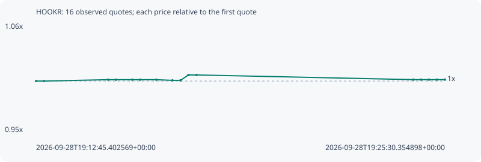

# HOOKR

**robinhood** / `0x18e674231a58c239dc7daedcffe15ec3a24cff5c`

[All tokens](README.md) · [Market window](../README.md)

## Native assessments

This contract is in the quote cohort; it has no native model assessment in this window.

## Series 9b445fb78b895013a352

Pool: `not supplied`

[Complete series](../series/robinhood/9b445fb78b895013a352.json)

Every dot is a captured quote. Lines connect observations; the curve ends at the last available quote.

| Peak | Final | Return | Maximum drawdown |
| ---: | ---: | ---: | ---: |
| 1.0060x | 1.0014x | +0.14% | 0.46% |

### Complete quote timeline

| Time (UTC) | Price (USD) | Multiple | Evidence |
| --- | ---: | ---: | --- |
| 2026-09-28T19:12:45.402569+00:00 | 0.0111623 | 1.0000x | `capture:8deb508c-ea33-4c21-a5c5-f0991dd6dcac:rank:95` |
| 2026-09-28T19:13:00.335966+00:00 | 0.0111623 | 1.0000x | `capture:ee3ee7f8-576f-4c42-a7e0-cd9f917fdb36:rank:95` |
| 2026-09-28T19:15:00.325882+00:00 | 0.0111772 | 1.0013x | `capture:663c0420-2b9e-4a94-998b-531fa9202dee:rank:96` |
| 2026-09-28T19:15:15.449577+00:00 | 0.0111772 | 1.0013x | `capture:14452070-ab94-45a0-af6d-e6c54082daec:rank:96` |
| 2026-09-28T19:15:45.353664+00:00 | 0.0111772 | 1.0013x | `capture:b9051b67-24e1-4469-9f82-bc08bd56807d:rank:97` |
| 2026-09-28T19:16:00.473367+00:00 | 0.0111772 | 1.0013x | `capture:cd404827-1073-4901-b09c-82ef1488855b:rank:97` |
| 2026-09-28T19:16:30.344303+00:00 | 0.0111772 | 1.0013x | `capture:18d587e7-b24d-4b8d-82f1-0ac2903a3303:rank:95` |
| 2026-09-28T19:17:00.510014+00:00 | 0.0111698 | 1.0007x | `capture:d9309a4d-09d7-45ee-91ce-c4a055e8faac:rank:94` |
| 2026-09-28T19:17:15.523068+00:00 | 0.0111698 | 1.0007x | `capture:333d670d-dbd3-4656-95f9-1bc781b271db:rank:96` |
| 2026-09-28T19:17:30.451540+00:00 | 0.0112291 | 1.0060x | `capture:e161007c-0751-46e4-acc9-c8e28cd7190a:rank:87` |
| 2026-09-28T19:17:45.582227+00:00 | 0.0112291 | 1.0060x | `capture:a3f98285-516a-4bd4-b2c4-63596c968a6b:rank:85` |
| 2026-09-28T19:24:31.344409+00:00 | 0.0111777 | 1.0014x | `capture:85f4db1c-c852-45c3-99aa-4320f3839031:rank:81` |
| 2026-09-28T19:24:45.576445+00:00 | 0.0111777 | 1.0014x | `capture:da07dfaa-56d9-4a51-99df-1ad071803eb0:rank:83` |
| 2026-09-28T19:25:00.412700+00:00 | 0.0111777 | 1.0014x | `capture:1dec2f8f-4694-4c32-8be8-eeec3980c853:rank:79` |
| 2026-09-28T19:25:15.316372+00:00 | 0.0111777 | 1.0014x | `capture:52eaf5a3-351e-4c29-b00b-a167107703e3:rank:81` |
| 2026-09-28T19:25:30.354898+00:00 | 0.0111777 | 1.0014x | `capture:d70b1f6a-3ec3-4ec2-8c88-db476beae4f9:rank:89` |

### Exit-policy timeline

Calculated from captured quotes under the window policy. Native assessments are linked separately above.

| Time (UTC) | Action | Price (USD) | Evidence |
| --- | --- | ---: | --- |
| 2026-09-28T19:12:45.402569+00:00 | BUY | 0.0111623 | `capture:8deb508c-ea33-4c21-a5c5-f0991dd6dcac:rank:95` |
| 2026-09-28T19:13:00.335966+00:00 | HOLD | 0.0111623 | `capture:ee3ee7f8-576f-4c42-a7e0-cd9f917fdb36:rank:95` |
| 2026-09-28T19:15:00.325882+00:00 | HOLD | 0.0111772 | `capture:663c0420-2b9e-4a94-998b-531fa9202dee:rank:96` |
| 2026-09-28T19:15:15.449577+00:00 | HOLD | 0.0111772 | `capture:14452070-ab94-45a0-af6d-e6c54082daec:rank:96` |
| 2026-09-28T19:15:45.353664+00:00 | HOLD | 0.0111772 | `capture:b9051b67-24e1-4469-9f82-bc08bd56807d:rank:97` |
| 2026-09-28T19:16:00.473367+00:00 | HOLD | 0.0111772 | `capture:cd404827-1073-4901-b09c-82ef1488855b:rank:97` |
| 2026-09-28T19:16:30.344303+00:00 | HOLD | 0.0111772 | `capture:18d587e7-b24d-4b8d-82f1-0ac2903a3303:rank:95` |
| 2026-09-28T19:17:00.510014+00:00 | HOLD | 0.0111698 | `capture:d9309a4d-09d7-45ee-91ce-c4a055e8faac:rank:94` |
| 2026-09-28T19:17:15.523068+00:00 | HOLD | 0.0111698 | `capture:333d670d-dbd3-4656-95f9-1bc781b271db:rank:96` |
| 2026-09-28T19:17:30.451540+00:00 | HOLD | 0.0112291 | `capture:e161007c-0751-46e4-acc9-c8e28cd7190a:rank:87` |
| 2026-09-28T19:17:45.582227+00:00 | HOLD | 0.0112291 | `capture:a3f98285-516a-4bd4-b2c4-63596c968a6b:rank:85` |
| 2026-09-28T19:24:31.344409+00:00 | HOLD | 0.0111777 | `capture:85f4db1c-c852-45c3-99aa-4320f3839031:rank:81` |
| 2026-09-28T19:24:45.576445+00:00 | HOLD | 0.0111777 | `capture:da07dfaa-56d9-4a51-99df-1ad071803eb0:rank:83` |
| 2026-09-28T19:25:00.412700+00:00 | HOLD | 0.0111777 | `capture:1dec2f8f-4694-4c32-8be8-eeec3980c853:rank:79` |
| 2026-09-28T19:25:15.316372+00:00 | HOLD | 0.0111777 | `capture:52eaf5a3-351e-4c29-b00b-a167107703e3:rank:81` |
| 2026-09-28T19:25:30.354898+00:00 | HOLD | 0.0111777 | `capture:d70b1f6a-3ec3-4ec2-8c88-db476beae4f9:rank:89` |
