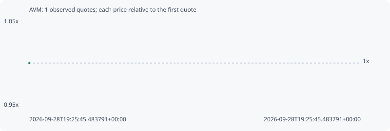

# AVM

**robinhood** / `0x6f48538fc1b79af9e7f56890e0da0582d763a272`

[All tokens](README.md) · [Market window](../README.md)

## Native assessments

This contract is in the quote cohort; it has no native model assessment in this window.

## Series 1057b1ddef254da92f02

Pool: `not supplied`

[Complete series](../series/robinhood/1057b1ddef254da92f02.json)

Every dot is a captured quote. Lines connect observations; the curve ends at the last available quote.

Fewer than two quotes: return and drawdown are not calculated.

### Complete quote timeline

| Time (UTC) | Price (USD) | Multiple | Evidence |
| --- | ---: | ---: | --- |
| 2026-09-28T19:25:45.483791+00:00 | 3.45618e-05 | 1.0000x | `capture:ebb21e05-3dc6-4a8f-a800-fa79ba147200:rank:98` |

### Exit-policy timeline

Calculated from captured quotes under the window policy. Native assessments are linked separately above.

| Time (UTC) | Action | Price (USD) | Evidence |
| --- | --- | ---: | --- |
